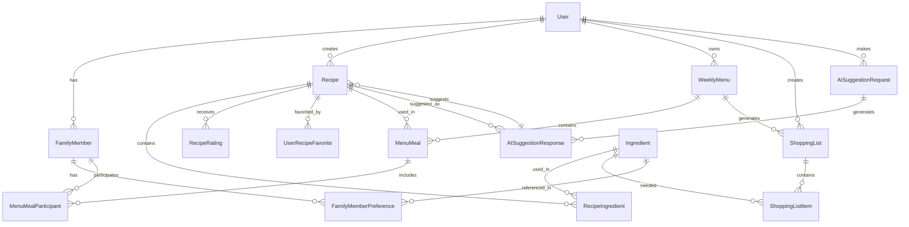

# Database Entity Relationships

## Overview
This document provides a comprehensive overview of the MealPrep database entity relationships, including Entity Relationship Diagrams (ERD), table relationships, and data integrity constraints.

## High-Level Entity Relationship Diagram



## Core Entity Definitions

### User Entity
**Primary Key:** UserId (int, identity)
**Description:** Central entity representing application users

| Column | Type | Constraints | Description |
|--------|------|-------------|-------------|
| UserId | int | PK, Identity | Unique user identifier |
| Email | nvarchar(255) | Unique, Not Null | User login email |
| PasswordHash | nvarchar(512) | Not Null | Hashed password |
| FirstName | nvarchar(100) | Not Null | User first name |
| LastName | nvarchar(100) | Not Null | User last name |
| ProfileImageUrl | nvarchar(500) | Nullable | Profile photo URL |
| CreatedDate | datetime2 | Not Null, Default: GETUTCDATE() | Account creation date |
| LastLoginDate | datetime2 | Nullable | Last successful login |
| IsActive | bit | Not Null, Default: 1 | Account status |
| EmailVerified | bit | Not Null, Default: 0 | Email verification status |

**Relationships:**
- One-to-Many with FamilyMember
- One-to-Many with Recipe
- One-to-Many with WeeklyMenu
- One-to-Many with ShoppingList
- One-to-Many with AISuggestionRequest

### FamilyMember Entity
**Primary Key:** FamilyMemberId (int, identity)
**Foreign Key:** UserId ? User.UserId
**Description:** Individual family members with preferences

| Column | Type | Constraints | Description |
|--------|------|-------------|-------------|
| FamilyMemberId | int | PK, Identity | Unique family member ID |
| UserId | int | FK, Not Null | Reference to User |
| Name | nvarchar(100) | Not Null | Family member name |
| Age | int | Nullable | Age for portion calculations |
| ProfileImageUrl | nvarchar(500) | Nullable | Profile photo URL |
| SpiceToleranceLevel | int | Check (1-10) | Spice tolerance scale |
| CookingSkillLevel | nvarchar(50) | Not Null | Beginner/Intermediate/Advanced |
| PreferredCookingTime | int | Nullable | Available cooking time (minutes) |
| HealthGoals | nvarchar(1000) | Nullable | Nutritional objectives |
| IsActive | bit | Not Null, Default: 1 | Active status |
| CreatedDate | datetime2 | Not Null, Default: GETUTCDATE() | Creation date |

**Relationships:**
- Many-to-One with User
- One-to-Many with FamilyMemberPreference
- Many-to-Many with MenuMeal (through MenuMealParticipant)

### FamilyMemberPreference Entity
**Primary Key:** PreferenceId (int, identity)
**Foreign Key:** FamilyMemberId ? FamilyMember.FamilyMemberId
**Description:** Individual preferences for ingredients, cuisines, and dietary restrictions

| Column | Type | Constraints | Description |
|--------|------|-------------|-------------|
| PreferenceId | int | PK, Identity | Unique preference ID |
| FamilyMemberId | int | FK, Not Null | Reference to FamilyMember |
| PreferenceType | nvarchar(50) | Not Null | Type: Allergy, Dislike, Like, Cuisine, DietaryRestriction |
| PreferenceValue | nvarchar(255) | Not Null | The actual preference value |
| Severity | nvarchar(20) | Nullable | Critical, High, Medium, Low |
| Notes | nvarchar(500) | Nullable | Additional context |
| CreatedDate | datetime2 | Not Null, Default: GETUTCDATE() | Creation date |

**Indexes:**
- IX_FamilyMemberPreference_Type_Value (FamilyMemberId, PreferenceType, PreferenceValue)

### Recipe Entity
**Primary Key:** RecipeId (int, identity)
**Foreign Key:** CreatedByUserId ? User.UserId
**Description:** Recipe information and metadata

| Column | Type | Constraints | Description |
|--------|------|-------------|-------------|
| RecipeId | int | PK, Identity | Unique recipe identifier |
| CreatedByUserId | int | FK, Nullable | Original creator (null for system recipes) |
| Name | nvarchar(255) | Not Null | Recipe name |
| Description | nvarchar(1000) | Nullable | Recipe description |
| Instructions | ntext | Not Null | Cooking instructions |
| PrepTimeMinutes | int | Not Null | Preparation time |
| CookTimeMinutes | int | Not Null | Cooking time |
| ServingSize | int | Not Null | Number of servings |
| DifficultyLevel | nvarchar(20) | Not Null | Easy, Medium, Hard |
| Cuisine | nvarchar(50) | Nullable | Cuisine type |
| EstimatedCost | decimal(10,2) | Nullable | Estimated cost |
| ImageUrl | nvarchar(500) | Nullable | Recipe image URL |
| Tags | nvarchar(500) | Nullable | Comma-separated tags |
| IsAiGenerated | bit | Not Null, Default: 0 | AI-generated flag |
| IsPublic | bit | Not Null, Default: 0 | Public visibility |
| AverageRating | decimal(3,2) | Default: 0 | Calculated average rating |
| RatingCount | int | Default: 0 | Number of ratings |
| FamilyFitScore | int | Nullable | AI-calculated family fit (1-10) |
| CreatedDate | datetime2 | Not Null, Default: GETUTCDATE() | Creation date |
| ModifiedDate | datetime2 | Not Null, Default: GETUTCDATE() | Last modification |

**Relationships:**
- Many-to-One with User
- One-to-Many with RecipeIngredient
- One-to-Many with RecipeRating
- Many-to-Many with User (through UserRecipeFavorite)
- One-to-Many with MenuMeal

**Indexes:**
- IX_Recipe_Search (Name, Cuisine, DifficultyLevel)
- IX_Recipe_User (CreatedByUserId, IsPublic)
- IX_Recipe_AI (IsAiGenerated, FamilyFitScore)

### Ingredient Entity
**Primary Key:** IngredientId (int, identity)
**Description:** Master ingredient database

| Column | Type | Constraints | Description |
|--------|------|-------------|-------------|
| IngredientId | int | PK, Identity | Unique ingredient identifier |
| Name | nvarchar(255) | Unique, Not Null | Ingredient name |
| Category | nvarchar(100) | Not Null | Ingredient category |
| CommonUnits | nvarchar(200) | Nullable | JSON array of common units |
| AverageCostPerUnit | decimal(10,2) | Nullable | Average cost |
| CaloriesPerUnit | decimal(10,2) | Nullable | Calories per standard unit |
| ProteinGrams | decimal(10,2) | Nullable | Protein content |
| CarbGrams | decimal(10,2) | Nullable | Carbohydrate content |
| FatGrams | decimal(10,2) | Nullable | Fat content |
| FiberGrams | decimal(10,2) | Nullable | Fiber content |
| SodiumMilligrams | decimal(10,2) | Nullable | Sodium content |
| Allergens | nvarchar(200) | Nullable | Known allergens |
| DietaryTags | nvarchar(200) | Nullable | Dietary classification tags |
| CreatedDate | datetime2 | Not Null, Default: GETUTCDATE() | Creation date |

**Relationships:**
- One-to-Many with RecipeIngredient
- One-to-Many with ShoppingListItem
- Referenced in FamilyMemberPreference

### RecipeIngredient Entity
**Primary Key:** RecipeIngredientId (int, identity)
**Foreign Keys:** RecipeId, IngredientId
**Description:** Junction entity linking recipes to ingredients with quantities

| Column | Type | Constraints | Description |
|--------|------|-------------|-------------|
| RecipeIngredientId | int | PK, Identity | Unique identifier |
| RecipeId | int | FK, Not Null | Reference to Recipe |
| IngredientId | int | FK, Not Null | Reference to Ingredient |
| Quantity | decimal(10,2) | Not Null | Amount needed |
| Unit | nvarchar(50) | Not Null | Measurement unit |
| PrepNotes | nvarchar(200) | Nullable | Preparation instructions |
| IsOptional | bit | Not Null, Default: 0 | Optional ingredient flag |
| SortOrder | int | Not Null, Default: 0 | Display order |

**Unique Constraint:** UK_RecipeIngredient (RecipeId, IngredientId)

### WeeklyMenu Entity
**Primary Key:** WeeklyMenuId (int, identity)
**Foreign Key:** UserId ? User.UserId
**Description:** Weekly meal planning container

| Column | Type | Constraints | Description |
|--------|------|-------------|-------------|
| WeeklyMenuId | int | PK, Identity | Unique menu identifier |
| UserId | int | FK, Not Null | Menu owner |
| Name | nvarchar(255) | Not Null | Menu name |
| StartDate | date | Not Null | Week start date |
| EndDate | date | Not Null | Week end date |
| TotalEstimatedCost | decimal(10,2) | Default: 0 | Calculated total cost |
| IsArchived | bit | Not Null, Default: 0 | Archive status |
| CreatedDate | datetime2 | Not Null, Default: GETUTCDATE() | Creation date |
| ModifiedDate | datetime2 | Not Null, Default: GETUTCDATE() | Last modification |

**Relationships:**
- Many-to-One with User
- One-to-Many with MenuMeal
- One-to-Many with ShoppingList

**Unique Constraint:** UK_WeeklyMenu_User_Dates (UserId, StartDate, EndDate)

### MenuMeal Entity
**Primary Key:** MenuMealId (int, identity)
**Foreign Keys:** WeeklyMenuId, RecipeId
**Description:** Individual meals within a weekly menu

| Column | Type | Constraints | Description |
|--------|------|-------------|-------------|
| MenuMealId | int | PK, Identity | Unique meal identifier |
| WeeklyMenuId | int | FK, Not Null | Reference to WeeklyMenu |
| RecipeId | int | FK, Nullable | Reference to Recipe (null for custom meals) |
| DayOfWeek | int | Not Null, Check (1-7) | Day (1=Monday, 7=Sunday) |
| MealType | nvarchar(20) | Not Null | Breakfast, Lunch, Dinner, Snack |
| CustomMealName | nvarchar(255) | Nullable | For non-recipe meals |
| ServingSize | int | Not Null, Default: 4 | Number of servings |
| Notes | nvarchar(500) | Nullable | Meal-specific notes |
| EstimatedCost | decimal(10,2) | Nullable | Cost for this meal |
| SortOrder | int | Not Null, Default: 0 | Display order within day |

**Relationships:**
- Many-to-One with WeeklyMenu
- Many-to-One with Recipe
- One-to-Many with MenuMealParticipant

### MenuMealParticipant Entity
**Primary Key:** ParticipantId (int, identity)
**Foreign Keys:** MenuMealId, FamilyMemberId
**Description:** Tracks which family members will eat specific meals

| Column | Type | Constraints | Description |
|--------|------|-------------|-------------|
| ParticipantId | int | PK, Identity | Unique participant identifier |
| MenuMealId | int | FK, Not Null | Reference to MenuMeal |
| FamilyMemberId | int | FK, Not Null | Reference to FamilyMember |
| PortionSize | decimal(5,2) | Default: 1.0 | Portion multiplier |
| Notes | nvarchar(200) | Nullable | Participant-specific notes |

**Unique Constraint:** UK_MenuMealParticipant (MenuMealId, FamilyMemberId)

### ShoppingList Entity
**Primary Key:** ShoppingListId (int, identity)
**Foreign Keys:** UserId, WeeklyMenuId
**Description:** Shopping list container

| Column | Type | Constraints | Description |
|--------|------|-------------|-------------|
| ShoppingListId | int | PK, Identity | Unique list identifier |
| UserId | int | FK, Not Null | List owner |
| WeeklyMenuId | int | FK, Nullable | Source menu (null for manual lists) |
| Name | nvarchar(255) | Not Null | List name |
| TotalEstimatedCost | decimal(10,2) | Default: 0 | Estimated total cost |
| TotalActualCost | decimal(10,2) | Default: 0 | Actual spent amount |
| IsCompleted | bit | Not Null, Default: 0 | Shopping completion status |
| CreatedDate | datetime2 | Not Null, Default: GETUTCDATE() | Creation date |
| CompletedDate | datetime2 | Nullable | Completion date |

**Relationships:**
- Many-to-One with User
- Many-to-One with WeeklyMenu
- One-to-Many with ShoppingListItem

### ShoppingListItem Entity
**Primary Key:** ItemId (int, identity)
**Foreign Keys:** ShoppingListId, IngredientId
**Description:** Individual items in shopping lists

| Column | Type | Constraints | Description |
|--------|------|-------------|-------------|
| ItemId | int | PK, Identity | Unique item identifier |
| ShoppingListId | int | FK, Not Null | Reference to ShoppingList |
| IngredientId | int | FK, Nullable | Reference to Ingredient |
| CustomItemName | nvarchar(255) | Nullable | For non-ingredient items |
| Quantity | decimal(10,2) | Not Null | Quantity needed |
| Unit | nvarchar(50) | Not Null | Measurement unit |
| Category | nvarchar(100) | Nullable | Store section/category |
| EstimatedCost | decimal(10,2) | Nullable | Estimated cost |
| ActualCost | decimal(10,2) | Nullable | Actual paid amount |
| IsPurchased | bit | Not Null, Default: 0 | Purchase status |
| IsPriority | bit | Not Null, Default: 0 | Priority item flag |
| Notes | nvarchar(200) | Nullable | Item-specific notes |
| SortOrder | int | Not Null, Default: 0 | Display order |
| PurchasedDate | datetime2 | Nullable | Purchase date |

### RecipeRating Entity
**Primary Key:** RatingId (int, identity)
**Foreign Keys:** RecipeId, UserId
**Description:** User ratings and reviews for recipes

| Column | Type | Constraints | Description |
|--------|------|-------------|-------------|
| RatingId | int | PK, Identity | Unique rating identifier |
| RecipeId | int | FK, Not Null | Reference to Recipe |
| UserId | int | FK, Not Null | Rating author |
| Rating | int | Not Null, Check (1-5) | Star rating (1-5) |
| Comment | nvarchar(1000) | Nullable | Review comment |
| CreatedDate | datetime2 | Not Null, Default: GETUTCDATE() | Rating date |

**Unique Constraint:** UK_RecipeRating_User (RecipeId, UserId)

### UserRecipeFavorite Entity
**Primary Key:** FavoriteId (int, identity)
**Foreign Keys:** UserId, RecipeId
**Description:** User favorite recipes junction table

| Column | Type | Constraints | Description |
|--------|------|-------------|-------------|
| FavoriteId | int | PK, Identity | Unique favorite identifier |
| UserId | int | FK, Not Null | Reference to User |
| RecipeId | int | FK, Not Null | Reference to Recipe |
| CreatedDate | datetime2 | Not Null, Default: GETUTCDATE() | Favorite date |

**Unique Constraint:** UK_UserRecipeFavorite (UserId, RecipeId)

### AISuggestionRequest Entity
**Primary Key:** RequestId (int, identity)
**Foreign Key:** UserId ? User.UserId
**Description:** AI meal suggestion requests and metadata

| Column | Type | Constraints | Description |
|--------|------|-------------|-------------|
| RequestId | int | PK, Identity | Unique request identifier |
| UserId | int | FK, Not Null | Request author |
| RequestType | nvarchar(50) | Not Null | MealSuggestion, WeeklyMenu, RecipePersonalization |
| RequestData | ntext | Not Null | JSON request parameters |
| RequestHash | nvarchar(64) | Not Null | SHA256 hash for caching |
| ProcessingStatus | nvarchar(20) | Not Null | Pending, Processing, Completed, Failed |
| EstimatedTokens | int | Nullable | AI token estimate |
| ActualTokens | int | Nullable | Actual tokens consumed |
| ProcessingTime | int | Nullable | Processing time in milliseconds |
| ErrorMessage | nvarchar(1000) | Nullable | Error details if failed |
| CreatedDate | datetime2 | Not Null, Default: GETUTCDATE() | Request date |
| CompletedDate | datetime2 | Nullable | Completion date |

**Relationships:**
- Many-to-One with User
- One-to-Many with AISuggestionResponse

**Indexes:**
- IX_AISuggestionRequest_Hash (RequestHash, CreatedDate)
- IX_AISuggestionRequest_User (UserId, RequestType, CreatedDate)

### AISuggestionResponse Entity
**Primary Key:** ResponseId (int, identity)
**Foreign Keys:** RequestId, RecipeId
**Description:** AI-generated suggestions and metadata

| Column | Type | Constraints | Description |
|--------|------|-------------|-------------|
| ResponseId | int | PK, Identity | Unique response identifier |
| RequestId | int | FK, Not Null | Reference to AISuggestionRequest |
| RecipeId | int | FK, Nullable | Reference to generated/suggested Recipe |
| ResponseData | ntext | Not Null | JSON response data |
| FamilyFitScore | int | Check (1-10) | AI-calculated family fit score |
| FamilyFitReasoning | nvarchar(1000) | Nullable | Explanation of fit score |
| SuggestionRank | int | Not Null | Ranking within request |
| UserFeedbackRating | int | Nullable, Check (1-5) | User rating of suggestion |
| UserFeedbackComment | nvarchar(500) | Nullable | User feedback comment |
| WasAccepted | bit | Nullable | Whether user accepted suggestion |
| CreatedDate | datetime2 | Not Null, Default: GETUTCDATE() | Response date |

**Relationships:**
- Many-to-One with AISuggestionRequest
- Many-to-One with Recipe

## Relationship Constraints and Business Rules

### Data Integrity Rules

#### User-Related Constraints
```sql
-- Email uniqueness
CONSTRAINT UK_User_Email UNIQUE (Email)

-- Active users must have verified emails for certain operations
CONSTRAINT CK_User_ActiveVerified 
  CHECK (IsActive = 0 OR EmailVerified = 1 OR CreatedDate > DATEADD(day, -7, GETUTCDATE()))
```

#### Family Member Constraints
```sql
-- Each user can have maximum 10 family members
CONSTRAINT CK_FamilyMember_Limit 
  CHECK (dbo.GetFamilyMemberCount(UserId) <= 10)

-- Spice tolerance must be 1-10
CONSTRAINT CK_FamilyMember_SpiceTolerance 
  CHECK (SpiceToleranceLevel BETWEEN 1 AND 10)

-- Cooking time must be reasonable
CONSTRAINT CK_FamilyMember_CookingTime 
  CHECK (PreferredCookingTime IS NULL OR PreferredCookingTime BETWEEN 5 AND 480)
```

#### Recipe Constraints
```sql
-- Preparation and cooking times must be positive
CONSTRAINT CK_Recipe_PrepTime CHECK (PrepTimeMinutes > 0)
CONSTRAINT CK_Recipe_CookTime CHECK (CookTimeMinutes > 0)

-- Serving size must be reasonable
CONSTRAINT CK_Recipe_ServingSize CHECK (ServingSize BETWEEN 1 AND 50)

-- Family fit score range
CONSTRAINT CK_Recipe_FamilyFitScore 
  CHECK (FamilyFitScore IS NULL OR FamilyFitScore BETWEEN 1 AND 10)
```

#### Menu Planning Constraints
```sql
-- Weekly menu date range must be valid
CONSTRAINT CK_WeeklyMenu_DateRange 
  CHECK (EndDate > StartDate AND DATEDIFF(day, StartDate, EndDate) <= 7)

-- Menu meal day of week range
CONSTRAINT CK_MenuMeal_DayOfWeek CHECK (DayOfWeek BETWEEN 1 AND 7)

-- Serving size must be positive
CONSTRAINT CK_MenuMeal_ServingSize CHECK (ServingSize > 0)
```

### Cascade Rules

#### Delete Cascades
```sql
-- User deletion cascades to all related data
ALTER TABLE FamilyMember 
  ADD CONSTRAINT FK_FamilyMember_User 
  FOREIGN KEY (UserId) REFERENCES User(UserId) 
  ON DELETE CASCADE

-- Family member deletion cascades to preferences
ALTER TABLE FamilyMemberPreference 
  ADD CONSTRAINT FK_FamilyMemberPreference_FamilyMember 
  FOREIGN KEY (FamilyMemberId) REFERENCES FamilyMember(FamilyMemberId) 
  ON DELETE CASCADE

-- Weekly menu deletion cascades to meals
ALTER TABLE MenuMeal 
  ADD CONSTRAINT FK_MenuMeal_WeeklyMenu 
  FOREIGN KEY (WeeklyMenuId) REFERENCES WeeklyMenu(WeeklyMenuId) 
  ON DELETE CASCADE
```

#### Update Cascades
```sql
-- Recipe updates affect menu meals
ALTER TABLE MenuMeal 
  ADD CONSTRAINT FK_MenuMeal_Recipe 
  FOREIGN KEY (RecipeId) REFERENCES Recipe(RecipeId) 
  ON UPDATE CASCADE

-- Ingredient updates cascade to recipe ingredients
ALTER TABLE RecipeIngredient 
  ADD CONSTRAINT FK_RecipeIngredient_Ingredient 
  FOREIGN KEY (IngredientId) REFERENCES Ingredient(IngredientId) 
  ON UPDATE CASCADE
```

## Advanced Relationship Patterns

### Soft Delete Pattern
```sql
-- Recipes use soft delete to maintain menu integrity
UPDATE Recipe 
SET IsActive = 0, 
    ModifiedDate = GETUTCDATE()
WHERE RecipeId = @RecipeId;

-- Query active recipes only
SELECT * FROM Recipe 
WHERE IsActive = 1;
```

### Audit Trail Pattern
```sql
-- Create audit table for recipe changes
CREATE TABLE RecipeAudit (
    AuditId int IDENTITY PRIMARY KEY,
    RecipeId int NOT NULL,
    Operation nvarchar(10) NOT NULL, -- INSERT, UPDATE, DELETE
    OldValues nvarchar(max),
    NewValues nvarchar(max),
    ChangedBy int NOT NULL,
    ChangeDate datetime2 DEFAULT GETUTCDATE()
);
```

### Calculated Fields Pattern
```sql
-- Auto-calculate recipe average rating
CREATE TRIGGER TR_RecipeRating_UpdateAverage
ON RecipeRating
AFTER INSERT, UPDATE, DELETE
AS
BEGIN
    UPDATE r
    SET AverageRating = ISNULL(avg_rating.AvgRating, 0),
        RatingCount = ISNULL(avg_rating.RatingCount, 0)
    FROM Recipe r
    LEFT JOIN (
        SELECT 
            RecipeId,
            AVG(CAST(Rating AS decimal(3,2))) AS AvgRating,
            COUNT(*) AS RatingCount
        FROM RecipeRating
        WHERE RecipeId IN (
            SELECT DISTINCT RecipeId FROM inserted
            UNION 
            SELECT DISTINCT RecipeId FROM deleted
        )
        GROUP BY RecipeId
    ) avg_rating ON r.RecipeId = avg_rating.RecipeId
    WHERE r.RecipeId IN (
        SELECT DISTINCT RecipeId FROM inserted
        UNION 
        SELECT DISTINCT RecipeId FROM deleted
    );
END;
```

## Query Optimization Patterns

### Efficient Family Preference Queries
```sql
-- Get family allergies efficiently
SELECT DISTINCT fp.PreferenceValue as Allergen
FROM FamilyMember fm
INNER JOIN FamilyMemberPreference fp ON fm.FamilyMemberId = fp.FamilyMemberId
WHERE fm.UserId = @UserId 
  AND fm.IsActive = 1
  AND fp.PreferenceType = 'Allergy';
```

### Recipe Search with Family Compatibility
```sql
-- Find recipes compatible with family
WITH FamilyAllergies AS (
    SELECT DISTINCT fp.PreferenceValue as AllergenIngredient
    FROM FamilyMember fm
    INNER JOIN FamilyMemberPreference fp ON fm.FamilyMemberId = fp.FamilyMemberId
    WHERE fm.UserId = @UserId AND fm.IsActive = 1 AND fp.PreferenceType = 'Allergy'
)
SELECT r.*, 
       CASE WHEN EXISTS (
           SELECT 1 FROM RecipeIngredient ri
           INNER JOIN Ingredient i ON ri.IngredientId = i.IngredientId
           INNER JOIN FamilyAllergies fa ON i.Name = fa.AllergenIngredient
           WHERE ri.RecipeId = r.RecipeId
       ) THEN 0 ELSE 1 END AS IsSafeForFamily
FROM Recipe r
WHERE r.IsActive = 1
  AND (@SearchTerm IS NULL OR r.Name LIKE '%' + @SearchTerm + '%')
ORDER BY IsSafeForFamily DESC, r.AverageRating DESC;
```

### Menu Planning Efficiency
```sql
-- Get complete weekly menu with recipes
SELECT 
    wm.Name AS MenuName,
    wm.StartDate,
    wm.EndDate,
    mm.DayOfWeek,
    mm.MealType,
    r.Name AS RecipeName,
    mm.CustomMealName,
    mm.ServingSize,
    STRING_AGG(fm.Name, ', ') AS Participants
FROM WeeklyMenu wm
INNER JOIN MenuMeal mm ON wm.WeeklyMenuId = mm.WeeklyMenuId
LEFT JOIN Recipe r ON mm.RecipeId = r.RecipeId
LEFT JOIN MenuMealParticipant mmp ON mm.MenuMealId = mmp.MenuMealId
LEFT JOIN FamilyMember fm ON mmp.FamilyMemberId = fm.FamilyMemberId
WHERE wm.UserId = @UserId 
  AND wm.StartDate <= @Date 
  AND wm.EndDate >= @Date
GROUP BY wm.Name, wm.StartDate, wm.EndDate, mm.DayOfWeek, mm.MealType, 
         r.Name, mm.CustomMealName, mm.ServingSize, mm.SortOrder
ORDER BY mm.DayOfWeek, mm.SortOrder;
```

## Performance Considerations

### Index Strategy
```sql
-- Recipe search performance
CREATE INDEX IX_Recipe_Search_Performance 
ON Recipe (Cuisine, DifficultyLevel, PrepTimeMinutes, IsActive) 
INCLUDE (Name, Description, AverageRating, ImageUrl);

-- Family preference lookups
CREATE INDEX IX_FamilyMemberPreference_Lookup 
ON FamilyMemberPreference (FamilyMemberId, PreferenceType) 
INCLUDE (PreferenceValue, Severity);

-- Menu date range queries
CREATE INDEX IX_WeeklyMenu_DateRange 
ON WeeklyMenu (UserId, StartDate, EndDate) 
INCLUDE (Name, TotalEstimatedCost);
```

### Partitioning Strategy
```sql
-- Partition AI requests by date for performance
CREATE PARTITION FUNCTION PF_AISuggestionRequest_Date (datetime2)
AS RANGE RIGHT FOR VALUES 
('2024-01-01', '2024-02-01', '2024-03-01', '2024-04-01');

CREATE PARTITION SCHEME PS_AISuggestionRequest_Date
AS PARTITION PF_AISuggestionRequest_Date
TO (FileGroup1, FileGroup2, FileGroup3, FileGroup4);

CREATE TABLE AISuggestionRequest (
    -- ... columns ...
) ON PS_AISuggestionRequest_Date(CreatedDate);
```

## Data Normalization and Design Principles

### Third Normal Form (3NF) Compliance
The database design follows 3NF principles:

1. **First Normal Form (1NF)**: All tables have atomic values and unique column names
2. **Second Normal Form (2NF)**: All non-key attributes are fully functionally dependent on primary keys
3. **Third Normal Form (3NF)**: No transitive dependencies exist

### Denormalization for Performance
Strategic denormalization for query performance:

```sql
-- Denormalized fields in Recipe table
AverageRating    -- Calculated from RecipeRating table
RatingCount      -- Count of ratings for performance
FamilyFitScore   -- AI-calculated score stored for quick access

-- Denormalized fields in WeeklyMenu table
TotalEstimatedCost -- Sum of all meal costs for quick display

-- Denormalized fields in ShoppingList table
TotalEstimatedCost -- Sum of all item costs
TotalActualCost    -- Sum of actual purchase prices
```

### ACID Properties Implementation

#### Atomicity
```sql
-- Transaction example for creating a complete recipe
BEGIN TRANSACTION
    INSERT INTO Recipe (...) VALUES (...)
    SET @RecipeId = SCOPE_IDENTITY()
    
    INSERT INTO RecipeIngredient (RecipeId, IngredientId, ...)
    VALUES (@RecipeId, @Ingredient1Id, ...)
    
    INSERT INTO RecipeIngredient (RecipeId, IngredientId, ...)
    VALUES (@RecipeId, @Ingredient2Id, ...)
    
    -- If any operation fails, all are rolled back
COMMIT TRANSACTION
```

#### Consistency
```sql
-- Consistency ensured through constraints and triggers
-- Example: Recipe rating updates maintain consistency
CREATE TRIGGER TR_RecipeRating_Consistency
ON RecipeRating
AFTER INSERT, UPDATE, DELETE
AS
BEGIN
    -- Automatically update recipe average rating
    -- Ensures data consistency across related tables
END
```

#### Isolation
```sql
-- Isolation levels for different operations
-- Reading recipes (shared data)
SET TRANSACTION ISOLATION LEVEL READ COMMITTED

-- Creating family-specific data (user-isolated)
SET TRANSACTION ISOLATION LEVEL REPEATABLE READ

-- AI suggestion processing (serializable for consistency)
SET TRANSACTION ISOLATION LEVEL SERIALIZABLE
```

#### Durability
- Database backups ensure durability
- Transaction log backups for point-in-time recovery
- Clustering and replication for high availability

## Data Quality and Validation

### Input Validation Rules
```sql
-- Email format validation
CONSTRAINT CK_User_EmailFormat 
  CHECK (Email LIKE '%_@_%.__%')

-- Recipe time validation
CONSTRAINT CK_Recipe_ReasonableTimes 
  CHECK (PrepTimeMinutes BETWEEN 1 AND 480 AND 
         CookTimeMinutes BETWEEN 1 AND 720)

-- Ingredient quantity validation
CONSTRAINT CK_RecipeIngredient_PositiveQuantity 
  CHECK (Quantity > 0)

-- Rating range validation
CONSTRAINT CK_RecipeRating_ValidRange 
  CHECK (Rating BETWEEN 1 AND 5)
```

### Data Integrity Functions
```sql
-- Function to validate family member count
CREATE FUNCTION dbo.GetFamilyMemberCount(@UserId INT)
RETURNS INT
AS
BEGIN
    DECLARE @Count INT
    SELECT @Count = COUNT(*) 
    FROM FamilyMember 
    WHERE UserId = @UserId AND IsActive = 1
    RETURN @Count
END

-- Function to calculate recipe complexity score
CREATE FUNCTION dbo.CalculateRecipeComplexity(@RecipeId INT)
RETURNS INT
AS
BEGIN
    DECLARE @ComplexityScore INT
    
    SELECT @ComplexityScore = 
        (PrepTimeMinutes / 10) +  -- Time complexity
        (SELECT COUNT(*) FROM RecipeIngredient WHERE RecipeId = @RecipeId) + -- Ingredient count
        CASE DifficultyLevel 
            WHEN 'Easy' THEN 1 
            WHEN 'Medium' THEN 3 
            WHEN 'Hard' THEN 5 
        END
    FROM Recipe 
    WHERE RecipeId = @RecipeId
    
    RETURN @ComplexityScore
END
```

## Future Schema Considerations

### Planned Enhancements
1. **Nutritional Tracking**: Enhanced nutrition data per serving
2. **Recipe Versioning**: Version control for recipe modifications
3. **Social Features**: Recipe sharing and community ratings
4. **Advanced AI**: Machine learning model metadata storage
5. **Multi-language**: Internationalization support

### Scalability Preparations
```sql
-- Prepared for horizontal partitioning
-- User-based partitioning strategy ready
CREATE PARTITION FUNCTION PF_User_Hash (INT)
AS RANGE LEFT FOR VALUES (1000, 2000, 3000, 4000)

-- Prepared for read replicas
-- Read-only views for reporting
CREATE VIEW vw_Recipe_ReadOnly AS
SELECT RecipeId, Name, Description, Cuisine, DifficultyLevel,
       PrepTimeMinutes, CookTimeMinutes, AverageRating
FROM Recipe 
WHERE IsActive = 1

-- Prepared for caching layer integration
-- Computed columns for cache keys
ALTER TABLE Recipe ADD CacheKey AS 
    CONVERT(VARCHAR(50), HASHBYTES('SHA1', 
        CONCAT(RecipeId, ModifiedDate, AverageRating)))
```

---

*Last Updated: December 2024*  
*Entity relationships documentation is complete and continuously maintained*