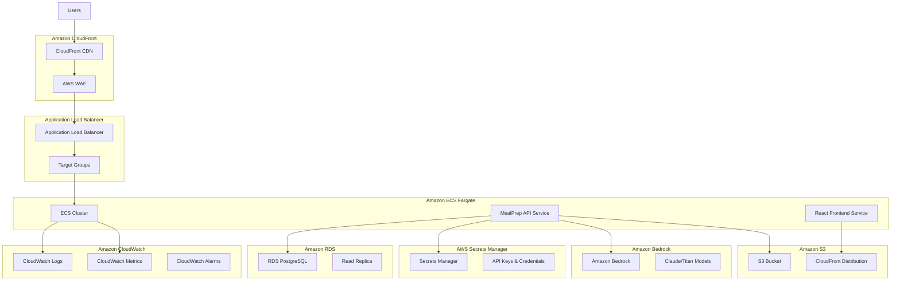

# AWS Deployment Guide

## Overview
Comprehensive guide for deploying the MealPrep AI-powered meal planning application to Amazon Web Services (AWS), covering infrastructure setup, security configuration, monitoring, scaling, and best practices for production deployment.

## AWS Architecture Overview

### High-Level Architecture


### AWS Services Used
```yaml
Compute Services:
  - Amazon ECS Fargate (Serverless containers)
  - AWS Lambda (Serverless functions)
  
Data Services:
  - Amazon RDS PostgreSQL (Primary database)
  - Amazon S3 (File storage and static hosting)
  - Amazon ElastiCache Redis (Caching layer)
  
AI/ML Services:
  - Amazon Bedrock (AI meal suggestions)
  - Amazon Rekognition (Image processing)
  
Security Services:
  - AWS Secrets Manager (Secrets management)
  - AWS IAM (Identity and access management)
  - AWS WAF (Web application firewall)
  
Monitoring Services:
  - Amazon CloudWatch (Logging and metrics)
  - AWS X-Ray (Distributed tracing)
  - AWS CloudTrail (API auditing)
  
Networking Services:
  - Amazon CloudFront (Global CDN)
  - Application Load Balancer (Load balancing)
  - Amazon VPC (Network isolation)
```

---

## Prerequisites

### Required Tools
```bash
# Install AWS CLI v2
curl "https://awscli.amazonaws.com/awscli-exe-linux-x86_64.zip" -o "awscliv2.zip"
unzip awscliv2.zip
sudo ./aws/install

# Install CDK
npm install -g aws-cdk

# Install Docker
sudo apt-get update
sudo apt-get install docker.io

# Verify installations
aws --version
cdk --version
docker --version
```

### AWS Account Setup
```bash
# Configure AWS credentials
aws configure

# Verify configuration
aws sts get-caller-identity

# Bootstrap CDK (one-time setup)
cdk bootstrap aws://ACCOUNT-NUMBER/REGION
```

### Required Permissions
- **PowerUserAccess**: For resource creation and management
- **IAMFullAccess**: For role and policy creation
- **EC2FullAccess**: For networking and compute resources
- **RDSFullAccess**: For database management

---

## Infrastructure as Code (CDK)

### Main CDK Stack
```typescript
// lib/mealprep-stack.ts
import * as cdk from 'aws-cdk-lib';
import * as ec2 from 'aws-cdk-lib/aws-ec2';
import * as ecs from 'aws-cdk-lib/aws-ecs';
import * as ecsPatterns from 'aws-cdk-lib/aws-ecs-patterns';
import * as rds from 'aws-cdk-lib/aws-rds';
import * as s3 from 'aws-cdk-lib/aws-s3';
import * as cloudfront from 'aws-cdk-lib/aws-cloudfront';
import * as secretsmanager from 'aws-cdk-lib/aws-secretsmanager';
import * as iam from 'aws-cdk-lib/aws-iam';
import * as logs from 'aws-cdk-lib/aws-logs';
import { Construct } from 'constructs';

export interface MealPrepStackProps extends cdk.StackProps {
  environment: string;
  domainName?: string;
}

export class MealPrepStack extends cdk.Stack {
  constructor(scope: Construct, id: string, props: MealPrepStackProps) {
    super(scope, id, props);

    const { environment } = props;
    const isProd = environment === 'prod';

    // VPC with public and private subnets
    const vpc = new ec2.Vpc(this, 'MealPrepVPC', {
      maxAzs: 3,
      natGateways: isProd ? 3 : 1,
      enableDnsHostnames: true,
      enableDnsSupport: true,
      subnetConfiguration: [
        {
          cidrMask: 24,
          name: 'Public',
          subnetType: ec2.SubnetType.PUBLIC,
        },
        {
          cidrMask: 24,
          name: 'Private',
          subnetType: ec2.SubnetType.PRIVATE_WITH_EGRESS,
        },
        {
          cidrMask: 28,
          name: 'Database',
          subnetType: ec2.SubnetType.PRIVATE_ISOLATED,
        },
      ],
    });

    // Security Groups
    const dbSecurityGroup = new ec2.SecurityGroup(this, 'DatabaseSG', {
      vpc,
      description: 'Security group for RDS database',
      allowAllOutbound: false,
    });

    const appSecurityGroup = new ec2.SecurityGroup(this, 'ApplicationSG', {
      vpc,
      description: 'Security group for ECS applications',
    });

    dbSecurityGroup.addIngressRule(
      appSecurityGroup,
      ec2.Port.tcp(5432),
      'Allow PostgreSQL access from application'
    );

    // RDS Database
    const dbCluster = new rds.DatabaseCluster(this, 'MealPrepDB', {
      engine: rds.DatabaseClusterEngine.auroraPostgres({
        version: rds.AuroraPostgresEngineVersion.VER_15_4,
      }),
      credentials: rds.Credentials.fromGeneratedSecret('mealprepadmin', {
        secretName: `${environment}/mealprep/db-credentials`,
      }),
      instances: isProd ? 2 : 1,
      instanceProps: {
        instanceType: isProd ? 
          ec2.InstanceType.of(ec2.InstanceClass.R6G, ec2.InstanceSize.LARGE) :
          ec2.InstanceType.of(ec2.InstanceClass.T4G, ec2.InstanceSize.MEDIUM),
        vpcSubnets: {
          subnetType: ec2.SubnetType.PRIVATE_ISOLATED,
        },
        securityGroups: [dbSecurityGroup],
      },
      backup: {
        retention: isProd ? cdk.Duration.days(30) : cdk.Duration.days(7),
      },
      deletionProtection: isProd,
      storageEncrypted: true,
    });

    // S3 Bucket for file storage
    const storageBucket = new s3.Bucket(this, 'MealPrepStorage', {
      bucketName: `mealprep-${environment}-storage-${this.account}`,
      encryption: s3.BucketEncryption.S3_MANAGED,
      blockPublicAccess: s3.BlockPublicAccess.BLOCK_ALL,
      versioned: isProd,
      lifecycleRules: [
        {
          id: 'DeleteOldVersions',
          expiration: cdk.Duration.days(90),
          noncurrentVersionExpiration: cdk.Duration.days(30),
        },
      ],
    });

    // CloudFront Distribution for frontend
    const frontendDistribution = new cloudfront.CloudFrontWebDistribution(this, 'FrontendDistribution', {
      originConfigs: [
        {
          s3OriginSource: {
            s3BucketSource: storageBucket,
            originPath: '/frontend',
          },
          behaviors: [
            {
              isDefaultBehavior: true,
              compress: true,
              allowedMethods: cloudfront.CloudFrontAllowedMethods.GET_HEAD_OPTIONS,
              cachedMethods: cloudfront.CloudFrontAllowedCachedMethods.GET_HEAD_OPTIONS,
              viewerProtocolPolicy: cloudfront.ViewerProtocolPolicy.REDIRECT_TO_HTTPS,
            },
          ],
        },
      ],
      errorConfigurations: [
        {
          errorCode: 404,
          responseCode: 200,
          responsePagePath: '/index.html',
        },
      ],
    });

    // ECS Cluster
    const cluster = new ecs.Cluster(this, 'MealPrepCluster', {
      vpc,
      containerInsights: true,
    });

    // Application Secrets
    const appSecrets = new secretsmanager.Secret(this, 'AppSecrets', {
      secretName: `${environment}/mealprep/app-secrets`,
      generateSecretString: {
        secretStringTemplate: JSON.stringify({
          jwtSecret: '',
          bedrockApiKey: '',
          emailApiKey: '',
        }),
        generateStringKey: 'jwtSecret',
        excludeCharacters: '"@/\\',
      },
    });

    // Task Role for ECS
    const taskRole = new iam.Role(this, 'ECSTaskRole', {
      assumedBy: new iam.ServicePrincipal('ecs-tasks.amazonaws.com'),
      managedPolicies: [
        iam.ManagedPolicy.fromAwsManagedPolicyName('service-role/AmazonECSTaskExecutionRolePolicy'),
      ],
    });

    // Grant permissions
    storageBucket.grantReadWrite(taskRole);
    appSecrets.grantRead(taskRole);
    dbCluster.secret?.grantRead(taskRole);

    // Add Bedrock permissions
    taskRole.addToPolicy(new iam.PolicyStatement({
      effect: iam.Effect.ALLOW,
      actions: [
        'bedrock:InvokeModel',
        'bedrock:InvokeModelWithResponseStream',
      ],
      resources: ['*'],
    }));

    // ECS Service for API
    const apiService = new ecsPatterns.ApplicationLoadBalancedFargateService(this, 'APIService', {
      cluster,
      memoryLimitMiB: isProd ? 2048 : 1024,
      cpu: isProd ? 1024 : 512,
      desiredCount: isProd ? 2 : 1,
      taskImageOptions: {
        image: ecs.ContainerImage.fromRegistry('mealprep/api:latest'),
        containerPort: 80,
        taskRole,
        environment: {
          ASPNETCORE_ENVIRONMENT: isProd ? 'Production' : 'Development',
          AWS_REGION: this.region,
          CLOUDFRONT_DOMAIN: frontendDistribution.distributionDomainName,
        },
        secrets: {
          ConnectionStrings__DefaultConnection: ecs.Secret.fromSecretsManager(
            dbCluster.secret!, 'connectionString'
          ),
          JWT__Secret: ecs.Secret.fromSecretsManager(appSecrets, 'jwtSecret'),
          Bedrock__ApiKey: ecs.Secret.fromSecretsManager(appSecrets, 'bedrockApiKey'),
        },
        logDriver: ecs.LogDrivers.awsLogs({
          streamPrefix: 'mealprep-api',
          logRetention: isProd ? logs.RetentionDays.ONE_MONTH : logs.RetentionDays.ONE_WEEK,
        }),
      },
      publicLoadBalancer: true,
      listenerPort: 443,
      protocol: ecsPatterns.ApplicationProtocol.HTTPS,
      domainName: props.domainName,
      domainZone: props.domainName ? 
        ec2.HostedZone.fromLookup(this, 'Zone', { domainName: props.domainName }) : 
        undefined,
    });

    // Auto Scaling
    const scaling = apiService.service.autoScaleTaskCount({
      maxCapacity: isProd ? 10 : 3,
      minCapacity: isProd ? 2 : 1,
    });

    scaling.scaleOnCpuUtilization('CpuScaling', {
      targetUtilizationPercent: 70,
      scaleInCooldown: cdk.Duration.seconds(300),
      scaleOutCooldown: cdk.Duration.seconds(60),
    });

    scaling.scaleOnMemoryUtilization('MemoryScaling', {
      targetUtilizationPercent: 80,
    });

    // CloudWatch Alarms
    const apiAlarm = new cloudwatch.Alarm(this, 'APIHighErrorRate', {
      metric: apiService.loadBalancer.metricHttpCodeTarget(
        elbv2.HttpCodeTarget.TARGET_5XX_COUNT,
        { period: cdk.Duration.minutes(5) }
      ),
      threshold: 10,
      evaluationPeriods: 2,
      treatMissingData: cloudwatch.TreatMissingData.NOT_BREACHING,
    });

    // Outputs
    new cdk.CfnOutput(this, 'APIEndpoint', {
      value: `https://${apiService.loadBalancer.loadBalancerDnsName}`,
      description: 'API endpoint URL',
    });

    new cdk.CfnOutput(this, 'FrontendURL', {
      value: `https://${frontendDistribution.distributionDomainName}`,
      description: 'Frontend CloudFront URL',
    });

    new cdk.CfnOutput(this, 'DatabaseEndpoint', {
      value: dbCluster.clusterEndpoint.hostname,
      description: 'Database endpoint',
    });
  }
}
```

### CDK App Configuration
```typescript
// bin/mealprep.ts
#!/usr/bin/env node
import 'source-map-support/register';
import * as cdk from 'aws-cdk-lib';
import { MealPrepStack } from '../lib/mealprep-stack';

const app = new cdk.App();

// Development environment
new MealPrepStack(app, 'MealPrepDev', {
  environment: 'dev',
  env: {
    account: process.env.CDK_DEFAULT_ACCOUNT,
    region: 'us-west-2',
  },
  tags: {
    Environment: 'development',
    Project: 'MealPrep',
    CostCenter: 'Engineering',
  },
});

// Production environment
new MealPrepStack(app, 'MealPrepProd', {
  environment: 'prod',
  domainName: 'api.mealprep.com',
  env: {
    account: process.env.CDK_DEFAULT_ACCOUNT,
    region: 'us-west-2',
  },
  tags: {
    Environment: 'production',
    Project: 'MealPrep',
    CostCenter: 'Engineering',
  },
});
```

---

## Deployment Pipeline

### GitHub Actions Workflow
```yaml
# .github/workflows/aws-deployment.yml
name: Deploy to AWS

on:
  push:
    branches: [main, develop]
  pull_request:
    branches: [main]
  workflow_dispatch:
    inputs:
      environment:
        description: 'Environment to deploy to'
        required: true
        default: 'dev'
        type: choice
        options:
          - dev
          - prod

env:
  AWS_REGION: us-west-2
  ECR_REPOSITORY: mealprep

jobs:
  build-and-test:
    runs-on: ubuntu-latest
    outputs:
      image-uri: ${{ steps.build-image.outputs.image }}
    
    steps:
    - name: Checkout
      uses: actions/checkout@v4

    - name: Setup .NET
      uses: actions/setup-dotnet@v4
      with:
        dotnet-version: '8.0.x'

    - name: Setup Node.js
      uses: actions/setup-node@v4
      with:
        node-version: '18'

    - name: Configure AWS credentials
      uses: aws-actions/configure-aws-credentials@v4
      with:
        aws-access-key-id: ${{ secrets.AWS_ACCESS_KEY_ID }}
        aws-secret-access-key: ${{ secrets.AWS_SECRET_ACCESS_KEY }}
        aws-region: ${{ env.AWS_REGION }}

    - name: Login to Amazon ECR
      id: login-ecr
      uses: aws-actions/amazon-ecr-login@v2

    - name: Build and Test API
      run: |
        dotnet restore
        dotnet build --configuration Release --no-restore
        dotnet test --configuration Release --no-build --verbosity normal

    - name: Build and Test Frontend
      run: |
        cd ClientApp
        npm ci
        npm run build
        npm test -- --coverage --passWithNoTests

    - name: Build and Push Docker Image
      id: build-image
      env:
        ECR_REGISTRY: ${{ steps.login-ecr.outputs.registry }}
        IMAGE_TAG: ${{ github.sha }}
      run: |
        # Build Docker image
        docker build -t $ECR_REGISTRY/$ECR_REPOSITORY:$IMAGE_TAG .
        docker build -t $ECR_REGISTRY/$ECR_REPOSITORY:latest .
        
        # Push image to ECR
        docker push $ECR_REGISTRY/$ECR_REPOSITORY:$IMAGE_TAG
        docker push $ECR_REGISTRY/$ECR_REPOSITORY:latest
        
        echo "image=$ECR_REGISTRY/$ECR_REPOSITORY:$IMAGE_TAG" >> $GITHUB_OUTPUT

  deploy-infrastructure:
    needs: build-and-test
    runs-on: ubuntu-latest
    environment: ${{ github.event.inputs.environment || (github.ref == 'refs/heads/main' && 'prod' || 'dev') }}
    
    steps:
    - name: Checkout
      uses: actions/checkout@v4

    - name: Configure AWS credentials
      uses: aws-actions/configure-aws-credentials@v4
      with:
        aws-access-key-id: ${{ secrets.AWS_ACCESS_KEY_ID }}
        aws-secret-access-key: ${{ secrets.AWS_SECRET_ACCESS_KEY }}
        aws-region: ${{ env.AWS_REGION }}

    - name: Setup Node.js
      uses: actions/setup-node@v4
      with:
        node-version: '18'

    - name: Install CDK
      run: npm install -g aws-cdk

    - name: Install dependencies
      run: npm ci

    - name: CDK Deploy
      env:
        ENVIRONMENT: ${{ github.event.inputs.environment || (github.ref == 'refs/heads/main' && 'prod' || 'dev') }}
      run: |
        cdk deploy MealPrep${{ env.ENVIRONMENT == 'prod' && 'Prod' || 'Dev' }} \
          --require-approval never \
          --outputs-file cdk-outputs.json

    - name: Upload CDK Outputs
      uses: actions/upload-artifact@v4
      with:
        name: cdk-outputs
        path: cdk-outputs.json

  deploy-application:
    needs: [build-and-test, deploy-infrastructure]
    runs-on: ubuntu-latest
    environment: ${{ github.event.inputs.environment || (github.ref == 'refs/heads/main' && 'prod' || 'dev') }}
    
    steps:
    - name: Configure AWS credentials
      uses: aws-actions/configure-aws-credentials@v4
      with:
        aws-access-key-id: ${{ secrets.AWS_ACCESS_KEY_ID }}
        aws-secret-access-key: ${{ secrets.AWS_SECRET_ACCESS_KEY }}
        aws-region: ${{ env.AWS_REGION }}

    - name: Download CDK Outputs
      uses: actions/download-artifact@v4
      with:
        name: cdk-outputs

    - name: Update ECS Service
      env:
        IMAGE_URI: ${{ needs.build-and-test.outputs.image-uri }}
        ENVIRONMENT: ${{ github.event.inputs.environment || (github.ref == 'refs/heads/main' && 'prod' || 'dev') }}
      run: |
        # Get cluster and service names from CDK outputs
        CLUSTER_NAME=$(jq -r '.MealPrep${{ env.ENVIRONMENT == "prod" && "Prod" || "Dev" }}.ClusterName' cdk-outputs.json)
        SERVICE_NAME=$(jq -r '.MealPrep${{ env.ENVIRONMENT == "prod" && "Prod" || "Dev" }}.ServiceName' cdk-outputs.json)
        
        # Update ECS service with new image
        aws ecs update-service \
          --cluster $CLUSTER_NAME \
          --service $SERVICE_NAME \
          --force-new-deployment

    - name: Wait for deployment
      env:
        ENVIRONMENT: ${{ github.event.inputs.environment || (github.ref == 'refs/heads/main' && 'prod' || 'dev') }}
      run: |
        CLUSTER_NAME=$(jq -r '.MealPrep${{ env.ENVIRONMENT == "prod" && "Prod" || "Dev" }}.ClusterName' cdk-outputs.json)
        SERVICE_NAME=$(jq -r '.MealPrep${{ env.ENVIRONMENT == "prod" && "Prod" || "Dev" }}.ServiceName' cdk-outputs.json)
        
        aws ecs wait services-stable \
          --cluster $CLUSTER_NAME \
          --services $SERVICE_NAME

  run-migrations:
    needs: [deploy-application]
    runs-on: ubuntu-latest
    environment: ${{ github.event.inputs.environment || (github.ref == 'refs/heads/main' && 'prod' || 'dev') }}
    
    steps:
    - name: Checkout
      uses: actions/checkout@v4

    - name: Configure AWS credentials
      uses: aws-actions/configure-aws-credentials@v4
      with:
        aws-access-key-id: ${{ secrets.AWS_ACCESS_KEY_ID }}
        aws-secret-access-key: ${{ secrets.AWS_SECRET_ACCESS_KEY }}
        aws-region: ${{ env.AWS_REGION }}

    - name: Setup .NET
      uses: actions/setup-dotnet@v4
      with:
        dotnet-version: '8.0.x'

    - name: Run Database Migrations
      env:
        ENVIRONMENT: ${{ github.event.inputs.environment || (github.ref == 'refs/heads/main' && 'prod' || 'dev') }}
      run: |
        # Get database connection string from Secrets Manager
        CONNECTION_STRING=$(aws secretsmanager get-secret-value \
          --secret-id "$ENVIRONMENT/mealprep/db-credentials" \
          --query SecretString --output text | jq -r .connectionString)
        
        # Install EF tools
        dotnet tool install --global dotnet-ef
        
        # Run migrations
        dotnet ef database update --connection "$CONNECTION_STRING"

  smoke-tests:
    needs: [run-migrations]
    runs-on: ubuntu-latest
    environment: ${{ github.event.inputs.environment || (github.ref == 'refs/heads/main' && 'prod' || 'dev') }}
    
    steps:
    - name: Download CDK Outputs
      uses: actions/download-artifact@v4
      with:
        name: cdk-outputs

    - name: Run Smoke Tests
      env:
        ENVIRONMENT: ${{ github.event.inputs.environment || (github.ref == 'refs/heads/main' && 'prod' || 'dev') }}
      run: |
        API_URL=$(jq -r '.MealPrep${{ env.ENVIRONMENT == "prod" && "Prod" || "Dev" }}.APIEndpoint' cdk-outputs.json)
        FRONTEND_URL=$(jq -r '.MealPrep${{ env.ENVIRONMENT == "prod" && "Prod" || "Dev" }}.FrontendURL' cdk-outputs.json)
        
        # API Health Check
        curl -f "$API_URL/health" || exit 1
        
        # Frontend Health Check
        curl -f "$FRONTEND_URL" || exit 1
        
        echo "? Smoke tests passed"
        echo "API URL: $API_URL"
        echo "Frontend URL: $FRONTEND_URL"
```

---

## Security Configuration

### IAM Roles and Policies
```json
{
  "Version": "2012-10-17",
  "Statement": [
    {
      "Sid": "ECSTaskRole",
      "Effect": "Allow",
      "Principal": {
        "Service": "ecs-tasks.amazonaws.com"
      },
      "Action": "sts:AssumeRole"
    }
  ]
}
```

```json
{
  "Version": "2012-10-17",
  "Statement": [
    {
      "Effect": "Allow",
      "Action": [
        "s3:GetObject",
        "s3:PutObject",
        "s3:DeleteObject"
      ],
      "Resource": "arn:aws:s3:::mealprep-*-storage-*/*"
    },
    {
      "Effect": "Allow",
      "Action": [
        "secretsmanager:GetSecretValue"
      ],
      "Resource": [
        "arn:aws:secretsmanager:*:*:secret:*/mealprep/*"
      ]
    },
    {
      "Effect": "Allow",
      "Action": [
        "bedrock:InvokeModel",
        "bedrock:InvokeModelWithResponseStream"
      ],
      "Resource": "*"
    },
    {
      "Effect": "Allow",
      "Action": [
        "logs:CreateLogGroup",
        "logs:CreateLogStream",
        "logs:PutLogEvents"
      ],
      "Resource": "arn:aws:logs:*:*:*"
    }
  ]
}
```

### Secrets Management
```bash
#!/bin/bash
# scripts/aws/setup-secrets.sh

ENVIRONMENT=${1:-dev}
REGION=${2:-us-west-2}

echo "Setting up secrets for $ENVIRONMENT environment in $REGION..."

# Create application secrets
aws secretsmanager create-secret \
  --name "$ENVIRONMENT/mealprep/app-secrets" \
  --description "Application secrets for MealPrep $ENVIRONMENT" \
  --secret-string '{
    "jwtSecret": "'$(openssl rand -base64 64)'",
    "bedrockApiKey": "REPLACE_WITH_ACTUAL_BEDROCK_KEY",
    "emailApiKey": "REPLACE_WITH_ACTUAL_EMAIL_KEY"
  }' \
  --region $REGION

echo "? Secrets configured successfully"
echo "??  Remember to update the Bedrock and Email API keys manually"
```

### VPC Security
```yaml
VPC Security Configuration:
  Public Subnets:
    - Application Load Balancer only
    - NAT Gateways for outbound traffic
    - Internet Gateway access
    
  Private Subnets:
    - ECS Fargate tasks
    - Lambda functions
    - ElastiCache cluster
    - Outbound internet via NAT Gateway
    
  Database Subnets:
    - RDS Aurora cluster
    - No internet access
    - Only accessible from application subnets
    
  Security Groups:
    Application:
      - Inbound: HTTP/HTTPS from ALB
      - Outbound: HTTPS to internet, PostgreSQL to database
    Database:
      - Inbound: PostgreSQL from application security group only
      - Outbound: None
    Load Balancer:
      - Inbound: HTTP/HTTPS from internet
      - Outbound: HTTP to application targets
```

---

## Monitoring and Observability

### CloudWatch Configuration
```typescript
// monitoring/cloudwatch-stack.ts
import * as cdk from 'aws-cdk-lib';
import * as cloudwatch from 'aws-cdk-lib/aws-cloudwatch';
import * as sns from 'aws-cdk-lib/aws-sns';
import * as snsSubscriptions from 'aws-cdk-lib/aws-sns-subscriptions';

export class MonitoringStack extends cdk.Stack {
  constructor(scope: Construct, id: string, props: cdk.StackProps) {
    super(scope, id, props);

    // SNS Topic for alerts
    const alertTopic = new sns.Topic(this, 'AlertTopic', {
      displayName: 'MealPrep Alerts',
    });

    // Email subscription
    alertTopic.addSubscription(
      new snsSubscriptions.EmailSubscription('admin@mealprep.com')
    );

    // CloudWatch Dashboard
    const dashboard = new cloudwatch.Dashboard(this, 'MealPrepDashboard', {
      dashboardName: 'MealPrep-Production',
    });

    // API Performance Metrics
    const apiMetrics = new cloudwatch.GraphWidget({
      title: 'API Performance',
      left: [
        new cloudwatch.Metric({
          namespace: 'AWS/ApplicationELB',
          metricName: 'TargetResponseTime',
          dimensionsMap: {
            LoadBalancer: 'app/MealPrep-API-ALB/1234567890abcdef',
          },
          statistic: 'Average',
        }),
      ],
      right: [
        new cloudwatch.Metric({
          namespace: 'AWS/ApplicationELB',
          metricName: 'RequestCount',
          dimensionsMap: {
            LoadBalancer: 'app/MealPrep-API-ALB/1234567890abcdef',
          },
          statistic: 'Sum',
        }),
      ],
    });

    dashboard.addWidgets(apiMetrics);

    // Database Performance Metrics
    const dbMetrics = new cloudwatch.GraphWidget({
      title: 'Database Performance',
      left: [
        new cloudwatch.Metric({
          namespace: 'AWS/RDS',
          metricName: 'CPUUtilization',
          dimensionsMap: {
            DBClusterIdentifier: 'mealprep-prod-cluster',
          },
          statistic: 'Average',
        }),
      ],
      right: [
        new cloudwatch.Metric({
          namespace: 'AWS/RDS',
          metricName: 'DatabaseConnections',
          dimensionsMap: {
            DBClusterIdentifier: 'mealprep-prod-cluster',
          },
          statistic: 'Average',
        }),
      ],
    });

    dashboard.addWidgets(dbMetrics);

    // Alarms
    const highErrorRateAlarm = new cloudwatch.Alarm(this, 'HighErrorRate', {
      metric: new cloudwatch.Metric({
        namespace: 'AWS/ApplicationELB',
        metricName: 'HTTPCode_Target_5XX_Count',
        dimensionsMap: {
          LoadBalancer: 'app/MealPrep-API-ALB/1234567890abcdef',
        },
        statistic: 'Sum',
        period: cdk.Duration.minutes(5),
      }),
      threshold: 10,
      evaluationPeriods: 2,
      treatMissingData: cloudwatch.TreatMissingData.NOT_BREACHING,
    });

    highErrorRateAlarm.addAlarmAction(
      new cloudwatchActions.SnsAction(alertTopic)
    );

    const highDatabaseCpuAlarm = new cloudwatch.Alarm(this, 'HighDatabaseCPU', {
      metric: new cloudwatch.Metric({
        namespace: 'AWS/RDS',
        metricName: 'CPUUtilization',
        dimensionsMap: {
          DBClusterIdentifier: 'mealprep-prod-cluster',
        },
        statistic: 'Average',
        period: cdk.Duration.minutes(5),
      }),
      threshold: 80,
      evaluationPeriods: 3,
    });

    highDatabaseCpuAlarm.addAlarmAction(
      new cloudwatchActions.SnsAction(alertTopic)
    );
  }
}
```

### X-Ray Tracing Configuration
```csharp
// Program.cs
using Amazon.XRay.Recorder.Core;
using Amazon.XRay.Recorder.Handlers.AwsSdk;

public class Program
{
    public static void Main(string[] args)
    {
        var builder = WebApplication.CreateBuilder(args);

        // Configure X-Ray
        AWSXRayRecorder.InitializeInstance(configuration: builder.Configuration);
        AWSSDKHandler.RegisterXRayForAllServices();

        builder.Services.AddXRay(o =>
        {
            o.UseDefaultSampling = false;
            o.SamplingRuleManifest = "sampling-rules.json";
        });

        var app = builder.Build();

        // Enable X-Ray middleware
        app.UseXRay("MealPrep-API");

        app.Run();
    }
}
```

---

## Scaling and Performance

### Auto Scaling Configuration
```typescript
// Auto Scaling for ECS Service
const scaling = service.autoScaleTaskCount({
  maxCapacity: 20,
  minCapacity: 2,
});

// Scale on CPU utilization
scaling.scaleOnCpuUtilization('CpuScaling', {
  targetUtilizationPercent: 70,
  scaleInCooldown: cdk.Duration.seconds(300),
  scaleOutCooldown: cdk.Duration.seconds(60),
});

// Scale on memory utilization
scaling.scaleOnMemoryUtilization('MemoryScaling', {
  targetUtilizationPercent: 80,
});

// Scale on custom metric (API requests)
scaling.scaleOnMetric('RequestScaling', {
  metric: new cloudwatch.Metric({
    namespace: 'AWS/ApplicationELB',
    metricName: 'RequestCountPerTarget',
    dimensionsMap: {
      TargetGroup: targetGroup.targetGroupFullName,
    },
  }),
  scalingSteps: [
    { upper: 100, change: -1 },
    { lower: 500, change: +1 },
    { lower: 1000, change: +2 },
  ],
});
```

### Database Performance Optimization
```sql
-- Database performance optimization for Aurora PostgreSQL
-- Enable performance insights
ALTER SYSTEM SET shared_preload_libraries = 'pg_stat_statements';
ALTER SYSTEM SET pg_stat_statements.track = 'all';

-- Optimize for application workload
ALTER SYSTEM SET effective_cache_size = '8GB';
ALTER SYSTEM SET shared_buffers = '2GB';
ALTER SYSTEM SET work_mem = '16MB';
ALTER SYSTEM SET maintenance_work_mem = '512MB';

-- Connection pooling settings
ALTER SYSTEM SET max_connections = 200;
ALTER SYSTEM SET max_prepared_transactions = 200;

-- Enable logging for slow queries
ALTER SYSTEM SET log_min_duration_statement = 1000;
ALTER SYSTEM SET log_statement = 'mod';

-- Restart required for some settings
SELECT pg_reload_conf();
```

---

## Backup and Disaster Recovery

### Automated Backup Configuration
```bash
#!/bin/bash
# scripts/aws/setup-backup.sh

ENVIRONMENT=${1:-prod}
REGION=${2:-us-west-2}

# Configure RDS automated backups
aws rds modify-db-cluster \
  --db-cluster-identifier "mealprep-$ENVIRONMENT-cluster" \
  --backup-retention-period 30 \
  --preferred-backup-window "03:00-04:00" \
  --preferred-maintenance-window "sun:04:00-sun:05:00" \
  --apply-immediately

# Enable point-in-time recovery
aws rds modify-db-cluster \
  --db-cluster-identifier "mealprep-$ENVIRONMENT-cluster" \
  --enable-cloudwatch-logs-exports error,general,slowquery

# Set up S3 bucket versioning and lifecycle
aws s3api put-bucket-versioning \
  --bucket "mealprep-$ENVIRONMENT-storage" \
  --versioning-configuration Status=Enabled

aws s3api put-bucket-lifecycle-configuration \
  --bucket "mealprep-$ENVIRONMENT-storage" \
  --lifecycle-configuration file://s3-lifecycle-config.json

echo "? Backup configuration completed"
```

### Cross-Region Replication
```typescript
// Cross-region backup for production
if (isProd) {
  // Cross-region RDS snapshot
  new rds.CfnDBClusterParameterGroup(this, 'BackupParameterGroup', {
    description: 'Parameter group for backup configuration',
    family: 'aurora-postgresql15',
    parameters: {
      'rds.force_ssl': '1',
      'log_statement': 'all',
      'log_min_duration_statement': '1000',
    },
  });

  // S3 Cross-Region Replication
  const backupBucket = new s3.Bucket(this, 'BackupBucket', {
    bucketName: `mealprep-${environment}-backup-${this.account}`,
    replicationConfiguration: {
      role: replicationRole.roleArn,
      rules: [
        {
          id: 'ReplicateToSecondaryRegion',
          status: s3.ReplicationStatus.ENABLED,
          prefix: 'backups/',
          destination: {
            bucket: `arn:aws:s3:::mealprep-${environment}-backup-secondary`,
            storageClass: s3.StorageClass.STANDARD_IA,
          },
        },
      ],
    },
  });
}
```

---

## Cost Optimization

### Cost Management
```bash
#!/bin/bash
# scripts/aws/setup-cost-management.sh

ENVIRONMENT=${1:-dev}

# Create cost budget
aws budgets create-budget \
  --account-id $(aws sts get-caller-identity --query Account --output text) \
  --budget '{
    "BudgetName": "MealPrep-'$ENVIRONMENT'-Budget",
    "BudgetLimit": {
      "Amount": "'$([ "$ENVIRONMENT" = "prod" ] && echo "1000" || echo "200")'",
      "Unit": "USD"
    },
    "TimeUnit": "MONTHLY",
    "BudgetType": "COST",
    "CostFilters": {
      "TagKey": ["Environment"],
      "TagValue": ["'$ENVIRONMENT'"]
    }
  }' \
  --notifications-with-subscribers '[
    {
      "Notification": {
        "NotificationType": "ACTUAL",
        "ComparisonOperator": "GREATER_THAN",
        "Threshold": 80
      },
      "Subscribers": [
        {
          "SubscriptionType": "EMAIL",
          "Address": "admin@mealprep.com"
        }
      ]
    }
  ]'

echo "? Cost management configured"
```

### Resource Optimization
```yaml
Cost Optimization Strategies:
  Development Environment:
    - Use t3.micro instances for development
    - Enable ECS Service scaling to zero during off-hours
    - Use GP2 storage instead of GP3 for non-critical workloads
    
  Production Environment:
    - Use Reserved Instances for predictable workloads
    - Enable Aurora Serverless v2 for variable workloads
    - Implement S3 Intelligent Tiering
    
  Monitoring:
    - Use AWS Cost Explorer for cost analysis
    - Set up AWS Trusted Advisor for optimization recommendations
    - Implement resource tagging for cost allocation
    
  Storage Optimization:
    - Configure S3 lifecycle policies
    - Use CloudFront for static content delivery
    - Compress images and assets
```

---

## Troubleshooting

### Common Issues and Solutions

#### ECS Service Deployment Issues
```bash
# Check ECS service status
aws ecs describe-services \
  --cluster MealPrepCluster \
  --services MealPrepAPIService

# Check task definition
aws ecs describe-tasks \
  --cluster MealPrepCluster \
  --tasks $(aws ecs list-tasks --cluster MealPrepCluster --query 'taskArns[0]' --output text)

# View ECS logs
aws logs get-log-events \
  --log-group-name /ecs/mealprep-api \
  --log-stream-name ecs/mealprep-api/TASK_ID
```

#### Database Connection Issues
```bash
# Test database connectivity
aws rds describe-db-clusters \
  --db-cluster-identifier mealprep-prod-cluster

# Check security groups
aws ec2 describe-security-groups \
  --group-ids sg-xxxxxxxxx

# Test connection from ECS task
aws ecs execute-command \
  --cluster MealPrepCluster \
  --task TASK_ARN \
  --container mealprep-api \
  --interactive \
  --command "/bin/bash"
```

#### Performance Issues
```bash
# Check CloudWatch metrics
aws cloudwatch get-metric-statistics \
  --namespace AWS/ECS \
  --metric-name CPUUtilization \
  --dimensions Name=ServiceName,Value=MealPrepAPIService \
  --start-time 2024-01-01T00:00:00Z \
  --end-time 2024-01-01T23:59:59Z \
  --period 300 \
  --statistics Average

# Check application logs
aws logs filter-log-events \
  --log-group-name /ecs/mealprep-api \
  --filter-pattern "ERROR"
```

This comprehensive AWS deployment guide provides production-ready infrastructure setup, automated deployment pipelines, security configuration, monitoring, and cost optimization for the MealPrep application on AWS.

---

*Last Updated: December 2024*  
*AWS deployment guide continuously updated with best practices and new AWS features*