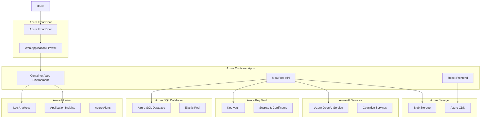

# Azure Deployment Guide

## Overview
Comprehensive guide for deploying the MealPrep AI-powered meal planning application to Microsoft Azure, covering infrastructure setup, security configuration, monitoring, scaling, and best practices for production deployment.

## Azure Architecture Overview

### High-Level Architecture


### Azure Services Used
```yaml
Compute Services:
  - Azure Container Apps (API hosting)
  - Azure Static Web Apps (Frontend hosting)
  
Data Services:
  - Azure SQL Database (Primary database)
  - Azure Blob Storage (File storage)
  - Azure Redis Cache (Caching layer)
  
AI/ML Services:
  - Azure OpenAI Service (AI meal suggestions)
  - Azure Cognitive Services (Image processing)
  
Security Services:
  - Azure Key Vault (Secrets management)
  - Azure Active Directory (Identity management)
  - Azure Web Application Firewall (Security)
  
Monitoring Services:
  - Azure Monitor (Logging and metrics)
  - Application Insights (APM)
  - Azure Log Analytics (Log aggregation)
  
Networking Services:
  - Azure Front Door (Global load balancing)
  - Azure CDN (Content delivery)
  - Azure Virtual Network (Network isolation)
```

---

## Prerequisites

### Required Tools
```bash
# Install Azure CLI
curl -sL https://aka.ms/InstallAzureCLIDeb | sudo bash

# Install Docker
sudo apt-get update
sudo apt-get install docker.io

# Install Bicep
az bicep install

# Verify installations
az version
docker --version
az bicep version
```

### Azure Subscription Setup
```bash
# Login to Azure
az login

# Set subscription (if multiple)
az account set --subscription "your-subscription-id"

# Verify current subscription
az account show
```

### Required Permissions
- **Subscription Contributor**: For resource creation and management
- **Azure AD Application Administrator**: For service principal creation
- **Key Vault Administrator**: For secrets management
- **SQL DB Contributor**: For database management

---

## Infrastructure as Code (Bicep)

### Main Bicep Template
```bicep
// main.bicep
@description('Environment name (dev, staging, prod)')
param environment string = 'dev'

@description('Location for all resources')
param location string = resourceGroup().location

@description('Application name prefix')
param appName string = 'mealprep'

@description('Container image for API')
param apiImageName string = 'mealprep/api:latest'

@description('Container image for frontend')
param webImageName string = 'mealprep/web:latest'

// Variables
var resourcePrefix = '${appName}-${environment}'
var tags = {
  Environment: environment
  Application: 'MealPrep'
  ManagedBy: 'Bicep'
}

// Key Vault
resource keyVault 'Microsoft.KeyVault/vaults@2023-07-01' = {
  name: '${resourcePrefix}-kv'
  location: location
  tags: tags
  properties: {
    sku: {
      family: 'A'
      name: 'standard'
    }
    tenantId: subscription().tenantId
    enabledForDeployment: true
    enabledForTemplateDeployment: true
    enabledForDiskEncryption: true
    enableRbacAuthorization: true
    enableSoftDelete: true
    softDeleteRetentionInDays: 7
    enablePurgeProtection: true
    networkAcls: {
      defaultAction: 'Deny'
      ipRules: []
      virtualNetworkRules: []
    }
  }
}

// Azure SQL Database
resource sqlServer 'Microsoft.Sql/servers@2023-05-01-preview' = {
  name: '${resourcePrefix}-sql'
  location: location
  tags: tags
  properties: {
    administratorLogin: 'mealprepadmin'
    administratorLoginPassword: '@Microsoft.KeyVault(SecretUri=${keyVault.properties.vaultUri}secrets/sql-admin-password)'
    version: '12.0'
    minimalTlsVersion: '1.2'
    publicNetworkAccess: 'Enabled'
  }
  
  resource database 'databases@2023-05-01-preview' = {
    name: '${resourcePrefix}-db'
    location: location
    tags: tags
    sku: {
      name: environment == 'prod' ? 'S2' : 'S1'
      tier: 'Standard'
    }
    properties: {
      collation: 'SQL_Latin1_General_CP1_CI_AS'
      maxSizeBytes: environment == 'prod' ? 268435456000 : 107374182400 // 250GB prod, 100GB dev
      requestedBackupStorageRedundancy: 'Geo'
    }
  }

  resource firewallRule 'firewallRules@2023-05-01-preview' = {
    name: 'AllowAzureServices'
    properties: {
      startIpAddress: '0.0.0.0'
      endIpAddress: '0.0.0.0'
    }
  }
}

// Application Insights
resource appInsights 'Microsoft.Insights/components@2020-02-02' = {
  name: '${resourcePrefix}-insights'
  location: location
  tags: tags
  kind: 'web'
  properties: {
    Application_Type: 'web'
    WorkspaceResourceId: logAnalytics.id
  }
}

// Log Analytics Workspace
resource logAnalytics 'Microsoft.OperationalInsights/workspaces@2023-09-01' = {
  name: '${resourcePrefix}-logs'
  location: location
  tags: tags
  properties: {
    sku: {
      name: 'PerGB2018'
    }
    retentionInDays: environment == 'prod' ? 90 : 30
    features: {
      searchVersion: 1
      legacy: 0
      enableLogAccessUsingOnlyResourcePermissions: true
    }
  }
}

// Container Apps Environment
resource containerAppsEnvironment 'Microsoft.App/managedEnvironments@2023-05-01' = {
  name: '${resourcePrefix}-env'
  location: location
  tags: tags
  properties: {
    appLogsConfiguration: {
      destination: 'log-analytics'
      logAnalyticsConfiguration: {
        customerId: logAnalytics.properties.customerId
        sharedKey: logAnalytics.listKeys().primarySharedKey
      }
    }
    zoneRedundant: environment == 'prod'
  }
}

// MealPrep API Container App
resource apiContainerApp 'Microsoft.App/containerApps@2023-05-01' = {
  name: '${resourcePrefix}-api'
  location: location
  tags: tags
  properties: {
    managedEnvironmentId: containerAppsEnvironment.id
    configuration: {
      activeRevisionsMode: 'Single'
      ingress: {
        external: true
        targetPort: 80
        allowInsecure: false
        traffic: [
          {
            weight: 100
            latestRevision: true
          }
        ]
      }
      secrets: [
        {
          name: 'connection-string'
          keyVaultUrl: '${keyVault.properties.vaultUri}secrets/sql-connection-string'
          identity: 'system'
        }
        {
          name: 'jwt-secret'
          keyVaultUrl: '${keyVault.properties.vaultUri}secrets/jwt-secret'
          identity: 'system'
        }
        {
          name: 'openai-key'
          keyVaultUrl: '${keyVault.properties.vaultUri}secrets/openai-api-key'
          identity: 'system'
        }
      ]
      registries: [
        {
          server: 'mealprep.azurecr.io'
          identity: 'system'
        }
      ]
    }
    template: {
      containers: [
        {
          image: apiImageName
          name: 'mealprep-api'
          env: [
            {
              name: 'ASPNETCORE_ENVIRONMENT'
              value: environment == 'prod' ? 'Production' : 'Development'
            }
            {
              name: 'ConnectionStrings__DefaultConnection'
              secretRef: 'connection-string'
            }
            {
              name: 'JWT__Secret'
              secretRef: 'jwt-secret'
            }
            {
              name: 'OpenAI__ApiKey'
              secretRef: 'openai-key'
            }
            {
              name: 'APPLICATIONINSIGHTS_CONNECTION_STRING'
              value: appInsights.properties.ConnectionString
            }
          ]
          resources: {
            cpu: environment == 'prod' ? 1.0 : 0.5
            memory: environment == 'prod' ? '2Gi' : '1Gi'
          }
          probes: [
            {
              type: 'Liveness'
              httpGet: {
                path: '/health'
                port: 80
              }
              initialDelaySeconds: 30
              periodSeconds: 10
            }
            {
              type: 'Readiness'
              httpGet: {
                path: '/health/ready'
                port: 80
              }
              initialDelaySeconds: 5
              periodSeconds: 5
            }
          ]
        }
      ]
      scale: {
        minReplicas: environment == 'prod' ? 2 : 1
        maxReplicas: environment == 'prod' ? 10 : 3
        rules: [
          {
            name: 'http-scaling-rule'
            http: {
              metadata: {
                concurrentRequests: '100'
              }
            }
          }
        ]
      }
    }
  }
  identity: {
    type: 'SystemAssigned'
  }
}

// Static Web App for Frontend
resource staticWebApp 'Microsoft.Web/staticSites@2023-01-01' = {
  name: '${resourcePrefix}-web'
  location: location
  tags: tags
  sku: {
    name: environment == 'prod' ? 'Standard' : 'Free'
    tier: environment == 'prod' ? 'Standard' : 'Free'
  }
  properties: {
    buildProperties: {
      appLocation: '/ClientApp'
      outputLocation: 'build'
    }
    stagingEnvironmentPolicy: 'Enabled'
  }
}

// Storage Account
resource storageAccount 'Microsoft.Storage/storageAccounts@2023-01-01' = {
  name: '${take(replace(resourcePrefix, '-', ''), 20)}st'
  location: location
  tags: tags
  sku: {
    name: environment == 'prod' ? 'Standard_GRS' : 'Standard_LRS'
  }
  kind: 'StorageV2'
  properties: {
    accessTier: 'Hot'
    allowBlobPublicAccess: false
    allowSharedKeyAccess: true
    defaultToOAuthAuthentication: true
    minimumTlsVersion: 'TLS1_2'
    networkAcls: {
      defaultAction: 'Allow'
    }
    supportsHttpsTrafficOnly: true
  }
  
  resource blobService 'blobServices@2023-01-01' = {
    name: 'default'
    
    resource recipeImagesContainer 'containers@2023-01-01' = {
      name: 'recipe-images'
      properties: {
        publicAccess: 'None'
      }
    }
  }
}

// Outputs
output apiUrl string = 'https://${apiContainerApp.properties.configuration.ingress.fqdn}'
output webUrl string = 'https://${staticWebApp.properties.defaultHostname}'
output keyVaultName string = keyVault.name
output databaseName string = sqlServer::database.name
```

### Parameters File
```json
// parameters.prod.json
{
  "$schema": "https://schema.management.azure.com/schemas/2019-04-01/deploymentParameters.json#",
  "contentVersion": "1.0.0.0",
  "parameters": {
    "environment": {
      "value": "prod"
    },
    "location": {
      "value": "East US 2"
    },
    "appName": {
      "value": "mealprep"
    },
    "apiImageName": {
      "value": "mealprep.azurecr.io/mealprep-api:latest"
    },
    "webImageName": {
      "value": "mealprep.azurecr.io/mealprep-web:latest"
    }
  }
}
```

---

## Deployment Pipeline

### GitHub Actions Workflow
```yaml
# .github/workflows/azure-deployment.yml
name: Deploy to Azure

on:
  push:
    branches: [main]
  pull_request:
    branches: [main]
  workflow_dispatch:
    inputs:
      environment:
        description: 'Environment to deploy to'
        required: true
        default: 'dev'
        type: choice
        options:
          - dev
          - staging
          - prod

env:
  AZURE_RESOURCE_GROUP: 'rg-mealprep-${{ github.event.inputs.environment || 'dev' }}'
  AZURE_LOCATION: 'East US 2'
  REGISTRY_NAME: 'mealprep.azurecr.io'

jobs:
  build:
    runs-on: ubuntu-latest
    outputs:
      api-image: ${{ steps.build-api.outputs.image }}
      web-image: ${{ steps.build-web.outputs.image }}
    
    steps:
    - name: Checkout
      uses: actions/checkout@v4

    - name: Setup .NET
      uses: actions/setup-dotnet@v4
      with:
        dotnet-version: '8.0.x'

    - name: Setup Node.js
      uses: actions/setup-node@v4
      with:
        node-version: '18'

    - name: Login to Azure
      uses: azure/login@v1
      with:
        creds: ${{ secrets.AZURE_CREDENTIALS }}

    - name: Login to Container Registry
      uses: azure/docker-login@v1
      with:
        login-server: ${{ env.REGISTRY_NAME }}
        username: ${{ secrets.REGISTRY_USERNAME }}
        password: ${{ secrets.REGISTRY_PASSWORD }}

    - name: Build and Test API
      run: |
        dotnet restore
        dotnet build --configuration Release --no-restore
        dotnet test --configuration Release --no-build --verbosity normal

    - name: Build and Test Frontend
      run: |
        cd ClientApp
        npm ci
        npm run build
        npm test -- --coverage --passWithNoTests

    - name: Build and Push API Image
      id: build-api
      run: |
        IMAGE_TAG="${{ env.REGISTRY_NAME }}/mealprep-api:${{ github.sha }}"
        docker build -t $IMAGE_TAG -f Dockerfile.api .
        docker push $IMAGE_TAG
        echo "image=$IMAGE_TAG" >> $GITHUB_OUTPUT

    - name: Build and Push Web Image
      id: build-web
      run: |
        IMAGE_TAG="${{ env.REGISTRY_NAME }}/mealprep-web:${{ github.sha }}"
        docker build -t $IMAGE_TAG -f Dockerfile.web ./ClientApp
        docker push $IMAGE_TAG
        echo "image=$IMAGE_TAG" >> $GITHUB_OUTPUT

  deploy-infrastructure:
    needs: build
    runs-on: ubuntu-latest
    environment: ${{ github.event.inputs.environment || 'dev' }}
    
    steps:
    - name: Checkout
      uses: actions/checkout@v4

    - name: Login to Azure
      uses: azure/login@v1
      with:
        creds: ${{ secrets.AZURE_CREDENTIALS }}

    - name: Create Resource Group
      run: |
        az group create \
          --name ${{ env.AZURE_RESOURCE_GROUP }} \
          --location "${{ env.AZURE_LOCATION }}"

    - name: Deploy Infrastructure
      run: |
        az deployment group create \
          --resource-group ${{ env.AZURE_RESOURCE_GROUP }} \
          --template-file infrastructure/main.bicep \
          --parameters @infrastructure/parameters.${{ github.event.inputs.environment || 'dev' }}.json \
          --parameters apiImageName=${{ needs.build.outputs.api-image }} \
          --parameters webImageName=${{ needs.build.outputs.web-image }}

  deploy-database:
    needs: [build, deploy-infrastructure]
    runs-on: ubuntu-latest
    environment: ${{ github.event.inputs.environment || 'dev' }}
    
    steps:
    - name: Checkout
      uses: actions/checkout@v4

    - name: Login to Azure
      uses: azure/login@v1
      with:
        creds: ${{ secrets.AZURE_CREDENTIALS }}

    - name: Get Database Connection String
      id: get-connection
      run: |
        CONNECTION_STRING=$(az keyvault secret show \
          --vault-name "mealprep-${{ github.event.inputs.environment || 'dev' }}-kv" \
          --name "sql-connection-string" \
          --query "value" -o tsv)
        echo "::add-mask::$CONNECTION_STRING"
        echo "connection-string=$CONNECTION_STRING" >> $GITHUB_OUTPUT

    - name: Run Database Migrations
      run: |
        dotnet tool install --global dotnet-ef
        dotnet ef database update --connection "${{ steps.get-connection.outputs.connection-string }}"

  deploy-application:
    needs: [build, deploy-infrastructure, deploy-database]
    runs-on: ubuntu-latest
    environment: ${{ github.event.inputs.environment || 'dev' }}
    
    steps:
    - name: Checkout
      uses: actions/checkout@v4

    - name: Login to Azure
      uses: azure/login@v1
      with:
        creds: ${{ secrets.AZURE_CREDENTIALS }}

    - name: Update Container App
      run: |
        az containerapp update \
          --name "mealprep-${{ github.event.inputs.environment || 'dev' }}-api" \
          --resource-group ${{ env.AZURE_RESOURCE_GROUP }} \
          --image ${{ needs.build.outputs.api-image }}

    - name: Deploy Frontend to Static Web App
      uses: Azure/static-web-apps-deploy@v1
      with:
        azure_static_web_apps_api_token: ${{ secrets.AZURE_STATIC_WEB_APPS_API_TOKEN }}
        repo_token: ${{ secrets.GITHUB_TOKEN }}
        action: "upload"
        app_location: "/ClientApp"
        output_location: "build"

  smoke-tests:
    needs: [deploy-application]
    runs-on: ubuntu-latest
    environment: ${{ github.event.inputs.environment || 'dev' }}
    
    steps:
    - name: Checkout
      uses: actions/checkout@v4

    - name: Get Deployment URLs
      id: get-urls
      run: |
        API_URL=$(az containerapp show \
          --name "mealprep-${{ github.event.inputs.environment || 'dev' }}-api" \
          --resource-group ${{ env.AZURE_RESOURCE_GROUP }} \
          --query "properties.configuration.ingress.fqdn" -o tsv)
        
        WEB_URL=$(az staticwebapp show \
          --name "mealprep-${{ github.event.inputs.environment || 'dev' }}-web" \
          --resource-group ${{ env.AZURE_RESOURCE_GROUP }} \
          --query "defaultHostname" -o tsv)
        
        echo "api-url=https://$API_URL" >> $GITHUB_OUTPUT
        echo "web-url=https://$WEB_URL" >> $GITHUB_OUTPUT

    - name: Run Smoke Tests
      run: |
        # API Health Check
        curl -f ${{ steps.get-urls.outputs.api-url }}/health || exit 1
        
        # Frontend Health Check
        curl -f ${{ steps.get-urls.outputs.web-url }} || exit 1
        
        echo "? Smoke tests passed"
        echo "API URL: ${{ steps.get-urls.outputs.api-url }}"
        echo "Web URL: ${{ steps.get-urls.outputs.web-url }}"
```

---

## Security Configuration

### Key Vault Secrets Setup
```bash
#!/bin/bash
# scripts/azure/setup-secrets.sh

ENVIRONMENT=${1:-dev}
RESOURCE_GROUP="rg-mealprep-$ENVIRONMENT"
KEY_VAULT_NAME="mealprep-$ENVIRONMENT-kv"

echo "Setting up secrets for $ENVIRONMENT environment..."

# SQL Admin Password
SQL_PASSWORD=$(openssl rand -base64 32)
az keyvault secret set \
  --vault-name $KEY_VAULT_NAME \
  --name "sql-admin-password" \
  --value "$SQL_PASSWORD"

# SQL Connection String
SQL_SERVER="mealprep-$ENVIRONMENT-sql.database.windows.net"
SQL_DATABASE="mealprep-$ENVIRONMENT-db"
CONNECTION_STRING="Server=tcp:$SQL_SERVER,1433;Initial Catalog=$SQL_DATABASE;Persist Security Info=False;User ID=mealprepadmin;Password=$SQL_PASSWORD;MultipleActiveResultSets=False;Encrypt=True;TrustServerCertificate=False;Connection Timeout=30;"

az keyvault secret set \
  --vault-name $KEY_VAULT_NAME \
  --name "sql-connection-string" \
  --value "$CONNECTION_STRING"

# JWT Secret
JWT_SECRET=$(openssl rand -base64 64)
az keyvault secret set \
  --vault-name $KEY_VAULT_NAME \
  --name "jwt-secret" \
  --value "$JWT_SECRET"

# OpenAI API Key (placeholder - set manually)
az keyvault secret set \
  --vault-name $KEY_VAULT_NAME \
  --name "openai-api-key" \
  --value "REPLACE_WITH_ACTUAL_OPENAI_KEY"

echo "? Secrets configured successfully"
echo "??  Remember to update the OpenAI API key manually"
```

### Managed Identity Configuration
```bash
# Grant Container App access to Key Vault
API_PRINCIPAL_ID=$(az containerapp show \
  --name "mealprep-$ENVIRONMENT-api" \
  --resource-group $RESOURCE_GROUP \
  --query "identity.principalId" -o tsv)

az keyvault set-policy \
  --name $KEY_VAULT_NAME \
  --object-id $API_PRINCIPAL_ID \
  --secret-permissions get list

# Grant Container App access to Storage Account
STORAGE_ACCOUNT="mealprep${ENVIRONMENT}st"
az role assignment create \
  --assignee $API_PRINCIPAL_ID \
  --role "Storage Blob Data Contributor" \
  --scope "/subscriptions/$(az account show --query id -o tsv)/resourceGroups/$RESOURCE_GROUP/providers/Microsoft.Storage/storageAccounts/$STORAGE_ACCOUNT"
```

---

## Monitoring and Observability

### Application Insights Configuration
```csharp
// Program.cs - Application Insights setup
builder.Services.AddApplicationInsightsTelemetry();
builder.Services.AddApplicationInsightsTelemetryProcessor<FilterTelemetryProcessor>();

// Custom telemetry processor
public class FilterTelemetryProcessor : ITelemetryProcessor
{
    private ITelemetryProcessor Next { get; set; }

    public FilterTelemetryProcessor(ITelemetryProcessor next)
    {
        Next = next;
    }

    public void Process(ITelemetry item)
    {
        // Filter out health check requests
        if (item is RequestTelemetry request && request.Url.AbsolutePath.Contains("/health"))
        {
            return;
        }

        // Add custom properties
        if (item is ISupportProperties telemetryWithProperties)
        {
            telemetryWithProperties.Properties["Environment"] = Environment.GetEnvironmentVariable("ASPNETCORE_ENVIRONMENT");
            telemetryWithProperties.Properties["Version"] = Assembly.GetExecutingAssembly().GetName().Version?.ToString();
        }

        Next.Process(item);
    }
}
```

### Azure Monitor Alerts
```json
// monitoring/alerts.json
{
  "$schema": "https://schema.management.azure.com/schemas/2019-04-01/deploymentTemplate.json#",
  "contentVersion": "1.0.0.0",
  "parameters": {
    "appName": {
      "type": "string"
    },
    "environment": {
      "type": "string"
    }
  },
  "variables": {
    "resourcePrefix": "[concat(parameters('appName'), '-', parameters('environment'))]"
  },
  "resources": [
    {
      "type": "Microsoft.Insights/metricAlerts",
      "apiVersion": "2018-03-01",
      "name": "[concat(variables('resourcePrefix'), '-high-response-time')]",
      "properties": {
        "description": "Alert when API response time is high",
        "severity": 2,
        "enabled": true,
        "scopes": [
          "[resourceId('Microsoft.App/containerApps', concat(variables('resourcePrefix'), '-api'))]"
        ],
        "evaluationFrequency": "PT1M",
        "windowSize": "PT5M",
        "criteria": {
          "odata.type": "Microsoft.Azure.Monitor.MultipleResourceMultipleMetricCriteria",
          "allOf": [
            {
              "name": "ResponseTime",
              "metricName": "RequestDuration",
              "operator": "GreaterThan",
              "threshold": 2000,
              "timeAggregation": "Average"
            }
          ]
        },
        "actions": [
          {
            "actionGroupId": "[resourceId('Microsoft.Insights/actionGroups', concat(variables('resourcePrefix'), '-alerts'))]"
          }
        ]
      }
    },
    {
      "type": "Microsoft.Insights/metricAlerts",
      "apiVersion": "2018-03-01",
      "name": "[concat(variables('resourcePrefix'), '-high-error-rate')]",
      "properties": {
        "description": "Alert when error rate is high",
        "severity": 1,
        "enabled": true,
        "scopes": [
          "[resourceId('Microsoft.App/containerApps', concat(variables('resourcePrefix'), '-api'))]"
        ],
        "evaluationFrequency": "PT1M",
        "windowSize": "PT5M",
        "criteria": {
          "odata.type": "Microsoft.Azure.Monitor.MultipleResourceMultipleMetricCriteria",
          "allOf": [
            {
              "name": "ErrorRate",
              "metricName": "RequestsPerSecond",
              "operator": "GreaterThan",
              "threshold": 5,
              "timeAggregation": "Count"
            }
          ]
        }
      }
    }
  ]
}
```

---

## Scaling and Performance

### Auto-scaling Configuration
```bicep
// Auto-scaling rules for Container Apps
scale: {
  minReplicas: environment == 'prod' ? 2 : 1
  maxReplicas: environment == 'prod' ? 20 : 5
  rules: [
    {
      name: 'http-scaling-rule'
      http: {
        metadata: {
          concurrentRequests: '100'
        }
      }
    }
    {
      name: 'cpu-scaling-rule'
      custom: {
        type: 'cpu'
        metadata: {
          type: 'Utilization'
          value: '70'
        }
      }
    }
    {
      name: 'memory-scaling-rule'
      custom: {
        type: 'memory'
        metadata: {
          type: 'Utilization'
          value: '80'
        }
      }
    }
  ]
}
```

### Database Performance Optimization
```sql
-- scripts/azure/database-optimization.sql

-- Enable Query Store for performance monitoring
ALTER DATABASE [mealprep-prod-db] SET QUERY_STORE = ON;
ALTER DATABASE [mealprep-prod-db] SET QUERY_STORE (
    OPERATION_MODE = READ_WRITE,
    CLEANUP_POLICY = (STALE_QUERY_THRESHOLD_DAYS = 30),
    DATA_FLUSH_INTERVAL_SECONDS = 900,
    INTERVAL_LENGTH_MINUTES = 60,
    MAX_STORAGE_SIZE_MB = 1000,
    QUERY_CAPTURE_MODE = AUTO,
    SIZE_BASED_CLEANUP_MODE = AUTO
);

-- Create indexes for common queries
CREATE NONCLUSTERED INDEX IX_Recipes_UserId_CreatedAt 
ON Recipes (UserId, CreatedAt DESC) 
INCLUDE (Name, Description, PrepTimeMinutes);

CREATE NONCLUSTERED INDEX IX_Recipes_Search
ON Recipes (Name, Description)
WHERE IsDeleted = 0;

-- Enable automatic tuning
ALTER DATABASE [mealprep-prod-db] SET AUTOMATIC_TUNING (FORCE_LAST_GOOD_PLAN = ON);
ALTER DATABASE [mealprep-prod-db] SET AUTOMATIC_TUNING (CREATE_INDEX = ON);
ALTER DATABASE [mealprep-prod-db] SET AUTOMATIC_TUNING (DROP_INDEX = ON);
```

---

## Backup and Disaster Recovery

### Database Backup Configuration
```bash
#!/bin/bash
# scripts/azure/setup-backup.sh

ENVIRONMENT=${1:-prod}
RESOURCE_GROUP="rg-mealprep-$ENVIRONMENT"
SQL_SERVER="mealprep-$ENVIRONMENT-sql"
DATABASE="mealprep-$ENVIRONMENT-db"
STORAGE_ACCOUNT="mealprep${ENVIRONMENT}backup"

# Configure automated backups
az sql db update \
  --resource-group $RESOURCE_GROUP \
  --server $SQL_SERVER \
  --name $DATABASE \
  --backup-storage-redundancy Geo

# Configure long-term retention
az sql db ltr-policy set \
  --resource-group $RESOURCE_GROUP \
  --server $SQL_SERVER \
  --database $DATABASE \
  --weekly-retention "P12W" \
  --monthly-retention "P12M" \
  --yearly-retention "P5Y" \
  --week-of-year 1

echo "? Database backup configured successfully"
```

### Container Registry Geo-replication
```bash
# Enable geo-replication for container registry
az acr replication create \
  --registry mealprep \
  --location "West US 2"

az acr replication create \
  --registry mealprep \
  --location "West Europe"
```

---

## Cost Optimization

### Cost Management Configuration
```bash
#!/bin/bash
# scripts/azure/setup-cost-management.sh

ENVIRONMENT=${1:-dev}
RESOURCE_GROUP="rg-mealprep-$ENVIRONMENT"

# Set up budget alerts
az consumption budget create \
  --resource-group $RESOURCE_GROUP \
  --budget-name "mealprep-$ENVIRONMENT-budget" \
  --amount 500 \
  --time-grain Monthly \
  --start-date "2024-01-01" \
  --end-date "2025-12-31" \
  --notifications alert1='{
    "enabled": true,
    "operator": "GreaterThan",
    "threshold": 80,
    "contactEmails": ["admin@mealprep.com"],
    "contactRoles": ["Owner", "Contributor"]
  }' \
  --notifications alert2='{
    "enabled": true,
    "operator": "GreaterThan", 
    "threshold": 100,
    "contactEmails": ["admin@mealprep.com"],
    "contactRoles": ["Owner", "Contributor"]
  }'

echo "? Cost management configured"
```

### Resource Optimization Recommendations
```yaml
Cost Optimization Strategies:
  Development Environment:
    - Use B-series burstable VMs for non-prod workloads
    - Implement auto-shutdown for development resources
    - Use Azure Dev/Test pricing for eligible resources
    
  Production Environment:
    - Use Reserved Instances for predictable workloads
    - Implement proper scaling policies to avoid over-provisioning
    - Use Azure Advisor recommendations for right-sizing
    
  Storage Optimization:
    - Use appropriate storage tiers (Hot/Cool/Archive)
    - Implement lifecycle management policies
    - Enable compression for blob storage
    
  Database Optimization:
    - Use SQL Database elastic pools for multiple databases
    - Implement proper indexing to reduce compute costs
    - Consider serverless tier for variable workloads
```

---

## Troubleshooting Common Issues

### Container App Deployment Issues
```bash
# Check container app logs
az containerapp logs show \
  --name "mealprep-prod-api" \
  --resource-group "rg-mealprep-prod" \
  --follow

# Check container app revisions
az containerapp revision list \
  --name "mealprep-prod-api" \
  --resource-group "rg-mealprep-prod"

# Restart container app
az containerapp revision restart \
  --name "mealprep-prod-api" \
  --resource-group "rg-mealprep-prod" \
  --revision-name "latest"
```

### Database Connection Issues
```bash
# Test database connectivity
az sql db show-connection-string \
  --server "mealprep-prod-sql" \
  --name "mealprep-prod-db" \
  --client ado.net

# Check firewall rules
az sql server firewall-rule list \
  --resource-group "rg-mealprep-prod" \
  --server "mealprep-prod-sql"

# Check SQL Server logs
az monitor activity-log list \
  --resource-group "rg-mealprep-prod" \
  --resource-id "/subscriptions/{subscription-id}/resourceGroups/rg-mealprep-prod/providers/Microsoft.Sql/servers/mealprep-prod-sql"
```

### Key Vault Access Issues
```bash
# Check managed identity permissions
az keyvault show \
  --name "mealprep-prod-kv" \
  --resource-group "rg-mealprep-prod"

# Test secret access
az keyvault secret show \
  --vault-name "mealprep-prod-kv" \
  --name "sql-connection-string"

# Update access policies
az keyvault set-policy \
  --name "mealprep-prod-kv" \
  --object-id "{managed-identity-object-id}" \
  --secret-permissions get list
```

---

## Maintenance and Updates

### Rolling Updates
```bash
#!/bin/bash
# scripts/azure/rolling-update.sh

ENVIRONMENT=${1:-prod}
NEW_IMAGE=${2}

if [ -z "$NEW_IMAGE" ]; then
  echo "Usage: $0 <environment> <new-image>"
  exit 1
fi

RESOURCE_GROUP="rg-mealprep-$ENVIRONMENT"
CONTAINER_APP="mealprep-$ENVIRONMENT-api"

echo "Performing rolling update for $ENVIRONMENT environment..."

# Update container app with new image
az containerapp update \
  --name $CONTAINER_APP \
  --resource-group $RESOURCE_GROUP \
  --image $NEW_IMAGE

# Monitor deployment
echo "Monitoring deployment..."
az containerapp revision show \
  --name $CONTAINER_APP \
  --resource-group $RESOURCE_GROUP \
  --revision latest

echo "? Rolling update completed"
```

### Database Maintenance
```sql
-- scripts/azure/database-maintenance.sql

-- Update database statistics
UPDATE STATISTICS [Recipes] WITH FULLSCAN;
UPDATE STATISTICS [Users] WITH FULLSCAN;
UPDATE STATISTICS [FamilyMembers] WITH FULLSCAN;

-- Rebuild fragmented indexes
DECLARE @sql NVARCHAR(MAX) = '';
SELECT @sql = @sql + 'ALTER INDEX ' + i.name + ' ON ' + OBJECT_NAME(i.object_id) + ' REBUILD;' + CHAR(13)
FROM sys.indexes i
INNER JOIN sys.dm_db_index_physical_stats(DB_ID(), NULL, NULL, NULL, 'LIMITED') ps 
    ON i.object_id = ps.object_id AND i.index_id = ps.index_id
WHERE ps.avg_fragmentation_in_percent > 30
    AND i.index_id > 0;

EXEC sp_executesql @sql;

-- Update query store statistics
EXEC sp_query_store_flush_db;
```

This comprehensive Azure deployment guide provides production-ready infrastructure setup, automated deployment pipelines, security configuration, monitoring, and maintenance procedures for the MealPrep application.

---

*Last Updated: December 2024*  
*Azure deployment guide continuously updated with best practices and new Azure features*