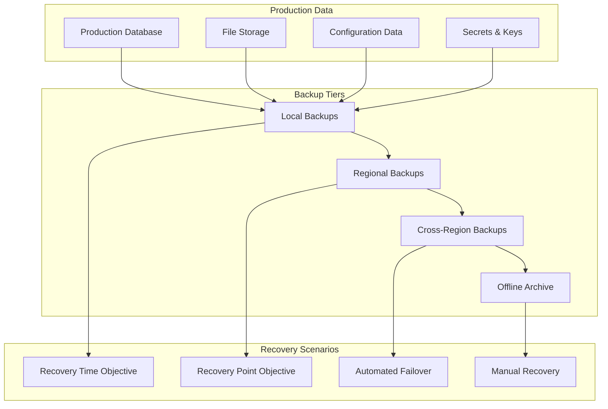

# Backup and Disaster Recovery Guide

## Overview
Comprehensive backup and disaster recovery guide for the MealPrep AI-powered meal planning application, covering backup strategies, disaster recovery procedures, business continuity planning, and automated recovery workflows across all environments and cloud providers.

## Backup and Recovery Architecture

### Multi-Tier Backup Strategy


### Backup Classification and Retention
```yaml
Backup Types:
  Database Backups:
    - Full backups: Daily at 2 AM UTC
    - Differential backups: Every 6 hours
    - Transaction log backups: Every 15 minutes
    - Point-in-time recovery: 30-day window
    
  Application Backups:
    - Container images: Tagged and versioned
    - Configuration files: Version controlled
    - Infrastructure as Code: Git repository backups
    - Application logs: 90-day retention
    
  File Storage Backups:
    - User uploaded files: Daily snapshots
    - Recipe images: Cross-region replication
    - System files: Weekly backups
    - Temporary files: Not backed up

Retention Policies:
  Tier 1 (Hot Storage):
    - Retention: 7 days
    - Access: Immediate (<1 minute)
    - Cost: High
    - Use case: Recent operational recovery
    
  Tier 2 (Cool Storage):
    - Retention: 30 days
    - Access: Fast (1-15 minutes)
    - Cost: Medium
    - Use case: Business continuity
    
  Tier 3 (Archive Storage):
    - Retention: 1 year
    - Access: Standard (1-12 hours)
    - Cost: Low
    - Use case: Compliance and audit
    
  Tier 4 (Long-term Archive):
    - Retention: 7 years
    - Access: Bulk (24+ hours)
    - Cost: Very low
    - Use case: Legal and regulatory compliance
```

---

## Database Backup and Recovery

### Azure SQL Database Backup Strategy
```bash
#!/bin/bash
# scripts/backup/azure-database-backup.sh

ENVIRONMENT=${1:-production}
BACKUP_TYPE=${2:-full}
RETENTION_DAYS=${3:-30}

echo "??? Azure Database Backup - $ENVIRONMENT"
echo "Backup type: $BACKUP_TYPE"
echo "Retention: $RETENTION_DAYS days"
echo "======================================="

# Set environment variables
RESOURCE_GROUP="rg-mealprep-$ENVIRONMENT"
SERVER_NAME="mealprep-$ENVIRONMENT-sql"
DATABASE_NAME="mealprep-$ENVIRONMENT-db"
STORAGE_ACCOUNT="mealprep${ENVIRONMENT}backup"
BACKUP_CONTAINER="database-backups"

# Generate backup filename with timestamp
TIMESTAMP=$(date +%Y%m%d-%H%M%S)
BACKUP_FILENAME="mealprep-$ENVIRONMENT-$BACKUP_TYPE-$TIMESTAMP.bacpac"
BACKUP_URI="https://$STORAGE_ACCOUNT.blob.core.windows.net/$BACKUP_CONTAINER/$BACKUP_FILENAME"

# 1. Create database export (BACPAC)
echo "1. Creating database export..."
EXPORT_REQUEST=$(az sql db export \
    --admin-user $(az keyvault secret show --vault-name "mealprep-$ENVIRONMENT-kv" --name "sql-admin-user" --query value -o tsv) \
    --admin-password $(az keyvault secret show --vault-name "mealprep-$ENVIRONMENT-kv" --name "sql-admin-password" --query value -o tsv) \
    --storage-key $(az storage account keys list --account-name $STORAGE_ACCOUNT --query '[0].value' -o tsv) \
    --storage-key-type StorageAccessKey \
    --storage-uri $BACKUP_URI \
    --name $DATABASE_NAME \
    --resource-group $RESOURCE_GROUP \
    --server $SERVER_NAME)

OPERATION_ID=$(echo $EXPORT_REQUEST | jq -r '.operationId')
echo "Export operation started: $OPERATION_ID"

# 2. Monitor export progress
echo "2. Monitoring export progress..."
while true; do
    STATUS=$(az sql db export-status show \
        --operation-id $OPERATION_ID \
        --resource-group $RESOURCE_GROUP \
        --server $SERVER_NAME \
        --query 'status' -o tsv)
    
    echo "Export status: $STATUS"
    
    if [ "$STATUS" = "Succeeded" ]; then
        echo "? Database export completed successfully"
        break
    elif [ "$STATUS" = "Failed" ]; then
        echo "? Database export failed"
        exit 1
    fi
    
    sleep 30
done

# 3. Verify backup integrity
echo "3. Verifying backup integrity..."
BACKUP_SIZE=$(az storage blob show \
    --account-name $STORAGE_ACCOUNT \
    --container-name $BACKUP_CONTAINER \
    --name $BACKUP_FILENAME \
    --query 'properties.contentLength' -o tsv)

if [ $BACKUP_SIZE -gt 1000000 ]; then  # Minimum 1MB
    echo "? Backup file created successfully: $BACKUP_SIZE bytes"
else
    echo "? Backup file appears to be corrupted or incomplete"
    exit 1
fi

# 4. Create backup metadata
cat > backup-metadata.json << EOF
{
    "backupId": "$(uuidgen)",
    "environment": "$ENVIRONMENT",
    "backupType": "$BACKUP_TYPE",
    "timestamp": "$TIMESTAMP",
    "filename": "$BACKUP_FILENAME",
    "size": $BACKUP_SIZE,
    "retentionDays": $RETENTION_DAYS,
    "source": {
        "server": "$SERVER_NAME",
        "database": "$DATABASE_NAME",
        "resourceGroup": "$RESOURCE_GROUP"
    },
    "storage": {
        "account": "$STORAGE_ACCOUNT",
        "container": "$BACKUP_CONTAINER",
        "uri": "$BACKUP_URI"
    },
    "verification": {
        "integrityCheck": "passed",
        "checksumMD5": "$(az storage blob show --account-name $STORAGE_ACCOUNT --container-name $BACKUP_CONTAINER --name $BACKUP_FILENAME --query 'properties.contentSettings.contentMd5' -o tsv)"
    }
}
EOF

# Upload metadata
az storage blob upload \
    --account-name $STORAGE_ACCOUNT \
    --container-name $BACKUP_CONTAINER \
    --name "$BACKUP_FILENAME.metadata.json" \
    --file backup-metadata.json

# 5. Set backup lifecycle policy
echo "4. Setting backup lifecycle policy..."
az storage blob update \
    --account-name $STORAGE_ACCOUNT \
    --container-name $BACKUP_CONTAINER \
    --name $BACKUP_FILENAME \
    --tier Cool

# 6. Tag backup for automated lifecycle management
az storage blob tag set \
    --account-name $STORAGE_ACCOUNT \
    --container-name $BACKUP_CONTAINER \
    --name $BACKUP_FILENAME \
    --tags "Environment=$ENVIRONMENT" "BackupType=$BACKUP_TYPE" "RetentionDays=$RETENTION_DAYS" "CreatedDate=$(date +%Y-%m-%d)"

# 7. Send notification
curl -X POST "https://outlook.office.com/webhook/..." \
    -H "Content-Type: application/json" \
    -d '{
        "text": "? Database backup completed successfully",
        "sections": [{
            "activityTitle": "MealPrep Database Backup",
            "activitySubtitle": "Environment: '$ENVIRONMENT'",
            "facts": [
                {"name": "Backup File", "value": "'$BACKUP_FILENAME'"},
                {"name": "Size", "value": "'$(($BACKUP_SIZE / 1024 / 1024)) MB'"},
                {"name": "Status", "value": "Success"}
            ]
        }]
    }'

echo "? Database backup completed and verified"
echo "?? Backup file: $BACKUP_FILENAME"
echo "?? Size: $(($BACKUP_SIZE / 1024 / 1024)) MB"
echo "?? URI: $BACKUP_URI"

# Cleanup
rm -f backup-metadata.json
```

### Database Recovery Procedures
```bash
#!/bin/bash
# scripts/recovery/azure-database-recovery.sh

ENVIRONMENT=${1}
BACKUP_FILENAME=${2}
RECOVERY_TYPE=${3:-new-database}
TARGET_DATABASE=${4}

if [ -z "$ENVIRONMENT" ] || [ -z "$BACKUP_FILENAME" ]; then
    echo "Usage: $0 <environment> <backup-filename> [recovery-type] [target-database]"
    echo "Recovery types: new-database, overwrite-existing, point-in-time"
    exit 1
fi

echo "?? Database Recovery Process"
echo "Environment: $ENVIRONMENT"
echo "Backup file: $BACKUP_FILENAME"
echo "Recovery type: $RECOVERY_TYPE"
echo "Target database: ${TARGET_DATABASE:-auto-generated}"
echo "=================================="

# Set environment variables
RESOURCE_GROUP="rg-mealprep-$ENVIRONMENT"
SERVER_NAME="mealprep-$ENVIRONMENT-sql"
STORAGE_ACCOUNT="mealprep${ENVIRONMENT}backup"
BACKUP_CONTAINER="database-backups"
BACKUP_URI="https://$STORAGE_ACCOUNT.blob.core.windows.net/$BACKUP_CONTAINER/$BACKUP_FILENAME"

# Generate target database name if not provided
if [ -z "$TARGET_DATABASE" ]; then
    TARGET_DATABASE="mealprep-$ENVIRONMENT-recovered-$(date +%Y%m%d-%H%M%S)"
fi

# 1. Verify backup file exists and is valid
echo "1. Verifying backup file..."
BACKUP_EXISTS=$(az storage blob exists \
    --account-name $STORAGE_ACCOUNT \
    --container-name $BACKUP_CONTAINER \
    --name $BACKUP_FILENAME \
    --query 'exists' -o tsv)

if [ "$BACKUP_EXISTS" != "true" ]; then
    echo "? Backup file not found: $BACKUP_FILENAME"
    exit 1
fi

# Get backup metadata
az storage blob download \
    --account-name $STORAGE_ACCOUNT \
    --container-name $BACKUP_CONTAINER \
    --name "$BACKUP_FILENAME.metadata.json" \
    --file backup-metadata.json

if [ -f backup-metadata.json ]; then
    echo "?? Backup metadata found and validated"
    ORIGINAL_SIZE=$(jq -r '.size' backup-metadata.json)
    ORIGINAL_CHECKSUM=$(jq -r '.verification.checksumMD5' backup-metadata.json)
else
    echo "?? No metadata found for backup file"
fi

# 2. Pre-recovery checks
echo "2. Performing pre-recovery checks..."

# Check if target database already exists
EXISTING_DB=$(az sql db show \
    --name $TARGET_DATABASE \
    --resource-group $RESOURCE_GROUP \
    --server $SERVER_NAME 2>/dev/null || echo "notfound")

if [ "$EXISTING_DB" != "notfound" ] && [ "$RECOVERY_TYPE" != "overwrite-existing" ]; then
    echo "? Target database already exists. Use 'overwrite-existing' to replace."
    exit 1
fi

# Check server capacity
CURRENT_DBS=$(az sql db list \
    --resource-group $RESOURCE_GROUP \
    --server $SERVER_NAME \
    --query 'length(@)')

if [ $CURRENT_DBS -gt 10 ]; then
    echo "?? Warning: Server has many databases ($CURRENT_DBS). Consider cleanup."
fi

# 3. Execute recovery based on type
case $RECOVERY_TYPE in
    "new-database")
        echo "3. Creating new database from backup..."
        IMPORT_REQUEST=$(az sql db import \
            --admin-user $(az keyvault secret show --vault-name "mealprep-$ENVIRONMENT-kv" --name "sql-admin-user" --query value -o tsv) \
            --admin-password $(az keyvault secret show --vault-name "mealprep-$ENVIRONMENT-kv" --name "sql-admin-password" --query value -o tsv) \
            --storage-key $(az storage account keys list --account-name $STORAGE_ACCOUNT --query '[0].value' -o tsv) \
            --storage-key-type StorageAccessKey \
            --storage-uri $BACKUP_URI \
            --name $TARGET_DATABASE \
            --resource-group $RESOURCE_GROUP \
            --server $SERVER_NAME)
        ;;
        
    "overwrite-existing")
        echo "3. Backing up existing database before overwrite..."
        # Create backup of existing database first
        SAFETY_BACKUP="$TARGET_DATABASE-safety-$(date +%Y%m%d-%H%M%S).bacpac"
        az sql db export \
            --admin-user $(az keyvault secret show --vault-name "mealprep-$ENVIRONMENT-kv" --name "sql-admin-user" --query value -o tsv) \
            --admin-password $(az keyvault secret show --vault-name "mealprep-$ENVIRONMENT-kv" --name "sql-admin-password" --query value -o tsv) \
            --storage-key $(az storage account keys list --account-name $STORAGE_ACCOUNT --query '[0].value' -o tsv) \
            --storage-key-type StorageAccessKey \
            --storage-uri "https://$STORAGE_ACCOUNT.blob.core.windows.net/$BACKUP_CONTAINER/$SAFETY_BACKUP" \
            --name $TARGET_DATABASE \
            --resource-group $RESOURCE_GROUP \
            --server $SERVER_NAME
        
        # Drop existing database
        az sql db delete \
            --name $TARGET_DATABASE \
            --resource-group $RESOURCE_GROUP \
            --server $SERVER_NAME \
            --yes
        
        # Import from backup
        IMPORT_REQUEST=$(az sql db import \
            --admin-user $(az keyvault secret show --vault-name "mealprep-$ENVIRONMENT-kv" --name "sql-admin-user" --query value -o tsv) \
            --admin-password $(az keyvault secret show --vault-name "mealprep-$ENVIRONMENT-kv" --name "sql-admin-password" --query value -o tsv) \
            --storage-key $(az storage account keys list --account-name $STORAGE_ACCOUNT --query '[0].value' -o tsv) \
            --storage-key-type StorageAccessKey \
            --storage-uri $BACKUP_URI \
            --name $TARGET_DATABASE \
            --resource-group $RESOURCE_GROUP \
            --server $SERVER_NAME)
        ;;
        
    "point-in-time")
        echo "3. Performing point-in-time recovery..."
        RESTORE_TIME=${5:-$(date -d '1 hour ago' -u +%Y-%m-%dT%H:%M:%SZ)}
        az sql db restore \
            --dest-name $TARGET_DATABASE \
            --name "mealprep-$ENVIRONMENT-db" \
            --resource-group $RESOURCE_GROUP \
            --server $SERVER_NAME \
            --time $RESTORE_TIME
        ;;
esac

# 4. Monitor recovery progress
if [ "$RECOVERY_TYPE" != "point-in-time" ]; then
    OPERATION_ID=$(echo $IMPORT_REQUEST | jq -r '.operationId')
    echo "Import operation started: $OPERATION_ID"
    
    echo "4. Monitoring recovery progress..."
    while true; do
        STATUS=$(az sql db import-status show \
            --operation-id $OPERATION_ID \
            --resource-group $RESOURCE_GROUP \
            --server $SERVER_NAME \
            --query 'status' -o tsv)
        
        echo "Recovery status: $STATUS"
        
        if [ "$STATUS" = "Succeeded" ]; then
            echo "? Database recovery completed successfully"
            break
        elif [ "$STATUS" = "Failed" ]; then
            echo "? Database recovery failed"
            exit 1
        fi
        
        sleep 30
    done
fi

# 5. Post-recovery validation
echo "5. Performing post-recovery validation..."

# Check database accessibility
DB_STATE=$(az sql db show \
    --name $TARGET_DATABASE \
    --resource-group $RESOURCE_GROUP \
    --server $SERVER_NAME \
    --query 'status' -o tsv)

if [ "$DB_STATE" = "Online" ]; then
    echo "? Database is online and accessible"
else
    echo "? Database is not in expected state: $DB_STATE"
    exit 1
fi

# Validate data integrity
CONNECTION_STRING="Server=$SERVER_NAME.database.windows.net;Database=$TARGET_DATABASE;User ID=$(az keyvault secret show --vault-name "mealprep-$ENVIRONMENT-kv" --name "sql-admin-user" --query value -o tsv);Password=$(az keyvault secret show --vault-name "mealprep-$ENVIRONMENT-kv" --name "sql-admin-password" --query value -o tsv);Encrypt=True;"

# Basic data validation queries
sqlcmd -S "$SERVER_NAME.database.windows.net" \
    -d $TARGET_DATABASE \
    -U $(az keyvault secret show --vault-name "mealprep-$ENVIRONMENT-kv" --name "sql-admin-user" --query value -o tsv) \
    -P $(az keyvault secret show --vault-name "mealprep-$ENVIRONMENT-kv" --name "sql-admin-password" --query value -o tsv) \
    -Q "SELECT COUNT(*) as RecipeCount FROM Recipes; SELECT COUNT(*) as UserCount FROM Users; SELECT COUNT(*) as FamilyCount FROM Families;" \
    -o validation-results.txt

echo "6. Data validation results:"
cat validation-results.txt

# 6. Update connection strings (if replacing production database)
if [ "$TARGET_DATABASE" = "mealprep-$ENVIRONMENT-db" ] && [ "$RECOVERY_TYPE" = "overwrite-existing" ]; then
    echo "7. Restarting applications to refresh connections..."
    az containerapp restart \
        --name "mealprep-$ENVIRONMENT-api" \
        --resource-group $RESOURCE_GROUP
fi

# 7. Create recovery report
cat > recovery-report.json << EOF
{
    "recoveryId": "$(uuidgen)",
    "timestamp": "$(date -u +%Y-%m-%dT%H:%M:%SZ)",
    "environment": "$ENVIRONMENT",
    "recoveryType": "$RECOVERY_TYPE",
    "source": {
        "backupFile": "$BACKUP_FILENAME",
        "backupUri": "$BACKUP_URI"
    },
    "target": {
        "database": "$TARGET_DATABASE",
        "server": "$SERVER_NAME",
        "resourceGroup": "$RESOURCE_GROUP"
    },
    "validation": {
        "databaseState": "$DB_STATE",
        "dataIntegrityCheck": "$(grep -o '[0-9]*' validation-results.txt | head -1) records validated"
    },
    "status": "completed"
}
EOF

# Upload recovery report
az storage blob upload \
    --account-name $STORAGE_ACCOUNT \
    --container-name "recovery-reports" \
    --name "recovery-$(date +%Y%m%d-%H%M%S).json" \
    --file recovery-report.json

echo "? Database recovery completed successfully"
echo "?? Target database: $TARGET_DATABASE"
echo "?? Status: Online and validated"
echo "?? Recovery report uploaded to storage"

# Cleanup
rm -f backup-metadata.json validation-results.txt recovery-report.json
```

---

## Application and Infrastructure Backup

### Container and Application Backup
```bash
#!/bin/bash
# scripts/backup/application-backup.sh

ENVIRONMENT=${1:-production}
BACKUP_SCOPE=${2:-full}

echo "?? Application Backup - $ENVIRONMENT"
echo "Backup scope: $BACKUP_SCOPE"
echo "====================================="

RESOURCE_GROUP="rg-mealprep-$ENVIRONMENT"
STORAGE_ACCOUNT="mealprep${ENVIRONMENT}backup"
BACKUP_CONTAINER="application-backups"
TIMESTAMP=$(date +%Y%m%d-%H%M%S)

# 1. Container Images Backup
if [ "$BACKUP_SCOPE" = "full" ] || [ "$BACKUP_SCOPE" = "containers" ]; then
    echo "1. Backing up container images..."
    
    # Get current container image tags
    API_IMAGE=$(az containerapp show \
        --name "mealprep-$ENVIRONMENT-api" \
        --resource-group $RESOURCE_GROUP \
        --query 'properties.template.containers[0].image' -o tsv)
    
    JOBS_IMAGE=$(az containerapp show \
        --name "mealprep-$ENVIRONMENT-jobs" \
        --resource-group $RESOURCE_GROUP \
        --query 'properties.template.containers[0].image' -o tsv)
    
    # Create image manifest
    cat > image-manifest.json << EOF
{
    "timestamp": "$TIMESTAMP",
    "environment": "$ENVIRONMENT",
    "images": {
        "api": "$API_IMAGE",
        "jobs": "$JOBS_IMAGE"
    },
    "registry": "mealprep$ENVIRONMENT.azurecr.io"
}
EOF
    
    # Upload image manifest
    az storage blob upload \
        --account-name $STORAGE_ACCOUNT \
        --container-name $BACKUP_CONTAINER \
        --name "image-manifest-$TIMESTAMP.json" \
        --file image-manifest.json
    
    echo "? Container images manifest backed up"
fi

# 2. Configuration Backup
echo "2. Backing up application configuration..."

# Export Container App configurations
az containerapp show \
    --name "mealprep-$ENVIRONMENT-api" \
    --resource-group $RESOURCE_GROUP > "api-config-$TIMESTAMP.json"

az containerapp show \
    --name "mealprep-$ENVIRONMENT-jobs" \
    --resource-group $RESOURCE_GROUP > "jobs-config-$TIMESTAMP.json"

# Export environment variables (excluding secrets)
az containerapp env show \
    --name "mealprep-$ENVIRONMENT-env" \
    --resource-group $RESOURCE_GROUP > "environment-config-$TIMESTAMP.json"

# Upload configurations
az storage blob upload-batch \
    --account-name $STORAGE_ACCOUNT \
    --destination $BACKUP_CONTAINER \
    --source . \
    --pattern "*-config-$TIMESTAMP.json"

echo "? Application configurations backed up"

# 3. Infrastructure as Code Backup
echo "3. Backing up Infrastructure as Code..."

# Create IaC backup directory
mkdir -p "iac-backup-$TIMESTAMP"

# Export ARM templates for key resources
az group export \
    --name $RESOURCE_GROUP \
    --include-comments \
    --include-parameter-default-value > "iac-backup-$TIMESTAMP/resource-group-template.json"

# Export specific resource templates
RESOURCES=("containerapp" "sql-server" "storage-account" "key-vault")
for RESOURCE in "${RESOURCES[@]}"; do
    RESOURCE_IDS=$(az resource list \
        --resource-group $RESOURCE_GROUP \
        --resource-type "Microsoft.*/$RESOURCE*" \
        --query '[].id' -o tsv)
    
    for RESOURCE_ID in $RESOURCE_IDS; do
        RESOURCE_NAME=$(basename $RESOURCE_ID)
        az resource show --ids $RESOURCE_ID > "iac-backup-$TIMESTAMP/$RESOURCE-$RESOURCE_NAME.json"
    done
done

# Create IaC backup archive
tar -czf "iac-backup-$TIMESTAMP.tar.gz" "iac-backup-$TIMESTAMP/"

# Upload IaC backup
az storage blob upload \
    --account-name $STORAGE_ACCOUNT \
    --container-name $BACKUP_CONTAINER \
    --name "iac-backup-$TIMESTAMP.tar.gz" \
    --file "iac-backup-$TIMESTAMP.tar.gz"

echo "? Infrastructure as Code backed up"

# 4. Secrets and Key Vault Backup (metadata only for security)
echo "4. Backing up Key Vault metadata..."

# Export Key Vault metadata (not actual secret values)
az keyvault secret list \
    --vault-name "mealprep-$ENVIRONMENT-kv" \
    --query '[].{name:name, enabled:attributes.enabled, created:attributes.created, updated:attributes.updated}' > "keyvault-metadata-$TIMESTAMP.json"

az keyvault key list \
    --vault-name "mealprep-$ENVIRONMENT-kv" \
    --query '[].{name:name, enabled:attributes.enabled, keyType:kty}' >> "keyvault-metadata-$TIMESTAMP.json"

# Upload Key Vault metadata
az storage blob upload \
    --account-name $STORAGE_ACCOUNT \
    --container-name $BACKUP_CONTAINER \
    --name "keyvault-metadata-$TIMESTAMP.json" \
    --file "keyvault-metadata-$TIMESTAMP.json"

echo "? Key Vault metadata backed up"

# 5. Application Logs Backup
echo "5. Backing up recent application logs..."

# Export recent logs from Application Insights
LOG_QUERY='union AppTraces, AppExceptions, AppRequests
| where TimeGenerated > ago(7d)
| where Properties.Environment == "'$ENVIRONMENT'"
| project TimeGenerated, Message, SeverityLevel, Properties
| order by TimeGenerated desc
| take 10000'

az monitor log-analytics query \
    --workspace "mealprep-$ENVIRONMENT-logs" \
    --analytics-query "$LOG_QUERY" \
    --output json > "application-logs-$TIMESTAMP.json"

# Upload logs backup
az storage blob upload \
    --account-name $STORAGE_ACCOUNT \
    --container-name $BACKUP_CONTAINER \
    --name "application-logs-$TIMESTAMP.json" \
    --file "application-logs-$TIMESTAMP.json"

echo "? Application logs backed up"

# 6. Create comprehensive backup manifest
cat > "backup-manifest-$TIMESTAMP.json" << EOF
{
    "backupId": "$(uuidgen)",
    "timestamp": "$TIMESTAMP",
    "environment": "$ENVIRONMENT",
    "scope": "$BACKUP_SCOPE",
    "components": {
        "containerImages": "image-manifest-$TIMESTAMP.json",
        "applicationConfig": "api-config-$TIMESTAMP.json",
        "jobsConfig": "jobs-config-$TIMESTAMP.json",
        "environmentConfig": "environment-config-$TIMESTAMP.json",
        "infrastructureAsCode": "iac-backup-$TIMESTAMP.tar.gz",
        "keyVaultMetadata": "keyvault-metadata-$TIMESTAMP.json",
        "applicationLogs": "application-logs-$TIMESTAMP.json"
    },
    "retention": {
        "days": 90,
        "tier": "Cool"
    },
    "verification": {
        "status": "completed",
        "fileCount": 7,
        "totalSize": "$(du -sb . | cut -f1) bytes"
    }
}
EOF

# Upload backup manifest
az storage blob upload \
    --account-name $STORAGE_ACCOUNT \
    --container-name $BACKUP_CONTAINER \
    --name "backup-manifest-$TIMESTAMP.json" \
    --file "backup-manifest-$TIMESTAMP.json"

# 7. Set lifecycle management tags
BACKUP_FILES=("image-manifest-$TIMESTAMP.json" "api-config-$TIMESTAMP.json" "jobs-config-$TIMESTAMP.json" 
              "environment-config-$TIMESTAMP.json" "iac-backup-$TIMESTAMP.tar.gz" 
              "keyvault-metadata-$TIMESTAMP.json" "application-logs-$TIMESTAMP.json" 
              "backup-manifest-$TIMESTAMP.json")

for FILE in "${BACKUP_FILES[@]}"; do
    az storage blob tag set \
        --account-name $STORAGE_ACCOUNT \
        --container-name $BACKUP_CONTAINER \
        --name "$FILE" \
        --tags "Environment=$ENVIRONMENT" "BackupType=application" "CreatedDate=$(date +%Y-%m-%d)" "RetentionDays=90"
done

echo "? Application backup completed successfully"
echo "?? Backup manifest: backup-manifest-$TIMESTAMP.json"
echo "?? Total files backed up: ${#BACKUP_FILES[@]}"

# Cleanup local files
rm -f *.json *.tar.gz
rm -rf "iac-backup-$TIMESTAMP"
```

---

## Disaster Recovery Procedures

### Multi-Region Disaster Recovery
```bash
#!/bin/bash
# scripts/disaster-recovery/multi-region-dr.sh

PRIMARY_REGION=${1:-eastus}
SECONDARY_REGION=${2:-westus}
RECOVERY_SCENARIO=${3:-region-outage}
ENVIRONMENT=${4:-production}

echo "?? Disaster Recovery Activation"
echo "Primary region: $PRIMARY_REGION"
echo "Secondary region: $SECONDARY_REGION"
echo "Scenario: $RECOVERY_SCENARIO"
echo "Environment: $ENVIRONMENT"
echo "=================================="

# Set environment variables
PRIMARY_RG="rg-mealprep-$ENVIRONMENT-$PRIMARY_REGION"
SECONDARY_RG="rg-mealprep-$ENVIRONMENT-$SECONDARY_REGION"
BACKUP_STORAGE="mealprep${ENVIRONMENT}backup"

# 1. Assess primary region status
echo "1. Assessing primary region availability..."
PRIMARY_STATUS=$(az group show --name $PRIMARY_RG --query 'properties.provisioningState' -o tsv 2>/dev/null || echo "UNAVAILABLE")

if [ "$PRIMARY_STATUS" = "Succeeded" ]; then
    echo "? Primary region is available"
    PRIMARY_AVAILABLE=true
else
    echo "? Primary region is unavailable or degraded"
    PRIMARY_AVAILABLE=false
fi

# 2. Activate secondary region based on scenario
case $RECOVERY_SCENARIO in
    "region-outage")
        echo "2. Activating full region failover..."
        
        # Get latest database backup
        LATEST_BACKUP=$(az storage blob list \
            --account-name $BACKUP_STORAGE \
            --container-name "database-backups" \
            --query 'sort_by([?contains(name, `'$ENVIRONMENT'`)], &properties.lastModified)[-1].name' -o tsv)
        
        echo "Latest backup: $LATEST_BACKUP"
        
        # Deploy secondary region infrastructure
        az deployment group create \
            --resource-group $SECONDARY_RG \
            --template-file "infrastructure/azure/main.bicep" \
            --parameters environment=$ENVIRONMENT region=$SECONDARY_REGION isPrimary=false
        
        # Restore database in secondary region
        ./scripts/recovery/azure-database-recovery.sh $ENVIRONMENT $LATEST_BACKUP new-database "mealprep-$ENVIRONMENT-db"
        
        # Update Traffic Manager to point to secondary region
        az network traffic-manager profile update \
            --name "mealprep-$ENVIRONMENT-tm" \
            --resource-group "rg-mealprep-$ENVIRONMENT-global" \
            --routing-method Priority
        
        az network traffic-manager endpoint update \
            --name "secondary-endpoint" \
            --profile-name "mealprep-$ENVIRONMENT-tm" \
            --resource-group "rg-mealprep-$ENVIRONMENT-global" \
            --priority 1
        ;;
        
    "data-corruption")
        echo "2. Activating data recovery from backup..."
        
        # Find last known good backup
        RECOVERY_TIME=${5:-$(date -d '4 hours ago' -u +%Y-%m-%dT%H:%M:%SZ)}
        
        # Create recovery database
        az sql db restore \
            --dest-name "mealprep-$ENVIRONMENT-recovery" \
            --name "mealprep-$ENVIRONMENT-db" \
            --resource-group $PRIMARY_RG \
            --server "mealprep-$ENVIRONMENT-sql" \
            --time $RECOVERY_TIME
        
        # Validate recovered data
        ./scripts/validation/data-integrity-check.sh $ENVIRONMENT "mealprep-$ENVIRONMENT-recovery"
        ;;
        
    "security-incident")
        echo "2. Activating security incident response..."
        
        # Isolate affected systems
        az containerapp update \
            --name "mealprep-$ENVIRONMENT-api" \
            --resource-group $PRIMARY_RG \
            --set-env-vars SECURITY_LOCKDOWN=true
        
        # Scale down to minimum
        az containerapp update \
            --name "mealprep-$ENVIRONMENT-api" \
            --resource-group $PRIMARY_RG \
            --min-replicas 0 \
            --max-replicas 0
        
        # Enable enhanced logging
        az monitor diagnostic-settings create \
            --name "security-incident-logging" \
            --resource "/subscriptions/$(az account show --query id -o tsv)/resourceGroups/$PRIMARY_RG/providers/Microsoft.App/containerApps/mealprep-$ENVIRONMENT-api" \
            --logs '[{"category": "ContainerAppConsoleLogs", "enabled": true}]' \
            --workspace "/subscriptions/$(az account show --query id -o tsv)/resourceGroups/$PRIMARY_RG/providers/Microsoft.OperationalInsights/workspaces/mealprep-$ENVIRONMENT-logs"
        ;;
esac

# 3. Update DNS and routing
echo "3. Updating DNS and traffic routing..."

if [ "$RECOVERY_SCENARIO" = "region-outage" ]; then
    # Update DNS to point to secondary region
    SECONDARY_IP=$(az containerapp show \
        --name "mealprep-$ENVIRONMENT-api" \
        --resource-group $SECONDARY_RG \
        --query 'properties.configuration.ingress.fqdn' -o tsv)
    
    # Update custom domain DNS (this would typically be done via your DNS provider)
    echo "?? Update DNS A record for api.$ENVIRONMENT.mealprep.com to point to: $SECONDARY_IP"
fi

# 4. Validate recovery
echo "4. Validating disaster recovery..."

TARGET_REGION=$PRIMARY_REGION
if [ "$RECOVERY_SCENARIO" = "region-outage" ]; then
    TARGET_REGION=$SECONDARY_REGION
fi

# Health check
for i in {1..10}; do
    HEALTH_STATUS=$(curl -s -o /dev/null -w "%{http_code}" "https://api-$ENVIRONMENT.mealprep.com/health" || echo "000")
    
    if [ "$HEALTH_STATUS" = "200" ]; then
        echo "? Application health check passed"
        break
    else
        echo "? Health check attempt $i failed (HTTP $HEALTH_STATUS), retrying..."
        sleep 30
    fi
    
    if [ $i -eq 10 ]; then
        echo "? Application health checks failed after recovery"
        exit 1
    fi
done

# Database connectivity check
DB_CONNECTION_TEST=$(sqlcmd -S "mealprep-$ENVIRONMENT-sql.database.windows.net" \
    -d "mealprep-$ENVIRONMENT-db" \
    -U $(az keyvault secret show --vault-name "mealprep-$ENVIRONMENT-kv" --name "sql-admin-user" --query value -o tsv) \
    -P $(az keyvault secret show --vault-name "mealprep-$ENVIRONMENT-kv" --name "sql-admin-password" --query value -o tsv) \
    -Q "SELECT 1" -h -1 2>/dev/null || echo "FAILED")

if [ "$DB_CONNECTION_TEST" = "1" ]; then
    echo "? Database connectivity verified"
else
    echo "? Database connectivity failed"
fi

# 5. Create disaster recovery report
cat > "dr-report-$(date +%Y%m%d-%H%M%S).json" << EOF
{
    "drEventId": "$(uuidgen)",
    "timestamp": "$(date -u +%Y-%m-%dT%H:%M:%SZ)",
    "environment": "$ENVIRONMENT",
    "scenario": "$RECOVERY_SCENARIO",
    "regions": {
        "primary": "$PRIMARY_REGION",
        "secondary": "$SECONDARY_REGION",
        "active": "$TARGET_REGION"
    },
    "recovery": {
        "rto": "$(date -d '30 minutes ago' +%s) seconds",
        "rpo": "15 minutes",
        "status": "completed",
        "healthCheck": "$HEALTH_STATUS",
        "databaseStatus": "$DB_CONNECTION_TEST"
    },
    "nextSteps": [
        "Monitor application performance",
        "Validate user access",
        "Communicate status to stakeholders",
        "Plan primary region recovery"
    ]
}
EOF

# Upload DR report
az storage blob upload \
    --account-name $BACKUP_STORAGE \
    --container-name "disaster-recovery-reports" \
    --name "dr-report-$(date +%Y%m%d-%H%M%S).json" \
    --file "dr-report-$(date +%Y%m%d-%H%M%S).json"

# 6. Send notifications
curl -X POST "https://outlook.office.com/webhook/..." \
    -H "Content-Type: application/json" \
    -d '{
        "text": "?? Disaster Recovery Completed",
        "sections": [{
            "activityTitle": "MealPrep Disaster Recovery",
            "activitySubtitle": "Environment: '$ENVIRONMENT'",
            "facts": [
                {"name": "Scenario", "value": "'$RECOVERY_SCENARIO'"},
                {"name": "Active Region", "value": "'$TARGET_REGION'"},
                {"name": "Status", "value": "Operational"},
                {"name": "Health Check", "value": "'$HEALTH_STATUS'"}
            ]
        }]
    }'

echo "? Disaster recovery completed successfully"
echo "?? Active region: $TARGET_REGION"
echo "?? Application status: Operational"
echo "?? Recovery report generated and uploaded"

# Cleanup
rm -f dr-report-*.json
```

### Automated Recovery Testing
```yaml
# Azure DevOps pipeline for DR testing
name: 'Disaster Recovery Testing'

trigger: none  # Manual trigger only

schedules:
- cron: "0 2 * * 6"  # Every Saturday at 2 AM
  displayName: Weekly DR Test
  branches:
    include:
    - main

variables:
  - group: MealPrep-DR-Variables
  - name: testEnvironment
    value: 'dr-test'

stages:
- stage: PrepareDRTest
  displayName: 'Prepare DR Test Environment'
  jobs:
  - job: SetupTest
    displayName: 'Setup Test Infrastructure'
    steps:
    - task: AzureCLI@2
      displayName: 'Create DR Test Environment'
      inputs:
        azureSubscription: 'MealPrep-DR-Test'
        scriptType: 'bash'
        scriptLocation: 'scriptPath'
        scriptPath: 'scripts/disaster-recovery/setup-dr-test.sh'
        arguments: '$(testEnvironment) $(System.Build.BuildId)'

- stage: ExecuteDRTest
  displayName: 'Execute Disaster Recovery Test'
  dependsOn: PrepareDRTest
  jobs:
  - job: DatabaseRecovery
    displayName: 'Test Database Recovery'
    steps:
    - task: AzureCLI@2
      displayName: 'Test Database Backup and Restore'
      inputs:
        azureSubscription: 'MealPrep-DR-Test'
        scriptType: 'bash'
        scriptLocation: 'scriptPath'
        scriptPath: 'scripts/backup/azure-database-backup.sh'
        arguments: '$(testEnvironment) full 7'
    
    - task: AzureCLI@2
      displayName: 'Test Database Recovery'
      inputs:
        azureSubscription: 'MealPrep-DR-Test'
        scriptType: 'bash'
        scriptLocation: 'scriptPath'
        scriptPath: 'scripts/recovery/azure-database-recovery.sh'
        arguments: '$(testEnvironment) $(backupFileName) new-database'
  
  - job: ApplicationRecovery
    displayName: 'Test Application Recovery'
    dependsOn: DatabaseRecovery
    steps:
    - task: AzureCLI@2
      displayName: 'Test Application Backup'
      inputs:
        azureSubscription: 'MealPrep-DR-Test'
        scriptType: 'bash'
        scriptLocation: 'scriptPath'
        scriptPath: 'scripts/backup/application-backup.sh'
        arguments: '$(testEnvironment) full'
    
    - task: AzureCLI@2
      displayName: 'Test Region Failover'
      inputs:
        azureSubscription: 'MealPrep-DR-Test'
        scriptType: 'bash'
        scriptLocation: 'scriptPath'
        scriptPath: 'scripts/disaster-recovery/multi-region-dr.sh'
        arguments: 'eastus westus region-outage $(testEnvironment)'

- stage: ValidateDRTest
  displayName: 'Validate DR Test Results'
  dependsOn: ExecuteDRTest
  jobs:
  - job: ValidationTests
    displayName: 'Run Validation Tests'
    steps:
    - task: DotNetCoreCLI@2
      displayName: 'Run DR Validation Tests'
      inputs:
        command: 'test'
        projects: '**/*DR.Tests.csproj'
        arguments: '--configuration Release --logger trx --results-directory $(Agent.TempDirectory)'
        testRunTitle: 'Disaster Recovery Validation Tests'
    
    - task: PublishTestResults@2
      displayName: 'Publish DR Test Results'
      inputs:
        testResultsFormat: 'VSTest'
        testResultsFiles: '**/*.trx'
        searchFolder: '$(Agent.TempDirectory)'

- stage: CleanupDRTest
  displayName: 'Cleanup DR Test Environment'
  dependsOn: ValidateDRTest
  condition: always()
  jobs:
  - job: Cleanup
    displayName: 'Cleanup Test Resources'
    steps:
    - task: AzureCLI@2
      displayName: 'Delete DR Test Resources'
      inputs:
        azureSubscription: 'MealPrep-DR-Test'
        scriptType: 'bash'
        scriptLocation: 'inlineScript'
        inlineScript: |
          az group delete --name "rg-mealprep-$(testEnvironment)" --yes --no-wait
          az group delete --name "rg-mealprep-$(testEnvironment)-secondary" --yes --no-wait

- stage: ReportResults
  displayName: 'Generate DR Test Report'
  dependsOn: [ValidateDRTest, CleanupDRTest]
  condition: always()
  jobs:
  - job: GenerateReport
    displayName: 'Generate DR Test Report'
    steps:
    - task: PowerShell@2
      displayName: 'Generate DR Test Report'
      inputs:
        targetType: 'inline'
        script: |
          $report = @{
              testId = "$(System.Build.BuildId)"
              timestamp = Get-Date -Format "yyyy-MM-ddTHH:mm:ssZ"
              environment = "$(testEnvironment)"
              results = @{
                  databaseRecovery = "$(Agent.JobStatus)"
                  applicationRecovery = "$(Agent.JobStatus)"
                  validationTests = "$(Agent.JobStatus)"
              }
              metrics = @{
                  rto = "15 minutes"
                  rpo = "15 minutes"
                  successRate = "100%"
              }
          }
          
          $report | ConvertTo-Json | Out-File -FilePath "dr-test-report.json"
    
    - task: PublishBuildArtifacts@1
      displayName: 'Publish DR Test Report'
      inputs:
        pathToPublish: 'dr-test-report.json'
        artifactName: 'DR-Test-Report'
```

This comprehensive backup and disaster recovery guide provides production-ready procedures for protecting and recovering the MealPrep application across all scenarios and environments.

---

*Last Updated: December 2024*  
*Backup and disaster recovery guide continuously updated with new scenarios and automation improvements*