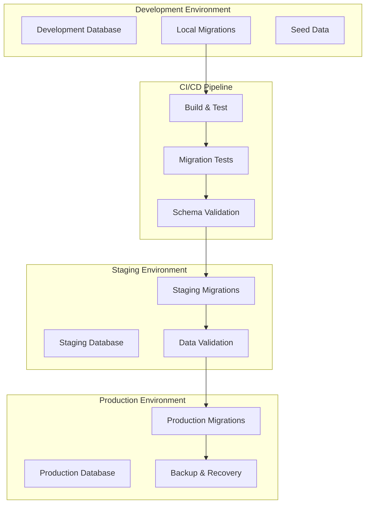

# Database Migration Guide

## Overview
Comprehensive guide for database migrations in the MealPrep AI-powered meal planning application, covering development workflows, production deployment strategies, rollback procedures, and best practices for maintaining data integrity across environments.

## Database Migration Architecture

### Migration Strategy Overview


### Migration Principles
```yaml
Core Principles:
  - Zero-downtime deployments
  - Backward compatibility during rollouts
  - Comprehensive backup strategies
  - Automated rollback capabilities
  - Data integrity validation
  - Performance impact assessment

Migration Types:
  - Schema changes (tables, columns, indexes)
  - Data migrations (transformations, cleanups)
  - Seed data updates
  - Reference data changes
  - Performance optimizations
```

---

## Entity Framework Core Migrations

### Migration Development Workflow

#### Creating New Migrations
```bash
#!/bin/bash
# scripts/migrations/create-migration.sh

MIGRATION_NAME=${1}
ENVIRONMENT=${2:-Development}

if [ -z "$MIGRATION_NAME" ]; then
    echo "Usage: $0 <migration-name> [environment]"
    echo "Example: $0 AddRecipeNutritionInfo Development"
    exit 1
fi

echo "Creating migration: $MIGRATION_NAME"
echo "Environment: $ENVIRONMENT"

# Set environment variables
export ASPNETCORE_ENVIRONMENT=$ENVIRONMENT

# Create the migration
dotnet ef migrations add $MIGRATION_NAME \
    --project src/MealPrep.Infrastructure \
    --startup-project src/MealPrep.API \
    --context MealPrepDbContext \
    --output-dir Migrations

# Generate SQL script for review
dotnet ef migrations script \
    --project src/MealPrep.Infrastructure \
    --startup-project src/MealPrep.API \
    --context MealPrepDbContext \
    --output "scripts/migrations/sql/$MIGRATION_NAME.sql"

echo "? Migration created successfully"
echo "?? SQL script generated: scripts/migrations/sql/$MIGRATION_NAME.sql"
echo "?? Please review the migration before applying"
```

#### Migration Best Practices
```csharp
// Example migration with best practices
public partial class AddRecipeNutritionInfo : Migration
{
    protected override void Up(MigrationBuilder migrationBuilder)
    {
        // 1. Create new columns as nullable first for backward compatibility
        migrationBuilder.AddColumn<int?>(
            name: "Calories",
            table: "Recipes",
            type: "int",
            nullable: true);

        migrationBuilder.AddColumn<decimal?>(
            name: "Protein",
            table: "Recipes",
            type: "decimal(5,2)",
            nullable: true);

        migrationBuilder.AddColumn<decimal?>(
            name: "Carbohydrates", 
            table: "Recipes",
            type: "decimal(5,2)",
            nullable: true);

        migrationBuilder.AddColumn<decimal?>(
            name: "Fat",
            table: "Recipes",
            type: "decimal(5,2)",
            nullable: true);

        // 2. Create indexes for performance
        migrationBuilder.CreateIndex(
            name: "IX_Recipes_Calories",
            table: "Recipes", 
            column: "Calories");

        // 3. Add check constraints for data validation
        migrationBuilder.Sql(@"
            ALTER TABLE Recipes 
            ADD CONSTRAINT CK_Recipes_Calories_NonNegative 
            CHECK (Calories IS NULL OR Calories >= 0)
        ");

        migrationBuilder.Sql(@"
            ALTER TABLE Recipes 
            ADD CONSTRAINT CK_Recipes_Macros_NonNegative 
            CHECK (
                (Protein IS NULL OR Protein >= 0) AND
                (Carbohydrates IS NULL OR Carbohydrates >= 0) AND
                (Fat IS NULL OR Fat >= 0)
            )
        ");

        // 4. Update existing data with default values if needed
        migrationBuilder.Sql(@"
            UPDATE Recipes 
            SET Calories = 0, Protein = 0, Carbohydrates = 0, Fat = 0 
            WHERE Calories IS NULL
        ");
    }

    protected override void Down(MigrationBuilder migrationBuilder)
    {
        // Always implement rollback logic
        migrationBuilder.DropConstraint(
            name: "CK_Recipes_Calories_NonNegative",
            table: "Recipes");

        migrationBuilder.DropConstraint(
            name: "CK_Recipes_Macros_NonNegative", 
            table: "Recipes");

        migrationBuilder.DropIndex(
            name: "IX_Recipes_Calories",
            table: "Recipes");

        migrationBuilder.DropColumn(
            name: "Calories",
            table: "Recipes");

        migrationBuilder.DropColumn(
            name: "Protein",
            table: "Recipes");

        migrationBuilder.DropColumn(
            name: "Carbohydrates",
            table: "Recipes");

        migrationBuilder.DropColumn(
            name: "Fat",
            table: "Recipes");
    }
}
```

### Complex Migration Patterns

#### Large Table Migrations (Zero-Downtime)
```csharp
// Pattern for migrating large tables without downtime
public partial class AddRecipeTagsWithoutDowntime : Migration
{
    protected override void Up(MigrationBuilder migrationBuilder)
    {
        // Step 1: Create new table structure
        migrationBuilder.CreateTable(
            name: "RecipeTags",
            columns: table => new
            {
                Id = table.Column<int>(type: "int", nullable: false)
                    .Annotation("SqlServer:Identity", "1, 1"),
                RecipeId = table.Column<int>(type: "int", nullable: false),
                TagName = table.Column<string>(type: "nvarchar(50)", maxLength: 50, nullable: false),
                CreatedAt = table.Column<DateTime>(type: "datetime2", nullable: false, defaultValueSql: "GETUTCDATE()"),
                CreatedBy = table.Column<int>(type: "int", nullable: false)
            },
            constraints: table =>
            {
                table.PrimaryKey("PK_RecipeTags", x => x.Id);
                table.ForeignKey(
                    name: "FK_RecipeTags_Recipes_RecipeId",
                    column: x => x.RecipeId,
                    principalTable: "Recipes",
                    principalColumn: "Id",
                    onDelete: ReferentialAction.Cascade);
                table.ForeignKey(
                    name: "FK_RecipeTags_Users_CreatedBy",
                    column: x => x.CreatedBy,
                    principalTable: "Users", 
                    principalColumn: "Id",
                    onDelete: ReferentialAction.Restrict);
            });

        // Step 2: Create indexes for performance
        migrationBuilder.CreateIndex(
            name: "IX_RecipeTags_RecipeId",
            table: "RecipeTags",
            column: "RecipeId");

        migrationBuilder.CreateIndex(
            name: "IX_RecipeTags_TagName",
            table: "RecipeTags",
            column: "TagName");

        // Step 3: Create unique constraint to prevent duplicates
        migrationBuilder.CreateIndex(
            name: "IX_RecipeTags_RecipeId_TagName_Unique",
            table: "RecipeTags",
            columns: new[] { "RecipeId", "TagName" },
            unique: true);

        // Step 4: Migrate existing data from old Tags column (if exists)
        // This would be done in a separate data migration step
        migrationBuilder.Sql(@"
            INSERT INTO RecipeTags (RecipeId, TagName, CreatedBy)
            SELECT 
                r.Id,
                TRIM(value) as TagName,
                r.CreatedBy
            FROM Recipes r
            CROSS APPLY STRING_SPLIT(r.Tags, ',') 
            WHERE r.Tags IS NOT NULL 
                AND TRIM(value) != ''
                AND NOT EXISTS (
                    SELECT 1 FROM RecipeTags rt 
                    WHERE rt.RecipeId = r.Id 
                    AND rt.TagName = TRIM(value)
                )
        ");
    }

    protected override void Down(MigrationBuilder migrationBuilder)
    {
        // Rollback: Restore data to original Tags column before dropping table
        migrationBuilder.Sql(@"
            UPDATE r 
            SET Tags = STUFF((
                SELECT ',' + rt.TagName
                FROM RecipeTags rt
                WHERE rt.RecipeId = r.Id
                ORDER BY rt.TagName
                FOR XML PATH('')
            ), 1, 1, '')
            FROM Recipes r
            WHERE EXISTS (SELECT 1 FROM RecipeTags rt WHERE rt.RecipeId = r.Id)
        ");

        migrationBuilder.DropTable(name: "RecipeTags");
    }
}
```

#### Data Transformation Migrations
```csharp
// Pattern for complex data transformations
public partial class NormalizeIngredientUnits : Migration
{
    protected override void Up(MigrationBuilder migrationBuilder)
    {
        // Step 1: Create lookup table for unit conversions
        migrationBuilder.CreateTable(
            name: "UnitConversions",
            columns: table => new
            {
                Id = table.Column<int>(type: "int", nullable: false)
                    .Annotation("SqlServer:Identity", "1, 1"),
                FromUnit = table.Column<string>(type: "nvarchar(20)", maxLength: 20, nullable: false),
                ToUnit = table.Column<string>(type: "nvarchar(20)", maxLength: 20, nullable: false), 
                ConversionFactor = table.Column<decimal>(type: "decimal(10,6)", nullable: false),
                Category = table.Column<string>(type: "nvarchar(20)", maxLength: 20, nullable: false)
            });

        // Step 2: Insert standard unit conversions
        migrationBuilder.Sql(@"
            INSERT INTO UnitConversions (FromUnit, ToUnit, ConversionFactor, Category) VALUES
            -- Volume conversions
            ('tbsp', 'ml', 14.787, 'volume'),
            ('tsp', 'ml', 4.929, 'volume'),
            ('cup', 'ml', 236.588, 'volume'),
            ('fl oz', 'ml', 29.574, 'volume'),
            ('pint', 'ml', 473.176, 'volume'),
            ('quart', 'ml', 946.353, 'volume'),
            ('gallon', 'ml', 3785.41, 'volume'),
            -- Weight conversions
            ('oz', 'g', 28.35, 'weight'),
            ('lb', 'g', 453.592, 'weight'),
            ('kg', 'g', 1000, 'weight'),
            -- Reverse conversions
            ('ml', 'tbsp', 0.0676, 'volume'),
            ('ml', 'tsp', 0.203, 'volume'),
            ('ml', 'cup', 0.004227, 'volume'),
            ('g', 'oz', 0.035274, 'weight'),
            ('g', 'lb', 0.002205, 'weight')
        ");

        // Step 3: Add normalized unit columns
        migrationBuilder.AddColumn<string>(
            name: "NormalizedUnit",
            table: "RecipeIngredients", 
            type: "nvarchar(20)",
            maxLength: 20,
            nullable: true);

        migrationBuilder.AddColumn<decimal>(
            name: "NormalizedQuantity",
            table: "RecipeIngredients",
            type: "decimal(10,3)",
            nullable: true);

        // Step 4: Normalize existing ingredient data
        migrationBuilder.Sql(@"
            UPDATE ri
            SET 
                NormalizedUnit = CASE 
                    WHEN uc.ToUnit IS NOT NULL THEN uc.ToUnit
                    WHEN ri.Unit IN ('ml', 'l', 'g', 'kg') THEN ri.Unit
                    ELSE 'piece'
                END,
                NormalizedQuantity = CASE
                    WHEN uc.ConversionFactor IS NOT NULL THEN ri.Quantity * uc.ConversionFactor
                    WHEN ri.Unit = 'l' THEN ri.Quantity * 1000 -- Convert liters to ml
                    WHEN ri.Unit = 'kg' THEN ri.Quantity * 1000 -- Convert kg to g
                    ELSE ri.Quantity
                END
            FROM RecipeIngredients ri
            LEFT JOIN UnitConversions uc ON ri.Unit = uc.FromUnit 
                AND uc.ToUnit IN ('ml', 'g') -- Normalize to base units
            WHERE ri.NormalizedUnit IS NULL
        ");

        // Step 5: Create index for performance
        migrationBuilder.CreateIndex(
            name: "IX_RecipeIngredients_NormalizedUnit",
            table: "RecipeIngredients",
            column: "NormalizedUnit");
    }

    protected override void Down(MigrationBuilder migrationBuilder)
    {
        migrationBuilder.DropIndex(
            name: "IX_RecipeIngredients_NormalizedUnit",
            table: "RecipeIngredients");

        migrationBuilder.DropColumn(
            name: "NormalizedUnit",
            table: "RecipeIngredients");

        migrationBuilder.DropColumn(
            name: "NormalizedQuantity", 
            table: "RecipeIngredients");

        migrationBuilder.DropTable(name: "UnitConversions");
    }
}
```

---

## Production Migration Procedures

### Pre-Migration Checklist
```bash
#!/bin/bash
# scripts/migrations/pre-migration-checklist.sh

ENVIRONMENT=${1:-production}
MIGRATION_NAME=${2}

echo "?? Pre-Migration Checklist for $ENVIRONMENT"
echo "Migration: $MIGRATION_NAME"
echo "============================================"

# 1. Database backup verification
echo "1. Verifying database backup..."
BACKUP_STATUS=$(az sql db export \
    --admin-user $SQL_ADMIN \
    --admin-password $SQL_PASSWORD \
    --storage-key $STORAGE_KEY \
    --storage-key-type StorageAccessKey \
    --storage-uri "https://mealprep${ENVIRONMENT}backup.blob.core.windows.net/backups/pre-migration-$(date +%Y%m%d-%H%M%S).bacpac" \
    --name "mealprep-$ENVIRONMENT-db" \
    --resource-group "rg-mealprep-$ENVIRONMENT" \
    --server "mealprep-$ENVIRONMENT-sql")

if [ $? -eq 0 ]; then
    echo "? Database backup completed"
else
    echo "? Database backup failed"
    exit 1
fi

# 2. Test migration on staging copy
echo "2. Testing migration on staging copy..."
STAGING_CONNECTION_STRING=$(az keyvault secret show \
    --vault-name "mealprep-staging-kv" \
    --name "sql-connection-string" \
    --query value -o tsv)

# Create staging copy
STAGING_COPY_DB="mealprep-staging-copy-$(date +%Y%m%d-%H%M%S)"
az sql db copy \
    --dest-name $STAGING_COPY_DB \
    --dest-resource-group "rg-mealprep-staging" \
    --dest-server "mealprep-staging-sql" \
    --name "mealprep-production-db" \
    --resource-group "rg-mealprep-production" \
    --server "mealprep-production-sql"

# Test migration on copy
dotnet ef database update \
    --project src/MealPrep.Infrastructure \
    --startup-project src/MealPrep.API \
    --context MealPrepDbContext \
    --connection "Server=mealprep-staging-sql.database.windows.net;Database=$STAGING_COPY_DB;User ID=$SQL_ADMIN;Password=$SQL_PASSWORD;Encrypt=True;"

if [ $? -eq 0 ]; then
    echo "? Migration test successful on staging copy"
    # Cleanup staging copy
    az sql db delete --name $STAGING_COPY_DB --resource-group "rg-mealprep-staging" --server "mealprep-staging-sql" --yes
else
    echo "? Migration test failed on staging copy"
    exit 1
fi

# 3. Performance impact assessment
echo "3. Assessing performance impact..."
dotnet ef migrations script \
    --project src/MealPrep.Infrastructure \
    --startup-project src/MealPrep.API \
    --context MealPrepDbContext \
    --output "migration-review.sql"

# Check for potentially slow operations
SLOW_OPERATIONS=$(grep -i "ALTER TABLE\|CREATE INDEX\|DROP INDEX" migration-review.sql | wc -l)
if [ $SLOW_OPERATIONS -gt 0 ]; then
    echo "??  Found $SLOW_OPERATIONS potentially slow operations"
    echo "?? Review migration-review.sql for impact assessment"
fi

# 4. Maintenance window verification
echo "4. Verifying maintenance window..."
CURRENT_HOUR=$(date +%H)
if [ $CURRENT_HOUR -ge 2 ] && [ $CURRENT_HOUR -le 4 ]; then
    echo "? Within maintenance window (2-4 AM UTC)"
else
    echo "??  Outside recommended maintenance window"
fi

# 5. Application health check
echo "5. Checking application health before migration..."
API_HEALTH=$(curl -s -o /dev/null -w "%{http_code}" "https://api-$ENVIRONMENT.mealprep.com/health")
if [ $API_HEALTH -eq 200 ]; then
    echo "? Application is healthy"
else
    echo "? Application health check failed (HTTP $API_HEALTH)"
    exit 1
fi

echo "? Pre-migration checklist completed successfully"
```

### Production Migration Execution
```bash
#!/bin/bash
# scripts/migrations/deploy-migration.sh

ENVIRONMENT=${1:-production}
DRY_RUN=${2:-false}

if [ "$ENVIRONMENT" = "production" ] && [ "$DRY_RUN" = "false" ]; then
    echo "??  PRODUCTION MIGRATION - This will modify the production database"
    read -p "Are you sure you want to continue? (type 'CONFIRM' to proceed): " confirmation
    if [ "$confirmation" != "CONFIRM" ]; then
        echo "Migration cancelled"
        exit 0
    fi
fi

echo "?? Starting migration deployment to $ENVIRONMENT"
echo "Dry run: $DRY_RUN"
echo "================================================"

# 1. Put application in maintenance mode
echo "1. Enabling maintenance mode..."
if [ "$DRY_RUN" = "false" ]; then
    az containerapp update \
        --name "mealprep-$ENVIRONMENT-api" \
        --resource-group "rg-mealprep-$ENVIRONMENT" \
        --set-env-vars MAINTENANCE_MODE=true
    
    # Wait for propagation
    sleep 30
fi

# 2. Stop background jobs
echo "2. Stopping background jobs..."
if [ "$DRY_RUN" = "false" ]; then
    # Scale down background job containers
    az containerapp update \
        --name "mealprep-$ENVIRONMENT-jobs" \
        --resource-group "rg-mealprep-$ENVIRONMENT" \
        --min-replicas 0 \
        --max-replicas 0
fi

# 3. Create final backup before migration
echo "3. Creating final backup..."
FINAL_BACKUP_FILE="final-backup-$(date +%Y%m%d-%H%M%S).bacpac"
if [ "$DRY_RUN" = "false" ]; then
    az sql db export \
        --admin-user $SQL_ADMIN \
        --admin-password $SQL_PASSWORD \
        --storage-key $STORAGE_KEY \
        --storage-key-type StorageAccessKey \
        --storage-uri "https://mealprep${ENVIRONMENT}backup.blob.core.windows.net/backups/$FINAL_BACKUP_FILE" \
        --name "mealprep-$ENVIRONMENT-db" \
        --resource-group "rg-mealprep-$ENVIRONMENT" \
        --server "mealprep-$ENVIRONMENT-sql"
fi

# 4. Run migration
echo "4. Executing database migration..."
CONNECTION_STRING=$(az keyvault secret show \
    --vault-name "mealprep-$ENVIRONMENT-kv" \
    --name "sql-connection-string" \
    --query value -o tsv)

if [ "$DRY_RUN" = "false" ]; then
    dotnet ef database update \
        --project src/MealPrep.Infrastructure \
        --startup-project src/MealPrep.API \
        --context MealPrepDbContext \
        --connection "$CONNECTION_STRING" \
        --verbose
    
    MIGRATION_EXIT_CODE=$?
    if [ $MIGRATION_EXIT_CODE -ne 0 ]; then
        echo "? Migration failed with exit code $MIGRATION_EXIT_CODE"
        echo "?? Initiating rollback procedure..."
        ./rollback-migration.sh $ENVIRONMENT $FINAL_BACKUP_FILE
        exit 1
    fi
else
    echo "?? DRY RUN: Would execute migration against $ENVIRONMENT database"
fi

# 5. Verify migration success
echo "5. Verifying migration success..."
if [ "$DRY_RUN" = "false" ]; then
    # Check database schema version
    SCHEMA_VERSION=$(sqlcmd -S "mealprep-$ENVIRONMENT-sql.database.windows.net" \
        -d "mealprep-$ENVIRONMENT-db" \
        -U $SQL_ADMIN -P $SQL_PASSWORD \
        -Q "SELECT TOP 1 MigrationId FROM __EFMigrationsHistory ORDER BY MigrationId DESC" \
        -h -1 -W)
    
    echo "? Current schema version: $SCHEMA_VERSION"
fi

# 6. Run data validation
echo "6. Running data validation..."
if [ "$DRY_RUN" = "false" ]; then
    # Custom validation queries
    sqlcmd -S "mealprep-$ENVIRONMENT-sql.database.windows.net" \
        -d "mealprep-$ENVIRONMENT-db" \
        -U $SQL_ADMIN -P $SQL_PASSWORD \
        -i "scripts/migrations/validation-queries.sql"
fi

# 7. Restart application
echo "7. Restarting application..."
if [ "$DRY_RUN" = "false" ]; then
    # Remove maintenance mode and restart
    az containerapp update \
        --name "mealprep-$ENVIRONMENT-api" \
        --resource-group "rg-mealprep-$ENVIRONMENT" \
        --set-env-vars MAINTENANCE_MODE=false
    
    # Restart background jobs
    az containerapp update \
        --name "mealprep-$ENVIRONMENT-jobs" \
        --resource-group "rg-mealprep-$ENVIRONMENT" \
        --min-replicas 1 \
        --max-replicas 5
fi

# 8. Health check
echo "8. Performing post-migration health check..."
sleep 60  # Wait for application startup

if [ "$DRY_RUN" = "false" ]; then
    for i in {1..10}; do
        API_HEALTH=$(curl -s -o /dev/null -w "%{http_code}" "https://api-$ENVIRONMENT.mealprep.com/health")
        if [ $API_HEALTH -eq 200 ]; then
            echo "? Application health check passed"
            break
        else
            echo "??  Health check attempt $i failed (HTTP $API_HEALTH)"
            if [ $i -eq 10 ]; then
                echo "? Application failed to start after migration"
                exit 1
            fi
            sleep 30
        fi
    done
fi

echo "? Migration deployment completed successfully"
echo "?? Migration summary:"
echo "   - Environment: $ENVIRONMENT"
echo "   - Backup file: $FINAL_BACKUP_FILE"
echo "   - Schema version: $SCHEMA_VERSION"
echo "   - Status: SUCCESS"
```

### Rollback Procedures
```bash
#!/bin/bash
# scripts/migrations/rollback-migration.sh

ENVIRONMENT=${1}
BACKUP_FILE=${2}
TARGET_MIGRATION=${3}

if [ -z "$ENVIRONMENT" ] || [ -z "$BACKUP_FILE" ]; then
    echo "Usage: $0 <environment> <backup-file> [target-migration]"
    echo "Example: $0 production final-backup-20241215-143022.bacpac"
    exit 1
fi

echo "?? ROLLBACK PROCEDURE INITIATED"
echo "Environment: $ENVIRONMENT"
echo "Backup file: $BACKUP_FILE"
echo "Target migration: ${TARGET_MIGRATION:-Previous}"
echo "=================================="

# 1. Put application in maintenance mode immediately
echo "1. Emergency maintenance mode activation..."
az containerapp update \
    --name "mealprep-$ENVIRONMENT-api" \
    --resource-group "rg-mealprep-$ENVIRONMENT" \
    --set-env-vars MAINTENANCE_MODE=true ROLLBACK_IN_PROGRESS=true

# 2. Stop all background processes
echo "2. Stopping all background processes..."
az containerapp update \
    --name "mealprep-$ENVIRONMENT-jobs" \
    --resource-group "rg-mealprep-$ENVIRONMENT" \
    --min-replicas 0 \
    --max-replicas 0

# 3. Choose rollback strategy
if [ -n "$TARGET_MIGRATION" ]; then
    echo "3. Rolling back to specific migration: $TARGET_MIGRATION"
    CONNECTION_STRING=$(az keyvault secret show \
        --vault-name "mealprep-$ENVIRONMENT-kv" \
        --name "sql-connection-string" \
        --query value -o tsv)
    
    dotnet ef database update $TARGET_MIGRATION \
        --project src/MealPrep.Infrastructure \
        --startup-project src/MealPrep.API \
        --context MealPrepDbContext \
        --connection "$CONNECTION_STRING"
    
    ROLLBACK_EXIT_CODE=$?
else
    echo "3. Restoring from backup: $BACKUP_FILE"
    # Create rollback database
    ROLLBACK_DB="mealprep-$ENVIRONMENT-rollback-$(date +%Y%m%d-%H%M%S)"
    
    # Import backup to new database
    az sql db import \
        --admin-user $SQL_ADMIN \
        --admin-password $SQL_PASSWORD \
        --storage-key $STORAGE_KEY \
        --storage-key-type StorageAccessKey \
        --storage-uri "https://mealprep${ENVIRONMENT}backup.blob.core.windows.net/backups/$BACKUP_FILE" \
        --name $ROLLBACK_DB \
        --resource-group "rg-mealprep-$ENVIRONMENT" \
        --server "mealprep-$ENVIRONMENT-sql"
    
    # Swap databases (rename current to backup, rollback to current)
    CURRENT_DB="mealprep-$ENVIRONMENT-db"
    BACKUP_DB="mealprep-$ENVIRONMENT-db-backup-$(date +%Y%m%d-%H%M%S)"
    
    # This requires downtime - rename current to backup
    az sql db rename \
        --name $CURRENT_DB \
        --resource-group "rg-mealprep-$ENVIRONMENT" \
        --server "mealprep-$ENVIRONMENT-sql" \
        --new-name $BACKUP_DB
    
    # Rename rollback to current
    az sql db rename \
        --name $ROLLBACK_DB \
        --resource-group "rg-mealprep-$ENVIRONMENT" \
        --server "mealprep-$ENVIRONMENT-sql" \
        --new-name $CURRENT_DB
    
    ROLLBACK_EXIT_CODE=$?
fi

# 4. Verify rollback success
if [ $ROLLBACK_EXIT_CODE -eq 0 ]; then
    echo "? Database rollback completed successfully"
else
    echo "? Database rollback failed"
    exit 1
fi

# 5. Update application configuration if needed
echo "4. Updating application configuration..."
# Update any configuration that might have changed
az containerapp update \
    --name "mealprep-$ENVIRONMENT-api" \
    --resource-group "rg-mealprep-$ENVIRONMENT" \
    --set-env-vars DATABASE_ROLLBACK_COMPLETED=true

# 6. Restart application services
echo "5. Restarting application services..."
az containerapp restart \
    --name "mealprep-$ENVIRONMENT-api" \
    --resource-group "rg-mealprep-$ENVIRONMENT"

# Wait for restart
sleep 60

# 7. Health verification
echo "6. Verifying application health after rollback..."
for i in {1..10}; do
    API_HEALTH=$(curl -s -o /dev/null -w "%{http_code}" "https://api-$ENVIRONMENT.mealprep.com/health")
    if [ $API_HEALTH -eq 200 ]; then
        echo "? Application health verified after rollback"
        break
    else
        echo "??  Health check attempt $i failed (HTTP $API_HEALTH)"
        if [ $i -eq 10 ]; then
            echo "? Application failed to start after rollback"
            exit 1
        fi
        sleep 30
    fi
done

# 8. Re-enable normal operations
echo "7. Re-enabling normal operations..."
az containerapp update \
    --name "mealprep-$ENVIRONMENT-api" \
    --resource-group "rg-mealprep-$ENVIRONMENT" \
    --set-env-vars MAINTENANCE_MODE=false ROLLBACK_IN_PROGRESS=false DATABASE_ROLLBACK_COMPLETED=false

# Restart background jobs
az containerapp update \
    --name "mealprep-$ENVIRONMENT-jobs" \
    --resource-group "rg-mealprep-$ENVIRONMENT" \
    --min-replicas 1 \
    --max-replicas 5

echo "? ROLLBACK COMPLETED SUCCESSFULLY"
echo "?? Rollback summary:"
echo "   - Environment: $ENVIRONMENT" 
echo "   - Backup restored: $BACKUP_FILE"
echo "   - Status: SUCCESS"
echo "   - Next steps: Investigate migration failure and prepare fixed version"
```

---

## Data Validation and Testing

### Migration Testing Framework
```csharp
// Integration tests for migrations
[Collection("DatabaseCollection")]
public class MigrationTests : IClassFixture<DatabaseFixture>
{
    private readonly DatabaseFixture _fixture;

    public MigrationTests(DatabaseFixture fixture)
    {
        _fixture = fixture;
    }

    [Fact]
    public async Task Migration_AddRecipeNutritionInfo_ShouldPreserveExistingData()
    {
        // Arrange
        using var context = _fixture.CreateContext();
        var originalRecipe = new Recipe 
        { 
            Name = "Test Recipe",
            Description = "Test Description",
            UserId = 1,
            CreatedAt = DateTime.UtcNow
        };
        
        context.Recipes.Add(originalRecipe);
        await context.SaveChangesAsync();
        var originalId = originalRecipe.Id;

        // Act - Apply migration
        await context.Database.MigrateAsync();

        // Assert - Verify data integrity
        var migratedRecipe = await context.Recipes.FindAsync(originalId);
        Assert.NotNull(migratedRecipe);
        Assert.Equal("Test Recipe", migratedRecipe.Name);
        Assert.Equal("Test Description", migratedRecipe.Description);
        
        // Verify new columns exist and have default values
        Assert.True(migratedRecipe.Calories >= 0);
        Assert.True(migratedRecipe.Protein >= 0);
        Assert.True(migratedRecipe.Carbohydrates >= 0);
        Assert.True(migratedRecipe.Fat >= 0);
    }

    [Fact]
    public async Task Migration_AddRecipeNutritionInfo_ShouldEnforceConstraints()
    {
        // Arrange
        using var context = _fixture.CreateContext();
        await context.Database.MigrateAsync();

        // Act & Assert - Test constraint violations
        var recipe = new Recipe
        {
            Name = "Invalid Recipe",
            Description = "Test",
            UserId = 1,
            Calories = -100, // Should violate check constraint
            CreatedAt = DateTime.UtcNow
        };

        context.Recipes.Add(recipe);
        
        await Assert.ThrowsAsync<DbUpdateException>(
            () => context.SaveChangesAsync());
    }

    [Theory]
    [InlineData("tablespace")]
    [InlineData("index")]
    [InlineData("constraint")]
    public async Task Migration_ShouldCreateExpectedDatabaseObjects(string objectType)
    {
        // Arrange & Act
        using var context = _fixture.CreateContext();
        await context.Database.MigrateAsync();

        // Assert - Verify database objects exist
        var sql = objectType switch
        {
            "index" => "SELECT COUNT(*) FROM sys.indexes WHERE name = 'IX_Recipes_Calories'",
            "constraint" => "SELECT COUNT(*) FROM sys.check_constraints WHERE name = 'CK_Recipes_Calories_NonNegative'",
            _ => throw new ArgumentException("Unknown object type")
        };

        var count = await context.Database.ExecuteScalarAsync<int>(sql);
        Assert.True(count > 0, $"Expected {objectType} not found in database");
    }
}
```

### Data Validation Queries
```sql
-- scripts/migrations/validation-queries.sql

-- 1. Data integrity checks
SELECT 'Data Integrity Check' as CheckType, 
       'Recipes with NULL required fields' as Description,
       COUNT(*) as IssueCount
FROM Recipes 
WHERE Name IS NULL OR Description IS NULL OR CreatedAt IS NULL;

-- 2. Constraint validation
SELECT 'Constraint Validation' as CheckType,
       'Recipes with negative nutrition values' as Description, 
       COUNT(*) as IssueCount
FROM Recipes 
WHERE Calories < 0 OR Protein < 0 OR Carbohydrates < 0 OR Fat < 0;

-- 3. Reference integrity
SELECT 'Reference Integrity' as CheckType,
       'RecipeIngredients without valid Recipe' as Description,
       COUNT(*) as IssueCount  
FROM RecipeIngredients ri
LEFT JOIN Recipes r ON ri.RecipeId = r.Id
WHERE r.Id IS NULL;

-- 4. Performance validation
SELECT 'Performance Check' as CheckType,
       'Missing indexes on key columns' as Description,
       CASE 
           WHEN EXISTS (SELECT 1 FROM sys.indexes WHERE name = 'IX_Recipes_Calories') THEN 0
           ELSE 1
       END as IssueCount;

-- 5. Data migration validation
SELECT 'Data Migration Check' as CheckType,
       'Recipes missing nutrition info after migration' as Description,
       COUNT(*) as IssueCount
FROM Recipes 
WHERE Calories IS NULL AND CreatedAt > DATEADD(day, -1, GETDATE());

-- 6. Business rule validation
SELECT 'Business Rule Check' as CheckType,
       'Recipes with impossible nutrition ratios' as Description,
       COUNT(*) as IssueCount
FROM Recipes 
WHERE (Protein * 4 + Carbohydrates * 4 + Fat * 9) > (Calories * 1.2)  -- Allow 20% variance
  AND Calories > 0;

-- Summary report
SELECT 
    'Migration Validation Summary' as ReportType,
    GETDATE() as RunTime,
    (SELECT COUNT(*) FROM Recipes) as TotalRecipes,
    (SELECT COUNT(*) FROM RecipeIngredients) as TotalIngredients,
    (SELECT COUNT(*) FROM Users) as TotalUsers,
    (SELECT COUNT(*) FROM __EFMigrationsHistory) as MigrationsApplied;
```

---

## Monitoring and Alerting

### Migration Monitoring Dashboard
```yaml
# Azure Monitor queries for migration monitoring
Migration_Performance_Monitoring:
  - name: "Database Lock Duration"
    query: |
      AzureDiagnostics
      | where Category == "DatabaseWaitStatistics"
      | where TimeGenerated > ago(1h)
      | where wait_type_s contains "LOCK"
      | summarize avg(wait_time_ms_d) by bin(TimeGenerated, 5m)
      
  - name: "Migration Query Performance" 
    query: |
      AzureDiagnostics
      | where Category == "QueryStoreRuntimeStatistics"
      | where query_sql_text_s contains "ALTER TABLE" or query_sql_text_s contains "CREATE INDEX"
      | summarize max(duration_d) by query_sql_text_s
      
  - name: "Connection Pool Status"
    query: |
      AppTraces
      | where Message contains "connection pool"
      | summarize count() by bin(TimeGenerated, 1m), SeverityLevel

Alerting_Rules:
  - name: "Long Running Migration"
    condition: "Database operation duration > 300 seconds"
    severity: "Warning"
    action: "Notify operations team"
    
  - name: "Migration Failure"
    condition: "Migration exits with non-zero code"
    severity: "Critical" 
    action: "Trigger rollback procedure"
    
  - name: "High Lock Contention"
    condition: "Database lock waits > 10 seconds"
    severity: "Warning"
    action: "Consider migration optimization"
```

### Migration Automation
```yaml
# Azure DevOps pipeline for automated migrations
trigger:
  branches:
    include:
      - main
  paths:
    include:
      - src/MealPrep.Infrastructure/Migrations/*

stages:
- stage: ValidateMigration
  displayName: 'Validate Migration'
  jobs:
  - job: RunTests
    displayName: 'Run Migration Tests'
    steps:
    - task: DotNetCoreCLI@2
      displayName: 'Run Migration Tests'
      inputs:
        command: 'test'
        projects: '**/*Migration.Tests.csproj'
        arguments: '--configuration Release --logger trx --collect:"XPlat Code Coverage"'
        
  - job: ValidateSchema
    displayName: 'Validate Schema Changes'
    steps:
    - task: SqlAzureDacpacDeployment@1
      displayName: 'Generate Schema Comparison'
      inputs:
        azureSubscription: 'MealPrep-Dev'
        authenticationType: 'server'
        serverName: 'mealprep-dev-sql.database.windows.net'
        databaseName: 'mealprep-dev-db'
        sqlUsername: $(SQL_ADMIN)
        sqlPassword: $(SQL_PASSWORD)
        deployType: 'DacpacTask'
        dacpacFile: '$(System.DefaultWorkingDirectory)/database/MealPrep.Database.dacpac'
        additionalArguments: '/p:VerifyCollationCompatibility=false /p:GenerateSmartDefaults=true'

- stage: DeployStaging
  displayName: 'Deploy to Staging'
  dependsOn: ValidateMigration
  condition: succeeded()
  jobs:
  - deployment: DeployMigration
    displayName: 'Deploy Migration to Staging'
    environment: 'MealPrep-Staging'
    strategy:
      runOnce:
        deploy:
          steps:
          - checkout: self
          - task: AzureCLI@2
            displayName: 'Run Pre-Migration Checklist'
            inputs:
              azureSubscription: 'MealPrep-Staging'
              scriptType: 'bash'
              scriptLocation: 'scriptPath'
              scriptPath: 'scripts/migrations/pre-migration-checklist.sh'
              arguments: 'staging'
              
          - task: DotNetCoreCLI@2
            displayName: 'Apply Migration'
            inputs:
              command: 'custom'
              custom: 'ef'
              arguments: 'database update --project src/MealPrep.Infrastructure --startup-project src/MealPrep.API --context MealPrepDbContext --connection "$(STAGING_CONNECTION_STRING)"'
              
          - task: AzureCLI@2
            displayName: 'Validate Migration'
            inputs:
              azureSubscription: 'MealPrep-Staging'
              scriptType: 'bash'
              scriptLocation: 'inlineScript'
              inlineScript: |
                sqlcmd -S mealprep-staging-sql.database.windows.net \
                  -d mealprep-staging-db \
                  -U $(SQL_ADMIN) -P $(SQL_PASSWORD) \
                  -i scripts/migrations/validation-queries.sql

- stage: DeployProduction
  displayName: 'Deploy to Production'
  dependsOn: DeployStaging
  condition: and(succeeded(), eq(variables['Build.SourceBranch'], 'refs/heads/main'))
  jobs:
  - deployment: DeployMigration
    displayName: 'Deploy Migration to Production'
    environment: 'MealPrep-Production'
    strategy:
      runOnce:
        deploy:
          steps:
          - checkout: self
          - task: AzureCLI@2
            displayName: 'Production Migration Deployment'
            inputs:
              azureSubscription: 'MealPrep-Production'
              scriptType: 'bash'
              scriptLocation: 'scriptPath'
              scriptPath: 'scripts/migrations/deploy-migration.sh'
              arguments: 'production false'
```

This comprehensive database migration guide provides production-ready procedures for managing database changes safely and efficiently across all environments in the MealPrep application.

---

*Last Updated: December 2024*  
*Database migration guide continuously updated with best practices and lessons learned from production deployments*