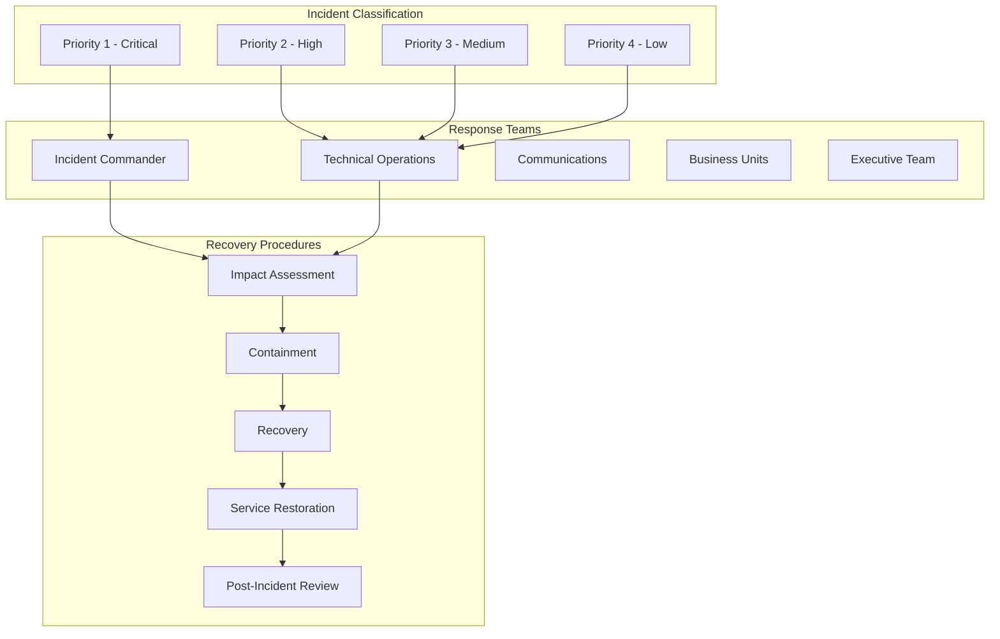

# Disaster Recovery Procedures

## Overview
Comprehensive disaster recovery procedures for the MealPrep AI-powered meal planning application, covering incident classification, recovery workflows, business continuity planning, communication protocols, and post-incident analysis across all disaster scenarios and environments.

## Disaster Recovery Framework

### Disaster Classification and Response Matrix


### Disaster Categories and Response Times
```yaml
Disaster Categories:
  Infrastructure Failures:
    - Data center outages
    - Network connectivity issues
    - Cloud provider service disruptions
    - Hardware failures
    - Power outages
    
  Application Failures:
    - Application crashes
    - Database corruption
    - API service failures
    - Authentication system failures
    - AI service disruptions
    
  Security Incidents:
    - Data breaches
    - Unauthorized access
    - Malware infections
    - DDoS attacks
    - Insider threats
    
  Data Loss Events:
    - Database failures
    - Backup corruption
    - Accidental deletions
    - Storage system failures
    - Ransomware attacks
    
  Natural Disasters:
    - Regional disasters
    - Pandemic impacts
    - Extended power outages
    - Internet infrastructure damage
    - Physical facility damage

Response Time Objectives (RTO):
  Priority 1 (Critical):
    - Detection: 5 minutes
    - Response: 15 minutes
    - Initial Recovery: 1 hour
    - Full Recovery: 4 hours
    
  Priority 2 (High):
    - Detection: 15 minutes
    - Response: 30 minutes
    - Initial Recovery: 2 hours
    - Full Recovery: 8 hours
    
  Priority 3 (Medium):
    - Detection: 1 hour
    - Response: 2 hours
    - Initial Recovery: 8 hours
    - Full Recovery: 24 hours
    
  Priority 4 (Low):
    - Detection: 4 hours
    - Response: 8 hours
    - Initial Recovery: 24 hours
    - Full Recovery: 72 hours

Recovery Point Objectives (RPO):
  Critical Data: 15 minutes
  Important Data: 1 hour
  Standard Data: 4 hours
  Archive Data: 24 hours
```

---

## Emergency Response Procedures

### Incident Detection and Initial Response
```bash
#!/bin/bash
# scripts/disaster-recovery/incident-response.sh

INCIDENT_TYPE=${1}
SEVERITY=${2}
ENVIRONMENT=${3:-production}
INCIDENT_ID=${4:-$(uuidgen)}

echo "?? DISASTER RECOVERY ACTIVATION"
echo "Incident ID: $INCIDENT_ID"
echo "Type: $INCIDENT_TYPE"
echo "Severity: $SEVERITY"
echo "Environment: $ENVIRONMENT"
echo "Time: $(date)"
echo "=================================="

# Set up incident tracking
INCIDENT_LOG="incident-$INCIDENT_ID.log"
INCIDENT_DIR="incidents/$(date +%Y%m%d)"
mkdir -p $INCIDENT_DIR

# Function to log incident activities
log_incident() {
    local message="$1"
    local timestamp=$(date '+%Y-%m-%d %H:%M:%S')
    echo "[$timestamp] $message" | tee -a "$INCIDENT_DIR/$INCIDENT_LOG"
}

# Function to send incident alerts
send_alert() {
    local status="$1"
    local message="$2"
    local alert_level="$3"
    
    # Teams notification
    curl -X POST "https://outlook.office.com/webhook/..." \
        -H "Content-Type: application/json" \
        -d '{
            "text": "?? INCIDENT ALERT - '$ENVIRONMENT'",
            "themeColor": "'$([ "$alert_level" = "critical" ] && echo "FF0000" || echo "FFA500")'",
            "sections": [{
                "activityTitle": "Disaster Recovery Activation",
                "activitySubtitle": "Incident: '$INCIDENT_ID'",
                "facts": [
                    {"name": "Type", "value": "'$INCIDENT_TYPE'"},
                    {"name": "Severity", "value": "'$SEVERITY'"},
                    {"name": "Environment", "value": "'$ENVIRONMENT'"},
                    {"name": "Status", "value": "'$status'"},
                    {"name": "Message", "value": "'$message'"},
                    {"name": "Time", "value": "'$(date)'"}
                ]
            }]
        }'
    
    # PagerDuty integration for critical incidents
    if [ "$SEVERITY" = "P1" ] || [ "$SEVERITY" = "P2" ]; then
        curl -X POST "https://events.pagerduty.com/v2/enqueue" \
            -H "Content-Type: application/json" \
            -d '{
                "routing_key": "'$PAGERDUTY_ROUTING_KEY'",
                "event_action": "trigger",
                "payload": {
                    "summary": "MealPrep Incident: '$INCIDENT_TYPE'",
                    "severity": "'$(echo $SEVERITY | tr '[:upper:]' '[:lower:]')'",
                    "source": "'$ENVIRONMENT'",
                    "component": "MealPrep Application",
                    "custom_details": {
                        "incident_id": "'$INCIDENT_ID'",
                        "environment": "'$ENVIRONMENT'",
                        "incident_type": "'$INCIDENT_TYPE'"
                    }
                }
            }'
    fi
}

# 1. Initial incident detection and logging
log_incident "INCIDENT DETECTED: $INCIDENT_TYPE (Severity: $SEVERITY)"
send_alert "DETECTED" "Incident detected and response initiated" "critical"

# 2. Immediate system health assessment
log_incident "Starting immediate system health assessment"

RESOURCE_GROUP="rg-mealprep-$ENVIRONMENT"

# Check application health
APP_HEALTH=$(curl -s -o /dev/null -w "%{http_code}" "https://api-$ENVIRONMENT.mealprep.com/health" || echo "000")
log_incident "Application health status: HTTP $APP_HEALTH"

# Check database connectivity
DB_STATUS=$(az sql db show \
    --name "mealprep-$ENVIRONMENT-db" \
    --resource-group $RESOURCE_GROUP \
    --server "mealprep-$ENVIRONMENT-sql" \
    --query 'status' -o tsv 2>/dev/null || echo "UNKNOWN")
log_incident "Database status: $DB_STATUS"

# Check container app status
CONTAINER_STATUS=$(az containerapp show \
    --name "mealprep-$ENVIRONMENT-api" \
    --resource-group $RESOURCE_GROUP \
    --query 'properties.runningStatus' -o tsv 2>/dev/null || echo "UNKNOWN")
log_incident "Container app status: $CONTAINER_STATUS"

# Check Redis cache
REDIS_STATUS=$(az redis show \
    --name "mealprep-$ENVIRONMENT-redis" \
    --resource-group $RESOURCE_GROUP \
    --query 'provisioningState' -o tsv 2>/dev/null || echo "UNKNOWN")
log_incident "Redis cache status: $REDIS_STATUS"

# 3. Determine impact scope
IMPACT_SCOPE="UNKNOWN"
AFFECTED_USERS="UNKNOWN"

if [ "$APP_HEALTH" != "200" ]; then
    IMPACT_SCOPE="TOTAL_OUTAGE"
    AFFECTED_USERS="ALL"
elif [ "$DB_STATUS" != "Online" ]; then
    IMPACT_SCOPE="DATA_UNAVAILABLE"
    AFFECTED_USERS="ALL"
elif [ "$CONTAINER_STATUS" != "Running" ]; then
    IMPACT_SCOPE="PARTIAL_OUTAGE"
    AFFECTED_USERS="PARTIAL"
else
    IMPACT_SCOPE="DEGRADED_PERFORMANCE"
    AFFECTED_USERS="MINIMAL"
fi

log_incident "Impact assessment: $IMPACT_SCOPE affecting $AFFECTED_USERS users"

# 4. Escalate based on severity and impact
case $SEVERITY in
    "P1")
        log_incident "P1 incident - Activating executive notification"
        send_alert "ESCALATED" "P1 incident requires executive notification" "critical"
        
        # Activate incident commander
        echo "Incident Commander activation required for P1 incident"
        ;;
    "P2")
        log_incident "P2 incident - Technical team notification"
        send_alert "ESCALATED" "P2 incident requires technical team response" "critical"
        ;;
    "P3"|"P4")
        log_incident "$SEVERITY incident - Standard team notification"
        send_alert "ACKNOWLEDGED" "$SEVERITY incident logged and being addressed" "warning"
        ;;
esac

# 5. Initiate appropriate recovery procedure
log_incident "Initiating recovery procedure for incident type: $INCIDENT_TYPE"

case $INCIDENT_TYPE in
    "application-failure")
        ./scripts/disaster-recovery/application-recovery.sh $ENVIRONMENT $INCIDENT_ID
        ;;
    "database-failure")
        ./scripts/disaster-recovery/database-recovery.sh $ENVIRONMENT $INCIDENT_ID
        ;;
    "infrastructure-failure")
        ./scripts/disaster-recovery/infrastructure-recovery.sh $ENVIRONMENT $INCIDENT_ID
        ;;
    "security-incident")
        ./scripts/disaster-recovery/security-incident-response.sh $ENVIRONMENT $INCIDENT_ID
        ;;
    "data-loss")
        ./scripts/disaster-recovery/data-recovery.sh $ENVIRONMENT $INCIDENT_ID
        ;;
    *)
        log_incident "Unknown incident type - manual intervention required"
        send_alert "MANUAL_INTERVENTION" "Unknown incident type requires manual response" "critical"
        ;;
esac

# 6. Create initial incident report
cat > "$INCIDENT_DIR/incident-report-$INCIDENT_ID.json" << EOF
{
    "incidentId": "$INCIDENT_ID",
    "detectionTime": "$(date -u +%Y-%m-%dT%H:%M:%SZ)",
    "incidentType": "$INCIDENT_TYPE",
    "severity": "$SEVERITY",
    "environment": "$ENVIRONMENT",
    "impactScope": "$IMPACT_SCOPE",
    "affectedUsers": "$AFFECTED_USERS",
    "systemStatus": {
        "application": "$APP_HEALTH",
        "database": "$DB_STATUS",
        "containerApp": "$CONTAINER_STATUS",
        "cache": "$REDIS_STATUS"
    },
    "responseActions": [],
    "status": "IN_PROGRESS",
    "assignedTeam": "operations",
    "communicationsLog": []
}
EOF

log_incident "Initial incident response completed - incident tracking active"
echo "Incident log: $INCIDENT_DIR/$INCIDENT_LOG"
echo "Incident report: $INCIDENT_DIR/incident-report-$INCIDENT_ID.json"
```

### Application Recovery Procedures
```bash
#!/bin/bash
# scripts/disaster-recovery/application-recovery.sh

ENVIRONMENT=${1}
INCIDENT_ID=${2}
RECOVERY_STRATEGY=${3:-auto}

echo "?? Application Recovery Procedure"
echo "Environment: $ENVIRONMENT"
echo "Incident ID: $INCIDENT_ID"
echo "Recovery strategy: $RECOVERY_STRATEGY"
echo "================================="

RESOURCE_GROUP="rg-mealprep-$ENVIRONMENT"
RECOVERY_LOG="application-recovery-$INCIDENT_ID.log"

# Function to log recovery activities
log_recovery() {
    local message="$1"
    local timestamp=$(date '+%Y-%m-%d %H:%M:%S')
    echo "[$timestamp] $message" | tee -a "incidents/$(date +%Y%m%d)/$RECOVERY_LOG"
}

# 1. Application health assessment
log_recovery "Starting application health assessment"

CONTAINER_APP_NAME="mealprep-$ENVIRONMENT-api"
JOBS_APP_NAME="mealprep-$ENVIRONMENT-jobs"

# Get current application status
API_STATUS=$(az containerapp show \
    --name $CONTAINER_APP_NAME \
    --resource-group $RESOURCE_GROUP \
    --query 'properties.runningStatus' -o tsv 2>/dev/null || echo "UNKNOWN")

JOBS_STATUS=$(az containerapp show \
    --name $JOBS_APP_NAME \
    --resource-group $RESOURCE_GROUP \
    --query 'properties.runningStatus' -o tsv 2>/dev/null || echo "UNKNOWN")

log_recovery "API container status: $API_STATUS"
log_recovery "Jobs container status: $JOBS_STATUS"

# Check replica health
API_REPLICAS=$(az containerapp replica list \
    --name $CONTAINER_APP_NAME \
    --resource-group $RESOURCE_GROUP \
    --query '[].{name:name,status:properties.runningState}' -o table)

log_recovery "API replica status:\n$API_REPLICAS"

# 2. Determine recovery action
RECOVERY_ACTION="UNKNOWN"

if [ "$API_STATUS" != "Running" ]; then
    RECOVERY_ACTION="RESTART_APPLICATION"
elif [ "$JOBS_STATUS" != "Running" ]; then
    RECOVERY_ACTION="RESTART_BACKGROUND_JOBS"
else
    # Check for unhealthy replicas
    UNHEALTHY_REPLICAS=$(echo "$API_REPLICAS" | grep -v "Running" | wc -l)
    if [ $UNHEALTHY_REPLICAS -gt 0 ]; then
        RECOVERY_ACTION="SCALE_HEALTHY_REPLICAS"
    else
        RECOVERY_ACTION="INVESTIGATE_PERFORMANCE"
    fi
fi

log_recovery "Determined recovery action: $RECOVERY_ACTION"

# 3. Execute recovery action
case $RECOVERY_ACTION in
    "RESTART_APPLICATION")
        log_recovery "Restarting API application"
        
        # Create backup of current configuration
        az containerapp show \
            --name $CONTAINER_APP_NAME \
            --resource-group $RESOURCE_GROUP > "app-config-backup-$INCIDENT_ID.json"
        
        # Restart the application
        az containerapp restart \
            --name $CONTAINER_APP_NAME \
            --resource-group $RESOURCE_GROUP
        
        if [ $? -eq 0 ]; then
            log_recovery "API application restart initiated successfully"
        else
            log_recovery "ERROR: API application restart failed"
            RECOVERY_ACTION="REDEPLOY_APPLICATION"
        fi
        ;;
        
    "RESTART_BACKGROUND_JOBS")
        log_recovery "Restarting background jobs application"
        
        az containerapp restart \
            --name $JOBS_APP_NAME \
            --resource-group $RESOURCE_GROUP
        
        if [ $? -eq 0 ]; then
            log_recovery "Background jobs restart initiated successfully"
        else
            log_recovery "ERROR: Background jobs restart failed"
        fi
        ;;
        
    "SCALE_HEALTHY_REPLICAS")
        log_recovery "Scaling up healthy replicas to compensate for unhealthy ones"
        
        # Get current replica count
        CURRENT_REPLICAS=$(az containerapp show \
            --name $CONTAINER_APP_NAME \
            --resource-group $RESOURCE_GROUP \
            --query 'properties.template.scale.minReplicas' -o tsv)
        
        # Scale up by 50% temporarily
        NEW_REPLICA_COUNT=$(( $CURRENT_REPLICAS * 3 / 2 ))
        
        az containerapp update \
            --name $CONTAINER_APP_NAME \
            --resource-group $RESOURCE_GROUP \
            --min-replicas $NEW_REPLICA_COUNT
        
        log_recovery "Scaled replicas from $CURRENT_REPLICAS to $NEW_REPLICA_COUNT"
        ;;
        
    "REDEPLOY_APPLICATION")
        log_recovery "Redeploying application from latest stable image"
        
        # Get latest stable image
        LATEST_STABLE_IMAGE=$(az acr repository show-tags \
            --name "mealprep$ENVIRONMENT" \
            --repository "mealprep-api" \
            --orderby time_desc \
            --query '[?!contains(name, `dev`) && !contains(name, `test`)][0].name' -o tsv)
        
        if [ -n "$LATEST_STABLE_IMAGE" ]; then
            log_recovery "Deploying stable image: $LATEST_STABLE_IMAGE"
            
            az containerapp update \
                --name $CONTAINER_APP_NAME \
                --resource-group $RESOURCE_GROUP \
                --image "mealprep$ENVIRONMENT.azurecr.io/mealprep-api:$LATEST_STABLE_IMAGE"
            
            log_recovery "Application redeployment initiated"
        else
            log_recovery "ERROR: No stable image found for redeployment"
        fi
        ;;
        
    "INVESTIGATE_PERFORMANCE")
        log_recovery "Application appears healthy - investigating performance issues"
        
        # Check recent errors and performance metrics
        ERROR_QUERY='
        union AppExceptions, AppRequests
        | where TimeGenerated > ago(30m)
        | where Properties.Environment == "'$ENVIRONMENT'"
        | summarize ErrorCount = count(), AvgDuration = avg(DurationMs) by bin(TimeGenerated, 5m)
        | order by TimeGenerated desc
        '
        
        az monitor log-analytics query \
            --workspace "mealprep-$ENVIRONMENT-logs" \
            --analytics-query "$ERROR_QUERY" \
            --output table > "performance-analysis-$INCIDENT_ID.txt"
        
        log_recovery "Performance analysis completed - see performance-analysis-$INCIDENT_ID.txt"
        ;;
esac

# 4. Wait for recovery and validate
log_recovery "Waiting for recovery to complete (60 seconds)"
sleep 60

# 5. Post-recovery validation
log_recovery "Starting post-recovery validation"

# Check application health endpoint
for i in {1..10}; do
    APP_HEALTH_POST=$(curl -s -o /dev/null -w "%{http_code}" "https://api-$ENVIRONMENT.mealprep.com/health" || echo "000")
    
    if [ "$APP_HEALTH_POST" = "200" ]; then
        log_recovery "Application health check PASSED (attempt $i)"
        break
    else
        log_recovery "Application health check FAILED - attempt $i (HTTP $APP_HEALTH_POST)"
        if [ $i -eq 10 ]; then
            log_recovery "ERROR: Application health checks failed after recovery"
            exit 1
        fi
        sleep 30
    fi
done

# Validate key functionality
log_recovery "Testing key application functionality"

# Test authentication endpoint
AUTH_TEST=$(curl -s -o /dev/null -w "%{http_code}" -X POST "https://api-$ENVIRONMENT.mealprep.com/api/auth/test" \
    -H "Content-Type: application/json" \
    -d '{"test": true}' || echo "000")

# Test database connectivity via API
DB_TEST=$(curl -s -o /dev/null -w "%{http_code}" "https://api-$ENVIRONMENT.mealprep.com/api/recipes/health-check" || echo "000")

# Test AI service connectivity
AI_TEST=$(curl -s -o /dev/null -w "%{http_code}" "https://api-$ENVIRONMENT.mealprep.com/api/ai/health-check" || echo "000")

log_recovery "Post-recovery test results:"
log_recovery "  Authentication: HTTP $AUTH_TEST"
log_recovery "  Database: HTTP $DB_TEST"
log_recovery "  AI Service: HTTP $AI_TEST"

# 6. Recovery completion report
RECOVERY_SUCCESS=true
if [ "$APP_HEALTH_POST" != "200" ] || [ "$AUTH_TEST" != "200" ] || [ "$DB_TEST" != "200" ]; then
    RECOVERY_SUCCESS=false
fi

cat > "incidents/$(date +%Y%m%d)/recovery-report-$INCIDENT_ID.json" << EOF
{
    "incidentId": "$INCIDENT_ID",
    "recoveryStartTime": "$(date -u +%Y-%m-%dT%H:%M:%SZ)",
    "recoveryEndTime": "$(date -u +%Y-%m-%dT%H:%M:%SZ)",
    "recoveryAction": "$RECOVERY_ACTION",
    "recoverySuccess": $RECOVERY_SUCCESS,
    "postRecoveryTests": {
        "applicationHealth": "$APP_HEALTH_POST",
        "authentication": "$AUTH_TEST",
        "database": "$DB_TEST",
        "aiService": "$AI_TEST"
    },
    "systemStatus": {
        "apiContainerStatus": "$(az containerapp show --name $CONTAINER_APP_NAME --resource-group $RESOURCE_GROUP --query 'properties.runningStatus' -o tsv)",
        "jobsContainerStatus": "$(az containerapp show --name $JOBS_APP_NAME --resource-group $RESOURCE_GROUP --query 'properties.runningStatus' -o tsv)"
    },
    "nextSteps": [
        "Monitor application performance for next 24 hours",
        "Review logs for root cause analysis",
        "Update monitoring thresholds if needed"
    ]
}
EOF

if [ "$RECOVERY_SUCCESS" = "true" ]; then
    log_recovery "? Application recovery completed successfully"
else
    log_recovery "? Application recovery completed with issues - manual intervention required"
fi

echo "Recovery log: incidents/$(date +%Y%m%d)/$RECOVERY_LOG"
echo "Recovery report: incidents/$(date +%Y%m%d)/recovery-report-$INCIDENT_ID.json"
```

---

## Business Continuity Planning

### Communication Protocols
```yaml
Communication Matrix:
  Internal Communications:
    Incident Commander:
      - Overall incident coordination
      - Executive briefings
      - External vendor coordination
      - Media response coordination
      
    Technical Team Lead:
      - Technical team coordination
      - Recovery progress updates
      - Resource allocation decisions
      - Technical communications to IC
      
    Operations Team:
      - System monitoring
      - Recovery execution
      - Status updates to team lead
      - Documentation of actions
      
    Business Team:
      - Customer impact assessment
      - Business priority decisions
      - Stakeholder communications
      - Revenue impact analysis
  
  External Communications:
    Customer Communications:
      P1 Incidents:
        - Initial: Within 30 minutes
        - Updates: Every hour
        - Channels: Email, in-app, status page
        
      P2 Incidents:
        - Initial: Within 2 hours
        - Updates: Every 4 hours
        - Channels: Status page, email
        
      P3/P4 Incidents:
        - Initial: Within 24 hours
        - Updates: Daily
        - Channels: Status page
    
    Vendor Communications:
      Cloud Providers:
        - Immediate for infrastructure issues
        - Include incident ID and impact
        - Request priority support
        
      Third-party Services:
        - Contact within 1 hour for P1/P2
        - Include technical details
        - Request status updates
    
    Regulatory Communications:
      Data Breach Incidents:
        - Legal team: Immediate
        - Regulatory bodies: Within 72 hours
        - Affected users: Within legal timeframe
        
      Compliance Incidents:
        - Compliance officer: Immediate
        - Auditors: As required
        - Documentation: Complete records

Communication Templates:
  Initial Incident Notification:
    Subject: "[INCIDENT] MealPrep Service Issue - [SEVERITY]"
    Content: |
      We are currently investigating an issue affecting MealPrep services.
      
      Impact: [Description of user impact]
      Start Time: [Time issue began]
      Status: Investigating/Identified/Monitoring/Resolved
      
      We will provide updates every [frequency] until resolved.
      
      For real-time updates: https://status.mealprep.com
      
  Progress Update:
    Subject: "[UPDATE] MealPrep Service Issue - [SEVERITY]"
    Content: |
      Update on the ongoing MealPrep service issue:
      
      Current Status: [Current status]
      Progress: [What has been done]
      Next Steps: [What will be done next]
      Expected Resolution: [Time estimate]
      
      Impact: [Current impact to users]
      
  Resolution Notification:
    Subject: "[RESOLVED] MealPrep Service Issue"
    Content: |
      The MealPrep service issue has been resolved.
      
      Resolution Time: [Time resolved]
      Root Cause: [Brief explanation]
      Prevention: [Steps taken to prevent recurrence]
      
      All services are now operating normally.
      
      We apologize for any inconvenience caused.
```

### Customer Impact Mitigation
```bash
#!/bin/bash
# scripts/disaster-recovery/customer-impact-mitigation.sh

INCIDENT_ID=${1}
IMPACT_LEVEL=${2}  # TOTAL, PARTIAL, DEGRADED
AFFECTED_FEATURES=${3}

echo "?? Customer Impact Mitigation"
echo "Incident ID: $INCIDENT_ID"
echo "Impact Level: $IMPACT_LEVEL"
echo "Affected Features: $AFFECTED_FEATURES"
echo "================================="

MITIGATION_LOG="customer-mitigation-$INCIDENT_ID.log"

# Function to log mitigation activities
log_mitigation() {
    local message="$1"
    local timestamp=$(date '+%Y-%m-%d %H:%M:%S')
    echo "[$timestamp] $message" | tee -a "incidents/$(date +%Y%m%d)/$MITIGATION_LOG"
}

# 1. Assess customer impact scope
log_mitigation "Assessing customer impact scope"

# Get active user statistics
ACTIVE_USERS_QUERY='
AppEvents
| where TimeGenerated > ago(1h)
| where Name == "UserSession"
| summarize ActiveUsers = dcount(UserId)
'

ACTIVE_USERS=$(az monitor log-analytics query \
    --workspace "mealprep-production-logs" \
    --analytics-query "$ACTIVE_USERS_QUERY" \
    --query 'tables[0].rows[0][0]' -o tsv)

log_mitigation "Estimated active users affected: $ACTIVE_USERS"

# 2. Implement immediate mitigation measures
case $IMPACT_LEVEL in
    "TOTAL")
        log_mitigation "Implementing total outage mitigation measures"
        
        # Enable maintenance mode with informative message
        az containerapp update \
            --name "mealprep-production-api" \
            --resource-group "rg-mealprep-production" \
            --set-env-vars MAINTENANCE_MODE=true \
                          MAINTENANCE_MESSAGE="We're currently experiencing technical difficulties. Our team is working to restore service as quickly as possible." \
                          INCIDENT_ID="$INCIDENT_ID"
        
        # Update status page
        curl -X POST "https://api.statuspage.io/v1/pages/PAGE_ID/incidents" \
            -H "Authorization: OAuth ACCESS_TOKEN" \
            -H "Content-Type: application/json" \
            -d '{
                "incident": {
                    "name": "Service Temporarily Unavailable",
                    "status": "investigating",
                    "impact_override": "critical",
                    "body": "We are currently investigating an issue that has made MealPrep temporarily unavailable. We will provide updates as we work to resolve this issue."
                }
            }'
        
        log_mitigation "Total outage mitigation measures activated"
        ;;
        
    "PARTIAL")
        log_mitigation "Implementing partial outage mitigation measures"
        
        # Enable degraded mode for affected features
        IFS=',' read -ra FEATURES <<< "$AFFECTED_FEATURES"
        for feature in "${FEATURES[@]}"; do
            case $feature in
                "ai-suggestions")
                    # Disable AI suggestions and show cached/default options
                    az containerapp update \
                        --name "mealprep-production-api" \
                        --resource-group "rg-mealprep-production" \
                        --set-env-vars AI_SERVICE_ENABLED=false \
                                      USE_FALLBACK_SUGGESTIONS=true
                    log_mitigation "AI suggestions disabled - using fallback suggestions"
                    ;;
                    
                "recipe-search")
                    # Enable simplified search with cache-only results
                    az containerapp update \
                        --name "mealprep-production-api" \
                        --resource-group "rg-mealprep-production" \
                        --set-env-vars SEARCH_MODE=cache_only \
                                      COMPLEX_SEARCH_ENABLED=false
                    log_mitigation "Recipe search limited to cached results"
                    ;;
                    
                "user-uploads")
                    # Disable file uploads temporarily
                    az containerapp update \
                        --name "mealprep-production-api" \
                        --resource-group "rg-mealprep-production" \
                        --set-env-vars FILE_UPLOADS_ENABLED=false
                    log_mitigation "User file uploads temporarily disabled"
                    ;;
            esac
        done
        
        # Update status page for partial outage
        curl -X POST "https://api.statuspage.io/v1/pages/PAGE_ID/incidents" \
            -H "Authorization: OAuth ACCESS_TOKEN" \
            -H "Content-Type: application/json" \
            -d '{
                "incident": {
                    "name": "Some Features Temporarily Unavailable",
                    "status": "investigating", 
                    "impact_override": "major",
                    "body": "We are currently investigating an issue affecting some MealPrep features: '$AFFECTED_FEATURES'. Core functionality remains available."
                }
            }'
        
        log_mitigation "Partial outage mitigation measures activated"
        ;;
        
    "DEGRADED")
        log_mitigation "Implementing degraded performance mitigation measures"
        
        # Enable performance optimization mode
        az containerapp update \
            --name "mealprep-production-api" \
            --resource-group "rg-mealprep-production" \
            --set-env-vars PERFORMANCE_MODE=optimized \
                          CACHE_AGGRESSIVE=true \
                          BACKGROUND_JOBS_THROTTLED=true
        
        # Scale up replicas temporarily
        CURRENT_REPLICAS=$(az containerapp show \
            --name "mealprep-production-api" \
            --resource-group "rg-mealprep-production" \
            --query 'properties.template.scale.minReplicas' -o tsv)
        
        NEW_REPLICAS=$(( $CURRENT_REPLICAS * 2 ))
        
        az containerapp update \
            --name "mealprep-production-api" \
            --resource-group "rg-mealprep-production" \
            --min-replicas $NEW_REPLICAS
        
        log_mitigation "Performance optimization enabled, scaled from $CURRENT_REPLICAS to $NEW_REPLICAS replicas"
        
        # Minor status page update
        curl -X POST "https://api.statuspage.io/v1/pages/PAGE_ID/incidents" \
            -H "Authorization: OAuth ACCESS_TOKEN" \
            -H "Content-Type: application/json" \
            -d '{
                "incident": {
                    "name": "Performance Issues",
                    "status": "investigating",
                    "impact_override": "minor", 
                    "body": "We are currently investigating performance issues that may cause slower response times. All features remain functional."
                }
            }'
        
        log_mitigation "Degraded performance mitigation measures activated"
        ;;
esac

# 3. Customer communication
log_mitigation "Initiating customer communications"

# Send email notification to active users (if total/partial outage)
if [ "$IMPACT_LEVEL" = "TOTAL" ] || [ "$IMPACT_LEVEL" = "PARTIAL" ]; then
    # Get list of users active in last 24 hours
    RECENT_USERS_QUERY='
    AppEvents
    | where TimeGenerated > ago(24h)
    | where Name == "UserSession"
    | distinct UserId
    | take 1000
    '
    
    az monitor log-analytics query \
        --workspace "mealprep-production-logs" \
        --analytics-query "$RECENT_USERS_QUERY" \
        --output json > "recent-users-$INCIDENT_ID.json"
    
    # Send notification via email service
    curl -X POST "https://api.mealprep.com/internal/notifications/incident" \
        -H "Content-Type: application/json" \
        -H "Authorization: Bearer $INTERNAL_API_TOKEN" \
        -d '{
            "incident_id": "'$INCIDENT_ID'",
            "impact_level": "'$IMPACT_LEVEL'",
            "affected_features": "'$AFFECTED_FEATURES'",
            "user_list_file": "recent-users-'$INCIDENT_ID'.json",
            "template": "incident_notification"
        }'
    
    log_mitigation "Customer email notifications sent"
fi

# 4. Enable enhanced monitoring during incident
log_mitigation "Enabling enhanced monitoring"

# Increase monitoring frequency
az monitor metrics alert update \
    --name "API-Response-Time-production" \
    --resource-group "rg-mealprep-production" \
    --evaluation-frequency PT1M \
    --window-size PT1M

az monitor metrics alert update \
    --name "API-Error-Rate-production" \
    --resource-group "rg-mealprep-production" \
    --evaluation-frequency PT1M \
    --window-size PT2M

log_mitigation "Enhanced monitoring activated"

# 5. Set up recovery validation
log_mitigation "Setting up recovery validation"

cat > "recovery-validation-$INCIDENT_ID.sh" << 'EOF'
#!/bin/bash
INCIDENT_ID=$1

echo "?? Recovery Validation"
echo "Incident ID: $INCIDENT_ID"

# Test key user journeys
echo "Testing user authentication..."
AUTH_TEST=$(curl -s -o /dev/null -w "%{http_code}" -X POST "https://api-production.mealprep.com/api/auth/login" \
    -H "Content-Type: application/json" \
    -d '{"email": "test@example.com", "password": "test"}')

echo "Testing recipe search..."
SEARCH_TEST=$(curl -s -o /dev/null -w "%{http_code}" "https://api-production.mealprep.com/api/recipes/search?q=chicken")

echo "Testing AI suggestions..."
AI_TEST=$(curl -s -o /dev/null -w "%{http_code}" -X POST "https://api-production.mealprep.com/api/ai/suggestions" \
    -H "Content-Type: application/json" \
    -d '{"familyId": "test", "mealType": "dinner"}')

echo "Validation Results:"
echo "  Authentication: HTTP $AUTH_TEST"
echo "  Recipe Search: HTTP $SEARCH_TEST" 
echo "  AI Suggestions: HTTP $AI_TEST"

# Record results
echo "$(date): Auth=$AUTH_TEST, Search=$SEARCH_TEST, AI=$AI_TEST" >> "recovery-validation-log-$INCIDENT_ID.txt"
EOF

chmod +x "recovery-validation-$INCIDENT_ID.sh"

log_mitigation "Recovery validation script created"

# 6. Create customer impact report
cat > "incidents/$(date +%Y%m%d)/customer-impact-report-$INCIDENT_ID.json" << EOF
{
    "incidentId": "$INCIDENT_ID",
    "impactAssessment": {
        "impactLevel": "$IMPACT_LEVEL",
        "affectedFeatures": "$AFFECTED_FEATURES",
        "estimatedAffectedUsers": $ACTIVE_USERS,
        "mitigationMeasures": [
            "Status page updated",
            "Customer notifications sent",
            "Enhanced monitoring enabled",
            "Recovery validation prepared"
        ]
    },
    "customerCommunications": {
        "statusPageUpdated": true,
        "emailNotificationsSent": $([ "$IMPACT_LEVEL" != "DEGRADED" ] && echo "true" || echo "false"),
        "socialMediaUpdated": false
    },
    "businessImpact": {
        "revenueImpact": "TBD",
        "customerSatisfactionRisk": "$([ "$IMPACT_LEVEL" = "TOTAL" ] && echo "HIGH" || echo "MEDIUM")",
        "brandReputationRisk": "$([ "$IMPACT_LEVEL" = "TOTAL" ] && echo "MEDIUM" || echo "LOW")"
    },
    "nextSteps": [
        "Monitor customer feedback channels",
        "Track user retention post-incident",
        "Prepare customer follow-up communications",
        "Document lessons learned for customer communication"
    ]
}
EOF

log_mitigation "Customer impact mitigation completed"
echo "Mitigation log: incidents/$(date +%Y%m%d)/$MITIGATION_LOG"
echo "Impact report: incidents/$(date +%Y%m%d)/customer-impact-report-$INCIDENT_ID.json"
echo "Recovery validation: recovery-validation-$INCIDENT_ID.sh"
```

---

## Post-Incident Analysis and Improvement

### Root Cause Analysis Framework
```yaml
Post-Incident Review Process:
  Timeline:
    Initial Review: Within 24 hours of resolution
    Detailed Analysis: Within 1 week of resolution
    Lessons Learned: Within 2 weeks of resolution
    Implementation: Within 1 month of resolution
    
  Participants:
    Required:
      - Incident Commander
      - Technical Team Lead
      - Primary Responders
      - System Owners
    
    Optional:
      - Business Stakeholders
      - Customer Support
      - Product Management
      - Executive Sponsor
      
  Analysis Framework:
    What Happened:
      - Timeline of events
      - Detection method
      - Response actions
      - Resolution steps
      
    Contributing Factors:
      - Technical factors
      - Process factors
      - Human factors
      - Environmental factors
      
    What Went Well:
      - Effective responses
      - Good decisions
      - Successful procedures
      - Team collaboration
      
    What Could Be Improved:
      - Response delays
      - Communication gaps
      - Process inefficiencies
      - Technical debt
      
    Root Causes:
      - Primary root cause
      - Contributing causes
      - Systemic issues
      - Prevention opportunities

Action Items:
  Immediate (1 week):
    - Critical fixes
    - Process updates
    - Documentation updates
    - Team briefings
    
  Short-term (1 month):
    - System improvements
    - Tool enhancements
    - Training updates
    - Monitoring improvements
    
  Long-term (3 months):
    - Architectural changes
    - Culture improvements
    - Skill development
    - Strategic investments
```

### Incident Knowledge Base
```bash
#!/bin/bash
# scripts/disaster-recovery/incident-knowledge-base.sh

INCIDENT_ID=${1}
OPERATION=${2:-create}  # create, search, update

echo "?? Incident Knowledge Base Management"
echo "Incident ID: $INCIDENT_ID"
echo "Operation: $OPERATION"
echo "====================================="

KNOWLEDGE_BASE_DIR="knowledge-base"
mkdir -p $KNOWLEDGE_BASE_DIR

case $OPERATION in
    "create")
        echo "Creating knowledge base entry for incident $INCIDENT_ID"
        
        # Extract key information from incident files
        INCIDENT_DIR="incidents/$(date +%Y%m%d)"
        INCIDENT_REPORT="$INCIDENT_DIR/incident-report-$INCIDENT_ID.json"
        
        if [ ! -f "$INCIDENT_REPORT" ]; then
            echo "ERROR: Incident report not found"
            exit 1
        fi
        
        # Extract incident details
        INCIDENT_TYPE=$(jq -r '.incidentType' "$INCIDENT_REPORT")
        SEVERITY=$(jq -r '.severity' "$INCIDENT_REPORT")
        RESOLUTION_TIME=$(jq -r '.resolutionTime // "N/A"' "$INCIDENT_REPORT")
        ROOT_CAUSE=$(jq -r '.rootCause // "TBD"' "$INCIDENT_REPORT")
        
        # Create knowledge base entry
        cat > "$KNOWLEDGE_BASE_DIR/incident-$INCIDENT_ID.md" << EOF
# Incident $INCIDENT_ID - $INCIDENT_TYPE

## Summary
- **Type**: $INCIDENT_TYPE
- **Severity**: $SEVERITY  
- **Date**: $(date +%Y-%m-%d)
- **Resolution Time**: $RESOLUTION_TIME
- **Root Cause**: $ROOT_CAUSE

## Timeline
$(jq -r '.timeline[]? // "Timeline not available"' "$INCIDENT_REPORT")

## Impact
$(jq -r '.impact // "Impact details not available"' "$INCIDENT_REPORT")

## Resolution
$(jq -r '.resolution // "Resolution details not available"' "$INCIDENT_REPORT")

## Lessons Learned
$(jq -r '.lessonsLearned[]? // "Lessons learned not documented"' "$INCIDENT_REPORT")

## Prevention Measures
$(jq -r '.preventionMeasures[]? // "Prevention measures not documented"' "$INCIDENT_REPORT")

## Related Incidents
$(jq -r '.relatedIncidents[]? // "No related incidents"' "$INCIDENT_REPORT")

## References
- Incident Report: $INCIDENT_REPORT
- Recovery Logs: $INCIDENT_DIR/
- Monitoring Data: [Link to monitoring dashboard]
EOF
        
        # Create searchable index entry
        echo "$INCIDENT_ID|$INCIDENT_TYPE|$SEVERITY|$(date +%Y-%m-%d)|$ROOT_CAUSE" >> "$KNOWLEDGE_BASE_DIR/incident-index.txt"
        
        echo "Knowledge base entry created: $KNOWLEDGE_BASE_DIR/incident-$INCIDENT_ID.md"
        ;;
        
    "search")
        SEARCH_TERM=${3}
        echo "Searching knowledge base for: $SEARCH_TERM"
        
        if [ -f "$KNOWLEDGE_BASE_DIR/incident-index.txt" ]; then
            grep -i "$SEARCH_TERM" "$KNOWLEDGE_BASE_DIR/incident-index.txt" | while IFS='|' read -r id type severity date cause; do
                echo "Incident: $id"
                echo "  Type: $type"
                echo "  Severity: $severity"
                echo "  Date: $date"
                echo "  Root Cause: $cause"
                echo "  Details: $KNOWLEDGE_BASE_DIR/incident-$id.md"
                echo ""
            done
        else
            echo "No incidents found in knowledge base"
        fi
        ;;
        
    "update")
        FIELD=${3}
        VALUE=${4}
        echo "Updating incident $INCIDENT_ID field '$FIELD' with '$VALUE'"
        
        KNOWLEDGE_FILE="$KNOWLEDGE_BASE_DIR/incident-$INCIDENT_ID.md"
        if [ -f "$KNOWLEDGE_FILE" ]; then
            # Create backup
            cp "$KNOWLEDGE_FILE" "$KNOWLEDGE_FILE.backup"
            
            # Update specific field (simplified - would need more sophisticated updating)
            case $FIELD in
                "root-cause")
                    sed -i "s/\*\*Root Cause\*\*:.*/\*\*Root Cause\*\*: $VALUE/" "$KNOWLEDGE_FILE"
                    ;;
                "lessons-learned")
                    echo "- $VALUE" >> "$KNOWLEDGE_FILE"
                    ;;
                *)
                    echo "Unknown field: $FIELD"
                    ;;
            esac
            
            echo "Knowledge base entry updated"
        else
            echo "Knowledge base entry not found for incident $INCIDENT_ID"
        fi
        ;;
        
    *)
        echo "Unknown operation: $OPERATION"
        echo "Available operations: create, search, update"
        ;;
esac
```

This comprehensive disaster recovery procedures guide provides production-ready incident response workflows, business continuity planning, and post-incident analysis capabilities for the MealPrep application across all disaster scenarios.

---

*Last Updated: December 2024*  
*Disaster recovery procedures continuously updated with new scenarios and response improvements*