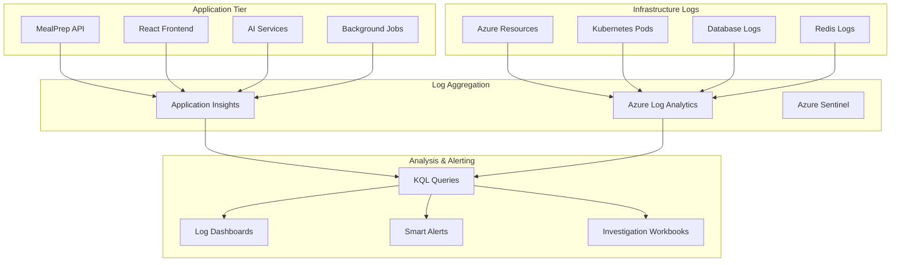

# Log Analysis and Troubleshooting Guide

## Overview
Comprehensive guide for log analysis and troubleshooting in the MealPrep AI-powered meal planning application, covering log aggregation, analysis techniques, debugging workflows, and automated alerting for proactive issue resolution.

## Logging Architecture

### Centralized Logging Overview


### Log Categories and Levels
```yaml
Log Categories:
  Application Logs:
    - Request/Response traces
    - Business logic operations
    - User authentication events
    - AI service interactions
    - Database operations
    
  System Logs:
    - Container lifecycle events
    - Resource utilization metrics
    - Network connectivity issues
    - Storage operations
    - Security events
    
  Integration Logs:
    - External API calls
    - Payment processing
    - Email service operations
    - File upload/download
    - Third-party service errors

Log Levels:
  TRACE: Detailed diagnostic information
  DEBUG: Development-time debugging information
  INFO: General application flow information
  WARN: Potentially harmful situations
  ERROR: Error events that allow application to continue
  FATAL: Critical errors that may cause application termination
```

---

## Application Logging Configuration

### .NET Core Logging Setup
```csharp
// Program.cs - Comprehensive logging configuration
public class Program
{
    public static void Main(string[] args)
    {
        var builder = WebApplication.CreateBuilder(args);
        
        // Configure logging
        builder.Logging.ClearProviders();
        
        // Console logging for development
        if (builder.Environment.IsDevelopment())
        {
            builder.Logging.AddConsole(options =>
            {
                options.IncludeScopes = true;
                options.TimestampFormat = "yyyy-MM-dd HH:mm:ss.fff ";
            });
            builder.Logging.AddDebug();
        }
        
        // Application Insights for production
        builder.Services.AddApplicationInsightsTelemetry(options =>
        {
            options.ConnectionString = builder.Configuration.GetConnectionString("ApplicationInsights");
            options.EnableAdaptiveSampling = true;
            options.EnableQuickPulseMetricStream = true;
        });
        
        // Structured logging with Serilog
        builder.Host.UseSerilog((context, configuration) =>
        {
            configuration
                .ReadFrom.Configuration(context.Configuration)
                .Enrich.FromLogContext()
                .Enrich.WithMachineName()
                .Enrich.WithThreadId()
                .Enrich.WithCorrelationId()
                .Enrich.With<UserContextEnricher>()
                .WriteTo.Console(outputTemplate: 
                    "[{Timestamp:yyyy-MM-dd HH:mm:ss.fff zzz}] [{Level:u3}] [{SourceContext}] {Message:lj} {Properties:j}{NewLine}{Exception}")
                .WriteTo.ApplicationInsights(
                    TelemetryConfiguration.CreateDefault(),
                    TelemetryConverter.Traces)
                .WriteTo.Conditional(
                    evt => evt.Level >= LogEventLevel.Warning,
                    wt => wt.AzureTableStorage(
                        connectionString: context.Configuration.GetConnectionString("AzureStorage"),
                        storageTableName: "MealPrepLogs"));
        });
        
        var app = builder.Build();
        
        // Request logging middleware
        app.UseMiddleware<RequestLoggingMiddleware>();
        app.UseSerilogRequestLogging(options =>
        {
            options.MessageTemplate = "HTTP {RequestMethod} {RequestPath} responded {StatusCode} in {Elapsed:0.0000} ms";
            options.GetLevel = GetLogLevel;
            options.EnrichDiagnosticContext = EnrichFromRequest;
        });
        
        app.Run();
    }
    
    private static LogEventLevel GetLogLevel(HttpContext context, double elapsedMs, Exception ex)
    {
        if (ex != null) return LogEventLevel.Error;
        if (context.Response.StatusCode >= 500) return LogEventLevel.Error;
        if (context.Response.StatusCode >= 400) return LogEventLevel.Warning;
        if (elapsedMs > 1000) return LogEventLevel.Warning;
        return LogEventLevel.Information;
    }
    
    private static void EnrichFromRequest(IDiagnosticContext diagnosticContext, HttpContext httpContext)
    {
        diagnosticContext.Set("RequestHost", httpContext.Request.Host.Value);
        diagnosticContext.Set("RequestScheme", httpContext.Request.Scheme);
        diagnosticContext.Set("UserAgent", httpContext.Request.Headers["User-Agent"].FirstOrDefault());
        diagnosticContext.Set("RemoteIP", httpContext.Connection.RemoteIpAddress?.ToString());
        
        if (httpContext.User.Identity?.IsAuthenticated == true)
        {
            diagnosticContext.Set("UserId", httpContext.User.FindFirst("sub")?.Value);
            diagnosticContext.Set("UserEmail", httpContext.User.FindFirst("email")?.Value);
        }
    }
}

// Custom enricher for user context
public class UserContextEnricher : ILogEventEnricher
{
    public void Enrich(LogEvent logEvent, ILogEventPropertyFactory propertyFactory)
    {
        var httpContext = GetHttpContext();
        if (httpContext?.User?.Identity?.IsAuthenticated == true)
        {
            logEvent.AddPropertyIfAbsent(propertyFactory.CreateProperty("UserId", 
                httpContext.User.FindFirst("sub")?.Value ?? "unknown"));
            logEvent.AddPropertyIfAbsent(propertyFactory.CreateProperty("SessionId", 
                httpContext.Session.Id));
        }
    }
    
    private HttpContext GetHttpContext()
    {
        return new HttpContextAccessor().HttpContext;
    }
}
```

### Request/Response Logging Middleware
```csharp
public class RequestLoggingMiddleware
{
    private readonly RequestDelegate _next;
    private readonly ILogger<RequestLoggingMiddleware> _logger;

    public RequestLoggingMiddleware(RequestDelegate next, ILogger<RequestLoggingMiddleware> logger)
    {
        _next = next;
        _logger = logger;
    }

    public async Task InvokeAsync(HttpContext context)
    {
        var correlationId = Guid.NewGuid().ToString();
        context.TraceIdentifier = correlationId;
        
        using var scope = _logger.BeginScope(new Dictionary<string, object>
        {
            ["CorrelationId"] = correlationId,
            ["RequestPath"] = context.Request.Path,
            ["RequestMethod"] = context.Request.Method,
            ["UserId"] = context.User?.FindFirst("sub")?.Value ?? "anonymous"
        });

        var stopwatch = Stopwatch.StartNew();
        
        // Log request details
        await LogRequestAsync(context, correlationId);
        
        // Capture response
        var originalResponseBodyStream = context.Response.Body;
        using var responseBodyStream = new MemoryStream();
        context.Response.Body = responseBodyStream;
        
        try
        {
            await _next(context);
        }
        catch (Exception ex)
        {
            _logger.LogError(ex, "Unhandled exception occurred during request processing");
            throw;
        }
        finally
        {
            stopwatch.Stop();
            
            // Log response details
            await LogResponseAsync(context, correlationId, stopwatch.ElapsedMilliseconds, responseBodyStream);
            
            // Copy response back to original stream
            responseBodyStream.Seek(0, SeekOrigin.Begin);
            await responseBodyStream.CopyToAsync(originalResponseBodyStream);
        }
    }

    private async Task LogRequestAsync(HttpContext context, string correlationId)
    {
        if (ShouldLogRequest(context))
        {
            var requestBody = string.Empty;
            if (context.Request.ContentLength > 0 && context.Request.ContentLength < 10000)
            {
                context.Request.EnableBuffering();
                using var reader = new StreamReader(context.Request.Body, Encoding.UTF8, false, 1024, true);
                requestBody = await reader.ReadToEndAsync();
                context.Request.Body.Position = 0;
            }

            _logger.LogInformation("Request started: {RequestMethod} {RequestPath} {QueryString} {RequestBody}",
                context.Request.Method,
                context.Request.Path,
                context.Request.QueryString,
                SanitizeRequestBody(requestBody));
        }
    }

    private async Task LogResponseAsync(HttpContext context, string correlationId, long elapsedMs, MemoryStream responseBodyStream)
    {
        if (ShouldLogResponse(context))
        {
            var responseBody = string.Empty;
            if (responseBodyStream.Length > 0 && responseBodyStream.Length < 10000)
            {
                responseBodyStream.Seek(0, SeekOrigin.Begin);
                responseBody = await new StreamReader(responseBodyStream).ReadToEndAsync();
            }

            _logger.LogInformation("Request completed: {StatusCode} in {ElapsedMilliseconds}ms {ResponseBody}",
                context.Response.StatusCode,
                elapsedMs,
                SanitizeResponseBody(responseBody));
        }
    }

    private bool ShouldLogRequest(HttpContext context)
    {
        // Skip logging for health checks and static files
        return !context.Request.Path.StartsWithSegments("/health") &&
               !context.Request.Path.StartsWithSegments("/swagger") &&
               !context.Request.Path.StartsWithSegments("/favicon.ico");
    }

    private bool ShouldLogResponse(HttpContext context)
    {
        return ShouldLogRequest(context) && 
               (context.Response.StatusCode >= 400 || 
                context.Request.Path.StartsWithSegments("/api"));
    }

    private string SanitizeRequestBody(string requestBody)
    {
        if (string.IsNullOrEmpty(requestBody)) return requestBody;
        
        // Remove sensitive information
        return Regex.Replace(requestBody, 
            @"""(password|token|secret|key)""\s*:\s*""[^""]*""", 
            @"""$1"":""***""", 
            RegexOptions.IgnoreCase);
    }

    private string SanitizeResponseBody(string responseBody)
    {
        if (string.IsNullOrEmpty(responseBody)) return responseBody;
        
        // Remove sensitive information from responses
        return Regex.Replace(responseBody,
            @"""(accessToken|refreshToken|password)""\s*:\s*""[^""]*""",
            @"""$1"":""***""",
            RegexOptions.IgnoreCase);
    }
}
```

### Structured Logging for Business Operations
```csharp
public class RecipeService
{
    private readonly ILogger<RecipeService> _logger;
    private readonly IMetrics _metrics;

    public async Task<Recipe> CreateRecipeAsync(CreateRecipeRequest request, string userId)
    {
        using var scope = _logger.BeginScope(new Dictionary<string, object>
        {
            ["Operation"] = "CreateRecipe",
            ["UserId"] = userId,
            ["RecipeName"] = request.Name
        });

        _logger.LogInformation("Starting recipe creation for user {UserId}", userId);
        
        var stopwatch = Stopwatch.StartNew();
        
        try
        {
            // Validate request
            await ValidateRecipeRequestAsync(request);
            _logger.LogDebug("Recipe request validation completed successfully");

            // Check for duplicates
            var existingRecipe = await _recipeRepository.GetByNameAsync(request.Name, userId);
            if (existingRecipe != null)
            {
                _logger.LogWarning("Duplicate recipe name detected: {RecipeName} for user {UserId}", 
                    request.Name, userId);
                throw new DuplicateRecipeException($"Recipe with name '{request.Name}' already exists");
            }

            // Create recipe
            var recipe = new Recipe
            {
                Name = request.Name,
                Description = request.Description,
                UserId = int.Parse(userId),
                CreatedAt = DateTime.UtcNow
            };

            await _recipeRepository.CreateAsync(recipe);
            
            stopwatch.Stop();
            
            _logger.LogInformation("Recipe created successfully: {RecipeId} in {ElapsedMs}ms", 
                recipe.Id, stopwatch.ElapsedMilliseconds);
            
            // Record metrics
            _metrics.Measure.Counter.Increment("recipes.created", new MetricTags("user_id", userId));
            _metrics.Measure.Timer.Time("recipes.creation_time", stopwatch.ElapsedMilliseconds);
            
            return recipe;
        }
        catch (ValidationException ex)
        {
            _logger.LogWarning(ex, "Recipe validation failed for user {UserId}: {ValidationErrors}", 
                userId, string.Join(", ", ex.Errors));
            throw;
        }
        catch (DuplicateRecipeException ex)
        {
            _logger.LogWarning(ex, "Duplicate recipe creation attempt by user {UserId}", userId);
            throw;
        }
        catch (Exception ex)
        {
            stopwatch.Stop();
            _logger.LogError(ex, "Recipe creation failed for user {UserId} after {ElapsedMs}ms", 
                userId, stopwatch.ElapsedMilliseconds);
            
            _metrics.Measure.Counter.Increment("recipes.creation_errors", new MetricTags("user_id", userId));
            throw;
        }
    }
}

// AI Service logging
public class GeminiAIService
{
    private readonly ILogger<GeminiAIService> _logger;

    public async Task<AISuggestionResponse> GenerateMealSuggestionsAsync(AISuggestionRequest request)
    {
        using var scope = _logger.BeginScope(new Dictionary<string, object>
        {
            ["Operation"] = "GenerateAISuggestions", 
            ["FamilyId"] = request.FamilyId,
            ["MealType"] = request.MealType,
            ["RequestId"] = Guid.NewGuid().ToString()
        });

        _logger.LogInformation("Starting AI meal suggestion generation for family {FamilyId}", request.FamilyId);
        
        var stopwatch = Stopwatch.StartNew();
        
        try
        {
            // Build family persona
            var familyPersona = await BuildFamilyPersonaAsync(request.FamilyId);
            _logger.LogDebug("Family persona built: {PersonaHash}", familyPersona.GetHashCode());

            // Generate AI prompt
            var prompt = BuildAIPrompt(request, familyPersona);
            _logger.LogTrace("AI prompt generated: {PromptLength} characters", prompt.Length);

            // Call Gemini API
            var geminiResponse = await CallGeminiAPIAsync(prompt);
            stopwatch.Stop();

            _logger.LogInformation("AI suggestions generated successfully in {ElapsedMs}ms: {SuggestionCount} suggestions", 
                stopwatch.ElapsedMilliseconds, geminiResponse.Suggestions?.Count ?? 0);

            // Log AI quality metrics
            var avgConfidence = geminiResponse.Suggestions?.Average(s => s.ConfidenceScore) ?? 0;
            _logger.LogInformation("AI suggestion quality: average confidence {AvgConfidence:F2}", avgConfidence);

            return geminiResponse;
        }
        catch (HttpRequestException ex)
        {
            stopwatch.Stop();
            _logger.LogError(ex, "Gemini API call failed after {ElapsedMs}ms: {ErrorMessage}", 
                stopwatch.ElapsedMilliseconds, ex.Message);
            
            // Return fallback suggestions
            return await GetFallbackSuggestionsAsync(request);
        }
        catch (Exception ex)
        {
            stopwatch.Stop();
            _logger.LogError(ex, "AI suggestion generation failed after {ElapsedMs}ms", 
                stopwatch.ElapsedMilliseconds);
            throw;
        }
    }
}
```

---

## Frontend Logging Configuration

### React Application Logging
```typescript
// Frontend logging service
export class LoggingService {
    private static instance: LoggingService;
    private apiClient: HttpClient;
    private logBuffer: LogEntry[] = [];
    private flushInterval: NodeJS.Timeout;
    
    private constructor() {
        this.apiClient = new HttpClient();
        this.setupAutoFlush();
        this.setupGlobalErrorHandling();
    }
    
    public static getInstance(): LoggingService {
        if (!LoggingService.instance) {
            LoggingService.instance = new LoggingService();
        }
        return LoggingService.instance;
    }
    
    // Log levels
    public trace(message: string, data?: any, context?: LogContext): void {
        this.log('trace', message, data, context);
    }
    
    public debug(message: string, data?: any, context?: LogContext): void {
        this.log('debug', message, data, context);
    }
    
    public info(message: string, data?: any, context?: LogContext): void {
        this.log('info', message, data, context);
    }
    
    public warn(message: string, data?: any, context?: LogContext): void {
        this.log('warn', message, data, context);
    }
    
    public error(message: string, error?: Error, data?: any, context?: LogContext): void {
        this.log('error', message, { error: this.serializeError(error), ...data }, context);
    }
    
    private log(level: LogLevel, message: string, data?: any, context?: LogContext): void {
        const logEntry: LogEntry = {
            timestamp: new Date().toISOString(),
            level,
            message,
            data: this.sanitizeData(data),
            context: {
                url: window.location.href,
                userAgent: navigator.userAgent,
                userId: this.getCurrentUserId(),
                sessionId: this.getSessionId(),
                correlationId: this.getCorrelationId(),
                ...context
            },
            fingerprint: this.generateFingerprint(level, message)
        };
        
        // Console logging for development
        if (process.env.NODE_ENV === 'development') {
            this.logToConsole(logEntry);
        }
        
        // Buffer for backend logging
        if (level !== 'trace' && level !== 'debug') {
            this.logBuffer.push(logEntry);
            
            // Immediate flush for errors
            if (level === 'error') {
                this.flushLogs();
            }
        }
    }
    
    private setupGlobalErrorHandling(): void {
        // Unhandled promise rejections
        window.addEventListener('unhandledrejection', (event) => {
            this.error('Unhandled promise rejection', event.reason, {
                promise: event.promise.toString()
            });
        });
        
        // Global JavaScript errors
        window.addEventListener('error', (event) => {
            this.error('Global JavaScript error', new Error(event.message), {
                filename: event.filename,
                lineno: event.lineno,
                colno: event.colno,
                stack: event.error?.stack
            });
        });
        
        // React error boundary fallback
        window.addEventListener('react-error', (event: CustomEvent) => {
            this.error('React component error', event.detail.error, {
                componentStack: event.detail.componentStack,
                errorBoundary: event.detail.errorBoundary
            });
        });
    }
    
    private setupAutoFlush(): void {
        // Flush logs every 30 seconds
        this.flushInterval = setInterval(() => {
            if (this.logBuffer.length > 0) {
                this.flushLogs();
            }
        }, 30000);
        
        // Flush on page unload
        window.addEventListener('beforeunload', () => {
            this.flushLogs();
        });
        
        // Flush when buffer reaches threshold
        if (this.logBuffer.length >= 50) {
            this.flushLogs();
        }
    }
    
    private async flushLogs(): Promise<void> {
        if (this.logBuffer.length === 0) return;
        
        const logsToSend = [...this.logBuffer];
        this.logBuffer = [];
        
        try {
            await this.apiClient.post('/api/logs/client', {
                logs: logsToSend,
                metadata: {
                    timestamp: new Date().toISOString(),
                    batchId: uuidv4(),
                    userAgent: navigator.userAgent,
                    url: window.location.href
                }
            });
        } catch (error) {
            // Re-add logs to buffer for retry
            this.logBuffer.unshift(...logsToSend);
            console.error('Failed to send logs to server:', error);
        }
    }
    
    private sanitizeData(data: any): any {
        if (!data) return data;
        
        const sanitized = JSON.parse(JSON.stringify(data));
        
        // Remove sensitive information
        const sensitiveKeys = ['password', 'token', 'secret', 'key', 'authorization'];
        
        function recursiveSanitize(obj: any): any {
            if (typeof obj === 'object' && obj !== null) {
                for (const key in obj) {
                    if (sensitiveKeys.some(sk => key.toLowerCase().includes(sk))) {
                        obj[key] = '***';
                    } else if (typeof obj[key] === 'object') {
                        recursiveSanitize(obj[key]);
                    }
                }
            }
            return obj;
        }
        
        return recursiveSanitize(sanitized);
    }
    
    private serializeError(error?: Error): any {
        if (!error) return null;
        
        return {
            name: error.name,
            message: error.message,
            stack: error.stack,
            cause: error.cause
        };
    }
    
    private generateFingerprint(level: LogLevel, message: string): string {
        return btoa(`${level}:${message.replace(/\d+/g, 'X')}`).substring(0, 16);
    }
    
    private getCurrentUserId(): string | null {
        const token = localStorage.getItem('accessToken');
        if (!token) return null;
        
        try {
            const payload = JSON.parse(atob(token.split('.')[1]));
            return payload.sub || null;
        } catch {
            return null;
        }
    }
    
    private getSessionId(): string {
        let sessionId = sessionStorage.getItem('sessionId');
        if (!sessionId) {
            sessionId = uuidv4();
            sessionStorage.setItem('sessionId', sessionId);
        }
        return sessionId;
    }
    
    private getCorrelationId(): string {
        return uuidv4();
    }
    
    private logToConsole(entry: LogEntry): void {
        const style = this.getConsoleStyle(entry.level);
        console.groupCollapsed(`%c[${entry.level.toUpperCase()}] ${entry.message}`, style);
        console.log('Timestamp:', entry.timestamp);
        console.log('Context:', entry.context);
        if (entry.data) {
            console.log('Data:', entry.data);
        }
        console.groupEnd();
    }
    
    private getConsoleStyle(level: LogLevel): string {
        const styles = {
            trace: 'color: #999',
            debug: 'color: #0066cc',
            info: 'color: #009900',
            warn: 'color: #ff9900; font-weight: bold',
            error: 'color: #cc0000; font-weight: bold'
        };
        return styles[level] || '';
    }
}

// React Hook for logging
export const useLogging = () => {
    const logger = LoggingService.getInstance();
    
    const logPageView = useCallback((pageName: string, additionalData?: any) => {
        logger.info(`Page viewed: ${pageName}`, {
            page: pageName,
            referrer: document.referrer,
            ...additionalData
        });
    }, [logger]);
    
    const logUserAction = useCallback((action: string, data?: any) => {
        logger.info(`User action: ${action}`, {
            action,
            timestamp: new Date().toISOString(),
            ...data
        });
    }, [logger]);
    
    const logApiCall = useCallback((endpoint: string, method: string, duration: number, status: number) => {
        const level = status >= 400 ? 'error' : status >= 300 ? 'warn' : 'info';
        logger[level](`API call: ${method} ${endpoint}`, {
            endpoint,
            method,
            duration,
            status,
            timestamp: new Date().toISOString()
        });
    }, [logger]);
    
    return {
        logger,
        logPageView,
        logUserAction,
        logApiCall
    };
};

// Types
interface LogEntry {
    timestamp: string;
    level: LogLevel;
    message: string;
    data?: any;
    context: LogContext;
    fingerprint: string;
}

interface LogContext {
    url: string;
    userAgent: string;
    userId: string | null;
    sessionId: string;
    correlationId: string;
    [key: string]: any;
}

type LogLevel = 'trace' | 'debug' | 'info' | 'warn' | 'error';
```

---

## Log Analysis Queries (KQL)

### Common Troubleshooting Queries

#### API Performance Analysis
```kql
// Slow API requests analysis
AppRequests
| where TimeGenerated > ago(1h)
| where DurationMs > 1000
| summarize 
    count() as SlowRequestCount,
    avg(DurationMs) as AvgDuration,
    max(DurationMs) as MaxDuration,
    percentile(DurationMs, 95) as P95Duration
    by Url, ResultCode
| order by SlowRequestCount desc

// Error rate trending
AppRequests
| where TimeGenerated > ago(24h)
| summarize 
    TotalRequests = count(),
    ErrorRequests = countif(Success == false),
    ErrorRate = round(countif(Success == false) * 100.0 / count(), 2)
    by bin(TimeGenerated, 1h)
| order by TimeGenerated desc

// Top failing endpoints
AppRequests
| where TimeGenerated > ago(24h)
| where Success == false
| summarize 
    FailureCount = count(),
    UniqueUsers = dcount(UserId),
    LastFailure = max(TimeGenerated)
    by Url, ResultCode
| order by FailureCount desc
| take 20
```

#### User Authentication Issues
```kql
// Failed login attempts analysis
AppTraces
| where TimeGenerated > ago(24h)
| where Message contains "login" and SeverityLevel >= 2
| extend UserId = tostring(Properties.UserId)
| extend RemoteIP = tostring(Properties.RemoteIP)
| summarize 
    FailedAttempts = count(),
    FirstAttempt = min(TimeGenerated),
    LastAttempt = max(TimeGenerated),
    UniqueIPs = dcount(RemoteIP)
    by UserId
| where FailedAttempts > 5
| order by FailedAttempts desc

// Suspicious login patterns
AppTraces
| where TimeGenerated > ago(1h)
| where Message contains "login successful"
| extend UserId = tostring(Properties.UserId)
| extend RemoteIP = tostring(Properties.RemoteIP)
| summarize 
    LoginCount = count(),
    UniqueIPs = dcount(RemoteIP),
    IPs = make_set(RemoteIP)
    by UserId, bin(TimeGenerated, 5m)
| where UniqueIPs > 3 or LoginCount > 10
| order by TimeGenerated desc
```

#### AI Service Analysis
```kql
// AI service performance and errors
AppTraces
| where TimeGenerated > ago(6h)
| where Message contains "AI" or Message contains "Gemini"
| extend Operation = tostring(Properties.Operation)
| extend Duration = toint(Properties.ElapsedMs)
| extend FamilyId = tostring(Properties.FamilyId)
| summarize 
    RequestCount = count(),
    AvgDuration = avg(Duration),
    MaxDuration = max(Duration),
    ErrorCount = countif(SeverityLevel >= 3),
    ErrorRate = round(countif(SeverityLevel >= 3) * 100.0 / count(), 2)
    by Operation, bin(TimeGenerated, 30m)
| order by TimeGenerated desc

// AI suggestion quality tracking
AppTraces
| where TimeGenerated > ago(24h)
| where Message contains "AI suggestion quality"
| extend AvgConfidence = todouble(Properties.AvgConfidence)
| extend FamilyId = tostring(Properties.FamilyId)
| summarize 
    SuggestionBatches = count(),
    OverallAvgConfidence = avg(AvgConfidence),
    MinConfidence = min(AvgConfidence),
    MaxConfidence = max(AvgConfidence)
    by bin(TimeGenerated, 1h)
| order by TimeGenerated desc
```

#### Database Performance Analysis
```kql
// Database query performance
AppDependencies
| where TimeGenerated > ago(2h)
| where Type == "SQL"
| extend QueryType = case(
    Data contains "SELECT", "SELECT",
    Data contains "INSERT", "INSERT", 
    Data contains "UPDATE", "UPDATE",
    Data contains "DELETE", "DELETE",
    "OTHER"
)
| summarize 
    QueryCount = count(),
    AvgDuration = avg(DurationMs),
    MaxDuration = max(DurationMs),
    P95Duration = percentile(DurationMs, 95)
    by QueryType, Target, bin(TimeGenerated, 15m)
| where AvgDuration > 100
| order by TimeGenerated desc, AvgDuration desc

// Database connection issues
AppExceptions
| where TimeGenerated > ago(1h)
| where OuterMessage contains "connection" or OuterMessage contains "timeout"
| extend ErrorType = case(
    OuterMessage contains "timeout", "Timeout",
    OuterMessage contains "connection pool", "Connection Pool",
    OuterMessage contains "network", "Network",
    "Other"
)
| summarize 
    ErrorCount = count(),
    FirstOccurrence = min(TimeGenerated),
    LastOccurrence = max(TimeGenerated),
    AffectedOperations = dcount(OperationName)
    by ErrorType, bin(TimeGenerated, 5m)
| order by TimeGenerated desc
```

#### Frontend Error Analysis
```kql
// Client-side JavaScript errors
AppTraces
| where TimeGenerated > ago(6h)
| where Properties.Source == "client"
| where SeverityLevel >= 2
| extend ErrorType = tostring(Properties.ErrorType)
| extend UserAgent = tostring(Properties.UserAgent)
| extend Browser = case(
    UserAgent contains "Chrome", "Chrome",
    UserAgent contains "Firefox", "Firefox", 
    UserAgent contains "Safari", "Safari",
    UserAgent contains "Edge", "Edge",
    "Other"
)
| summarize 
    ErrorCount = count(),
    UniqueUsers = dcount(tostring(Properties.UserId)),
    UniqueSessions = dcount(tostring(Properties.SessionId))
    by ErrorType, Browser, bin(TimeGenerated, 30m)
| order by TimeGenerated desc, ErrorCount desc

// API call failures from frontend
AppTraces
| where TimeGenerated > ago(2h)
| where Message contains "API call:" and SeverityLevel >= 2
| extend Endpoint = tostring(Properties.Endpoint)
| extend Method = tostring(Properties.Method)
| extend Status = toint(Properties.Status)
| summarize 
    FailureCount = count(),
    UniqueUsers = dcount(tostring(Properties.UserId)),
    AvgDuration = avg(toint(Properties.Duration))
    by Endpoint, Method, Status, bin(TimeGenerated, 15m)
| order by TimeGenerated desc, FailureCount desc
```

---

## Automated Alerting Rules

### Critical System Alerts
```yaml
# Azure Monitor Alert Rules
Critical_Alerts:
  - name: "High Error Rate"
    description: "API error rate exceeds 5% for 5 minutes"
    query: |
      AppRequests
      | where TimeGenerated > ago(5m)
      | summarize 
          TotalRequests = count(),
          ErrorRequests = countif(Success == false),
          ErrorRate = round(countif(Success == false) * 100.0 / count(), 2)
      | where ErrorRate > 5 and TotalRequests > 10
    threshold: 1
    severity: "Critical"
    action_group: "MealPrep-Critical-Alerts"
    
  - name: "Database Connection Failures"
    description: "Multiple database connection failures detected"
    query: |
      AppExceptions
      | where TimeGenerated > ago(5m)
      | where OuterMessage contains "connection" or OuterMessage contains "SQL"
      | summarize ErrorCount = count()
      | where ErrorCount > 5
    threshold: 1
    severity: "Critical"
    action_group: "MealPrep-Critical-Alerts"
    
  - name: "AI Service Degradation"
    description: "AI service response time degraded significantly"
    query: |
      AppTraces
      | where TimeGenerated > ago(10m)
      | where Message contains "AI suggestions generated"
      | extend Duration = toint(Properties.ElapsedMs)
      | summarize 
          AvgDuration = avg(Duration),
          RequestCount = count()
      | where AvgDuration > 15000 and RequestCount > 3
    threshold: 1
    severity: "High"
    action_group: "MealPrep-High-Alerts"

Warning_Alerts:
  - name: "Slow API Responses"
    description: "API response times consistently above threshold"
    query: |
      AppRequests
      | where TimeGenerated > ago(15m)
      | summarize 
          P95Duration = percentile(DurationMs, 95),
          RequestCount = count()
      | where P95Duration > 2000 and RequestCount > 20
    threshold: 1
    severity: "Warning"
    action_group: "MealPrep-Warning-Alerts"
    
  - name: "Unusual Traffic Pattern"
    description: "Significant deviation from normal traffic patterns"
    query: |
      AppRequests
      | where TimeGenerated > ago(15m)
      | summarize CurrentRequests = count()
      | join (
          AppRequests
          | where TimeGenerated between (ago(7d)..ago(6d))
          | where hourofday(TimeGenerated) == hourofday(now())
          | summarize HistoricalAvg = avg(count()) by bin(TimeGenerated, 15m)
          | summarize BaselineRequests = avg(HistoricalAvg)
      ) on $left.dummy == $right.dummy
      | extend DeviationRatio = CurrentRequests * 1.0 / BaselineRequests
      | where DeviationRatio > 3 or DeviationRatio < 0.3
    threshold: 1
    severity: "Warning"
    action_group: "MealPrep-Warning-Alerts"
```

### Alert Action Groups
```json
{
  "actionGroups": [
    {
      "name": "MealPrep-Critical-Alerts",
      "shortName": "CriticalAG",
      "enabled": true,
      "emailReceivers": [
        {
          "name": "OpsTeam",
          "emailAddress": "ops@mealprep.com",
          "useCommonAlertSchema": true
        }
      ],
      "smsReceivers": [
        {
          "name": "OnCallEngineer", 
          "countryCode": "1",
          "phoneNumber": "+1234567890"
        }
      ],
      "webhookReceivers": [
        {
          "name": "TeamsWebhook",
          "serviceUri": "https://outlook.office.com/webhook/...",
          "useCommonAlertSchema": true
        },
        {
          "name": "PagerDutyWebhook",
          "serviceUri": "https://events.pagerduty.com/integration/...",
          "useCommonAlertSchema": false
        }
      ],
      "logicAppReceivers": [
        {
          "name": "AutoRemediation",
          "resourceId": "/subscriptions/.../providers/Microsoft.Logic/workflows/alert-remediation",
          "callbackUrl": "https://prod-00.westus.logic.azure.com/...",
          "useCommonAlertSchema": true
        }
      ]
    }
  ]
}
```

---

## Log Retention and Archival

### Log Lifecycle Management
```bash
#!/bin/bash
# scripts/logging/log-lifecycle-management.sh

ENVIRONMENT=${1:-production}
RETENTION_DAYS=${2:-90}

echo "???  Log Lifecycle Management for $ENVIRONMENT"
echo "Retention period: $RETENTION_DAYS days"
echo "============================================="

# 1. Application Insights data retention
echo "1. Configuring Application Insights retention..."
az monitor app-insights component update \
    --app "mealprep-$ENVIRONMENT-insights" \
    --resource-group "rg-mealprep-$ENVIRONMENT" \
    --retention-time $RETENTION_DAYS

# 2. Log Analytics workspace retention
echo "2. Configuring Log Analytics retention..."
az monitor log-analytics workspace update \
    --workspace-name "mealprep-$ENVIRONMENT-logs" \
    --resource-group "rg-mealprep-$ENVIRONMENT" \
    --retention-time $RETENTION_DAYS

# 3. Storage account lifecycle policy for archived logs
echo "3. Setting up storage lifecycle policies..."
cat > lifecycle-policy.json << EOF
{
  "rules": [
    {
      "enabled": true,
      "name": "LogArchivalPolicy",
      "type": "Lifecycle",
      "definition": {
        "filters": {
          "blobTypes": ["blockBlob"],
          "prefixMatch": ["logs/"]
        },
        "actions": {
          "baseBlob": {
            "tierToCool": {
              "daysAfterModificationGreaterThan": 30
            },
            "tierToArchive": {
              "daysAfterModificationGreaterThan": 90
            },
            "delete": {
              "daysAfterModificationGreaterThan": 2555
            }
          }
        }
      }
    }
  ]
}
EOF

az storage account management-policy create \
    --account-name "mealprep${ENVIRONMENT}logs" \
    --resource-group "rg-mealprep-$ENVIRONMENT" \
    --policy @lifecycle-policy.json

# 4. Automated log export for compliance
echo "4. Setting up automated log export..."
az monitor log-analytics workspace data-export create \
    --workspace-name "mealprep-$ENVIRONMENT-logs" \
    --resource-group "rg-mealprep-$ENVIRONMENT" \
    --data-export-name "SecurityLogsExport" \
    --tables "AppTraces" "AppExceptions" "AppRequests" \
    --destination "/subscriptions/$(az account show --query id -o tsv)/resourceGroups/rg-mealprep-$ENVIRONMENT/providers/Microsoft.Storage/storageAccounts/mealprep${ENVIRONMENT}logs"

echo "? Log lifecycle management configured successfully"
```

### Compliance and Security Log Management
```powershell
# PowerShell script for compliance log management
param(
    [Parameter(Mandatory=$true)]
    [string]$Environment,
    
    [Parameter(Mandatory=$false)]
    [int]$ComplianceRetentionYears = 7
)

Write-Host "?? Compliance Log Management for $Environment" -ForegroundColor Green
Write-Host "Compliance retention: $ComplianceRetentionYears years" -ForegroundColor Green
Write-Host "=============================================" -ForegroundColor Green

# Security event log export
$securityQuery = @"
union AppTraces, AppExceptions, AppRequests
| where TimeGenerated > ago(1d)
| where (Message contains "login" or Message contains "authentication" or 
         Message contains "authorization" or SeverityLevel >= 2)
| extend EventType = case(
    Message contains "login", "Authentication",
    Message contains "authorization", "Authorization", 
    SeverityLevel >= 3, "SecurityIncident",
    "SecurityEvent"
)
| project TimeGenerated, EventType, Message, Properties, UserId = tostring(Properties.UserId)
| order by TimeGenerated desc
"@

# Export security logs for compliance
$exportResult = az monitor log-analytics query `
    --workspace "mealprep-$Environment-logs" `
    --analytics-query $securityQuery `
    --output json

# Save to compliance storage
$complianceStorage = "mealprep${Environment}compliance"
$fileName = "security-logs-$(Get-Date -Format 'yyyy-MM-dd').json"

$exportResult | Out-File -FilePath $fileName -Encoding UTF8
az storage blob upload `
    --account-name $complianceStorage `
    --container-name "compliance-logs" `
    --name "security/$fileName" `
    --file $fileName `
    --tier Archive

Write-Host "? Security logs exported for compliance" -ForegroundColor Green

# Audit trail generation
$auditQuery = @"
AppTraces
| where TimeGenerated > ago(1d)
| where Properties.Operation in ("CreateRecipe", "UpdateRecipe", "DeleteRecipe", 
                                  "AddFamilyMember", "UpdateUser", "DeleteUser")
| extend AuditEvent = strcat(Properties.Operation, " by ", Properties.UserId)
| project TimeGenerated, AuditEvent, Properties
| order by TimeGenerated desc
"@

$auditResult = az monitor log-analytics query `
    --workspace "mealprep-$Environment-logs" `
    --analytics-query $auditQuery `
    --output json

$auditFileName = "audit-trail-$(Get-Date -Format 'yyyy-MM-dd').json"
$auditResult | Out-File -FilePath $auditFileName -Encoding UTF8

az storage blob upload `
    --account-name $complianceStorage `
    --container-name "compliance-logs" `
    --name "audit/$auditFileName" `
    --file $auditFileName `
    --tier Archive

Write-Host "? Audit trail generated and archived" -ForegroundColor Green

# Cleanup local files
Remove-Item $fileName, $auditFileName

Write-Host "? Compliance log management completed" -ForegroundColor Green
```

This comprehensive log analysis and troubleshooting guide provides production-ready logging infrastructure, analysis techniques, and automated alerting for maintaining system health and rapid issue resolution in the MealPrep application.

---

*Last Updated: December 2024*  
*Log analysis guide continuously updated with new troubleshooting scenarios and analysis techniques*