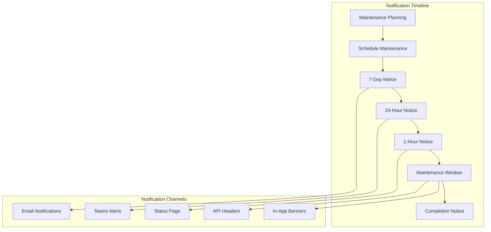

# Maintenance Schedules and Procedures

## Overview
Comprehensive maintenance schedule and procedures guide for the MealPrep AI-powered meal planning application, covering routine maintenance tasks, scheduled downtime procedures, system health checks, dependency updates, and automated maintenance workflows across all environments.

## Maintenance Philosophy and Schedule

### Maintenance Windows and Timing
```yaml
Maintenance Schedule:
  Production Environment:
    Primary Window: 
      - Day: Sunday
      - Time: 02:00 - 04:00 UTC
      - Duration: 2 hours maximum
      - Frequency: Weekly
    
    Emergency Window:
      - Day: Any
      - Time: 02:00 - 06:00 UTC
      - Duration: 4 hours maximum
      - Frequency: As needed
    
    Extended Maintenance:
      - Day: First Sunday of month
      - Time: 01:00 - 05:00 UTC
      - Duration: 4 hours maximum
      - Frequency: Monthly
  
  Staging Environment:
    Primary Window:
      - Day: Saturday
      - Time: 20:00 - 23:00 UTC
      - Duration: 3 hours maximum
      - Frequency: Weekly
  
  Development Environment:
    Continuous Maintenance:
      - No scheduled downtime
      - Rolling updates during business hours
      - Automatic overnight maintenance

Maintenance Types:
  Routine Maintenance:
    - Security patches
    - Dependency updates
    - Database maintenance
    - Certificate renewals
    - Log cleanup
    - Performance optimization
  
  Scheduled Maintenance:
    - Major version upgrades
    - Infrastructure scaling
    - Database schema changes
    - Configuration updates
    - Disaster recovery testing
  
  Emergency Maintenance:
    - Critical security patches
    - System failures
    - Data corruption recovery
    - Performance issues
```

### Maintenance Notification Strategy


---

## Routine Maintenance Procedures

### Weekly Maintenance Script
```bash
#!/bin/bash
# scripts/maintenance/weekly-maintenance.sh

ENVIRONMENT=${1:-production}
MAINTENANCE_TYPE=${2:-routine}
DRY_RUN=${3:-false}

echo "?? Weekly Maintenance - $ENVIRONMENT"
echo "Maintenance type: $MAINTENANCE_TYPE"
echo "Dry run: $DRY_RUN"
echo "Start time: $(date)"
echo "======================================="

RESOURCE_GROUP="rg-mealprep-$ENVIRONMENT"
MAINTENANCE_LOG="maintenance-$(date +%Y%m%d-%H%M%S).log"

# Function to log maintenance activities
log_activity() {
    local message="$1"
    local timestamp=$(date '+%Y-%m-%d %H:%M:%S')
    echo "[$timestamp] $message" | tee -a $MAINTENANCE_LOG
}

# Function to send maintenance notifications
send_notification() {
    local status="$1"
    local message="$2"
    
    if [ "$DRY_RUN" = "false" ]; then
        curl -X POST "https://outlook.office.com/webhook/..." \
            -H "Content-Type: application/json" \
            -d '{
                "text": "?? Maintenance Update - '$ENVIRONMENT'",
                "sections": [{
                    "activityTitle": "Weekly Maintenance",
                    "activitySubtitle": "Environment: '$ENVIRONMENT'",
                    "facts": [
                        {"name": "Status", "value": "'$status'"},
                        {"name": "Message", "value": "'$message'"},
                        {"name": "Time", "value": "'$(date)'"}
                    ]
                }]
            }'
    fi
}

# 1. Pre-maintenance health check
log_activity "Starting pre-maintenance health check"
send_notification "IN_PROGRESS" "Starting weekly maintenance procedures"

# Check application health
APP_HEALTH=$(curl -s -o /dev/null -w "%{http_code}" "https://api-$ENVIRONMENT.mealprep.com/health" || echo "000")
if [ "$APP_HEALTH" != "200" ]; then
    log_activity "WARNING: Application health check failed (HTTP $APP_HEALTH)"
    send_notification "WARNING" "Application health check failed before maintenance"
fi

# Check database connectivity
DB_CONNECTION_TEST=$(az sql db show \
    --name "mealprep-$ENVIRONMENT-db" \
    --resource-group $RESOURCE_GROUP \
    --server "mealprep-$ENVIRONMENT-sql" \
    --query 'status' -o tsv 2>/dev/null || echo "FAILED")

if [ "$DB_CONNECTION_TEST" != "Online" ]; then
    log_activity "WARNING: Database connectivity check failed"
    send_notification "WARNING" "Database connectivity issues detected"
fi

log_activity "Pre-maintenance health check completed"

# 2. Application updates and patches
log_activity "Starting application updates"

if [ "$MAINTENANCE_TYPE" = "routine" ] || [ "$MAINTENANCE_TYPE" = "full" ]; then
    # Get current image versions
    CURRENT_API_IMAGE=$(az containerapp show \
        --name "mealprep-$ENVIRONMENT-api" \
        --resource-group $RESOURCE_GROUP \
        --query 'properties.template.containers[0].image' -o tsv)
    
    log_activity "Current API image: $CURRENT_API_IMAGE"
    
    # Check for security updates
    SECURITY_UPDATES=$(az acr repository show-tags \
        --name "mealprep$ENVIRONMENT" \
        --repository "mealprep-api" \
        --orderby time_desc \
        --top 5 \
        --query '[?contains(name, `security`)]' -o tsv)
    
    if [ -n "$SECURITY_UPDATES" ]; then
        log_activity "Security updates available: $SECURITY_UPDATES"
        
        if [ "$DRY_RUN" = "false" ]; then
            # Apply security updates
            LATEST_SECURITY_TAG=$(echo $SECURITY_UPDATES | head -1)
            NEW_IMAGE="mealprep$ENVIRONMENT.azurecr.io/mealprep-api:$LATEST_SECURITY_TAG"
            
            az containerapp update \
                --name "mealprep-$ENVIRONMENT-api" \
                --resource-group $RESOURCE_GROUP \
                --image $NEW_IMAGE
            
            log_activity "Applied security update: $NEW_IMAGE"
        else
            log_activity "DRY RUN: Would apply security update"
        fi
    else
        log_activity "No security updates available"
    fi
fi

# 3. Database maintenance
log_activity "Starting database maintenance"

if [ "$DRY_RUN" = "false" ]; then
    # Database index maintenance
    sqlcmd -S "mealprep-$ENVIRONMENT-sql.database.windows.net" \
        -d "mealprep-$ENVIRONMENT-db" \
        -U $(az keyvault secret show --vault-name "mealprep-$ENVIRONMENT-kv" --name "sql-admin-user" --query value -o tsv) \
        -P $(az keyvault secret show --vault-name "mealprep-$ENVIRONMENT-kv" --name "sql-admin-password" --query value -o tsv) \
        -Q "
        -- Update statistics
        EXEC sp_updatestats;
        
        -- Rebuild fragmented indexes
        DECLARE @sql NVARCHAR(MAX) = '';
        SELECT @sql = @sql + 'ALTER INDEX ' + i.name + ' ON ' + s.name + '.' + t.name + ' REBUILD;' + CHAR(13)
        FROM sys.indexes i
        INNER JOIN sys.tables t ON i.object_id = t.object_id
        INNER JOIN sys.schemas s ON t.schema_id = s.schema_id
        INNER JOIN sys.dm_db_index_physical_stats(DB_ID(), NULL, NULL, NULL, 'LIMITED') ps 
            ON i.object_id = ps.object_id AND i.index_id = ps.index_id
        WHERE ps.avg_fragmentation_in_percent > 30 AND i.index_id > 0;
        EXEC sp_executesql @sql;
        
        -- Check database integrity
        DBCC CHECKDB WITH NO_INFOMSGS;
        " \
        -o database-maintenance-results.txt
    
    if [ $? -eq 0 ]; then
        log_activity "Database maintenance completed successfully"
    else
        log_activity "ERROR: Database maintenance failed"
        send_notification "ERROR" "Database maintenance failed - manual intervention required"
    fi
else
    log_activity "DRY RUN: Would perform database maintenance"
fi

# 4. Log cleanup and archival
log_activity "Starting log cleanup"

if [ "$DRY_RUN" = "false" ]; then
    # Archive old application logs (older than 90 days)
    ARCHIVE_DATE=$(date -d '90 days ago' '+%Y-%m-%d')
    
    # Export logs to storage for archival
    LOG_EXPORT_QUERY="
    union AppTraces, AppExceptions, AppRequests
    | where TimeGenerated < datetime('$ARCHIVE_DATE')
    | where Properties.Environment == '$ENVIRONMENT'
    | project TimeGenerated, Message, SeverityLevel, Properties
    | order by TimeGenerated desc
    "
    
    az monitor log-analytics query \
        --workspace "mealprep-$ENVIRONMENT-logs" \
        --analytics-query "$LOG_EXPORT_QUERY" \
        --output json > "archived-logs-$(date +%Y%m%d).json"
    
    # Upload to archive storage
    az storage blob upload \
        --account-name "mealprep${ENVIRONMENT}logs" \
        --container-name "archived-logs" \
        --name "logs-archive-$(date +%Y%m%d).json" \
        --file "archived-logs-$(date +%Y%m%d).json" \
        --tier Archive
    
    log_activity "Log archival completed"
    
    # Clean up local files
    rm -f archived-logs-*.json database-maintenance-results.txt
else
    log_activity "DRY RUN: Would perform log cleanup and archival"
fi

# 5. Certificate and secret rotation check
log_activity "Checking certificates and secrets"

# Check certificate expiration
CERT_EXPIRY=$(az keyvault certificate show \
    --vault-name "mealprep-$ENVIRONMENT-kv" \
    --name "api-ssl-cert" \
    --query 'attributes.expires' -o tsv 2>/dev/null || echo "NOT_FOUND")

if [ "$CERT_EXPIRY" != "NOT_FOUND" ]; then
    CERT_EXPIRY_DATE=$(date -d "$CERT_EXPIRY" +%s)
    CURRENT_DATE=$(date +%s)
    DAYS_TO_EXPIRY=$(( ($CERT_EXPIRY_DATE - $CURRENT_DATE) / 86400 ))
    
    if [ $DAYS_TO_EXPIRY -le 30 ]; then
        log_activity "WARNING: SSL certificate expires in $DAYS_TO_EXPIRY days"
        send_notification "WARNING" "SSL certificate expires in $DAYS_TO_EXPIRY days - renewal required"
    else
        log_activity "SSL certificate valid for $DAYS_TO_EXPIRY days"
    fi
else
    log_activity "WARNING: SSL certificate not found in Key Vault"
fi

# Check API keys rotation
API_KEY_LAST_UPDATED=$(az keyvault secret show \
    --vault-name "mealprep-$ENVIRONMENT-kv" \
    --name "gemini-api-key" \
    --query 'attributes.updated' -o tsv 2>/dev/null || echo "NOT_FOUND")

if [ "$API_KEY_LAST_UPDATED" != "NOT_FOUND" ]; then
    LAST_UPDATED_DATE=$(date -d "$API_KEY_LAST_UPDATED" +%s)
    CURRENT_DATE=$(date +%s)
    DAYS_SINCE_UPDATE=$(( ($CURRENT_DATE - $LAST_UPDATED_DATE) / 86400 ))
    
    if [ $DAYS_SINCE_UPDATE -ge 90 ]; then
        log_activity "WARNING: API keys not rotated in $DAYS_SINCE_UPDATE days"
        send_notification "WARNING" "API keys should be rotated - last updated $DAYS_SINCE_UPDATE days ago"
    else
        log_activity "API keys last rotated $DAYS_SINCE_UPDATE days ago"
    fi
fi

# 6. Performance optimization
log_activity "Starting performance optimization"

if [ "$DRY_RUN" = "false" ]; then
    # Clear Redis cache for fresh start
    REDIS_HOST=$(az redis show \
        --name "mealprep-$ENVIRONMENT-redis" \
        --resource-group $RESOURCE_GROUP \
        --query 'hostName' -o tsv)
    
    REDIS_KEY=$(az redis list-keys \
        --name "mealprep-$ENVIRONMENT-redis" \
        --resource-group $RESOURCE_GROUP \
        --query 'primaryKey' -o tsv)
    
    # Flush specific cache patterns during maintenance
    redis-cli -h $REDIS_HOST -p 6380 -a $REDIS_KEY --tls \
        --eval "return redis.call('del', unpack(redis.call('keys', ARGV[1])))" 0 "temp:*"
    
    log_activity "Temporary cache entries cleared"
    
    # Warm up critical cache entries
    curl -s "https://api-$ENVIRONMENT.mealprep.com/api/recipes/popular" > /dev/null
    curl -s "https://api-$ENVIRONMENT.mealprep.com/api/ingredients/common" > /dev/null
    
    log_activity "Cache warming completed"
else
    log_activity "DRY RUN: Would perform performance optimization"
fi

# 7. Security scan and vulnerability assessment
log_activity "Starting security assessment"

if [ "$MAINTENANCE_TYPE" = "full" ] && [ "$DRY_RUN" = "false" ]; then
    # Run container vulnerability scan
    az acr task run \
        --registry "mealprep$ENVIRONMENT" \
        --name "security-scan-task" > security-scan-results.txt
    
    # Check for high/critical vulnerabilities
    CRITICAL_VULNS=$(grep -c "CRITICAL" security-scan-results.txt || echo "0")
    HIGH_VULNS=$(grep -c "HIGH" security-scan-results.txt || echo "0")
    
    if [ $CRITICAL_VULNS -gt 0 ] || [ $HIGH_VULNS -gt 5 ]; then
        log_activity "WARNING: Found $CRITICAL_VULNS critical and $HIGH_VULNS high vulnerabilities"
        send_notification "WARNING" "Security vulnerabilities detected - review required"
    else
        log_activity "Security scan completed - no critical issues found"
    fi
    
    rm -f security-scan-results.txt
else
    log_activity "DRY RUN: Would perform security assessment"
fi

# 8. Backup verification
log_activity "Verifying backup integrity"

# Check latest database backup
LATEST_BACKUP=$(az storage blob list \
    --account-name "mealprep${ENVIRONMENT}backup" \
    --container-name "database-backups" \
    --query 'sort_by([?contains(name, `'$ENVIRONMENT'`)], &properties.lastModified)[-1].name' -o tsv)

if [ -n "$LATEST_BACKUP" ]; then
    BACKUP_DATE=$(az storage blob show \
        --account-name "mealprep${ENVIRONMENT}backup" \
        --container-name "database-backups" \
        --name "$LATEST_BACKUP" \
        --query 'properties.lastModified' -o tsv)
    
    BACKUP_AGE_HOURS=$(( ($(date +%s) - $(date -d "$BACKUP_DATE" +%s)) / 3600 ))
    
    if [ $BACKUP_AGE_HOURS -le 24 ]; then
        log_activity "Latest backup verified: $LATEST_BACKUP (${BACKUP_AGE_HOURS}h old)"
    else
        log_activity "WARNING: Latest backup is ${BACKUP_AGE_HOURS}h old"
        send_notification "WARNING" "Database backup is stale - immediate backup recommended"
    fi
else
    log_activity "ERROR: No recent backups found"
    send_notification "ERROR" "No database backups found - immediate action required"
fi

# 9. Post-maintenance health check
log_activity "Starting post-maintenance health check"

sleep 30  # Allow services to stabilize

# Application health check
APP_HEALTH_POST=$(curl -s -o /dev/null -w "%{http_code}" "https://api-$ENVIRONMENT.mealprep.com/health" || echo "000")
if [ "$APP_HEALTH_POST" = "200" ]; then
    log_activity "Post-maintenance application health check: PASSED"
else
    log_activity "ERROR: Post-maintenance application health check: FAILED (HTTP $APP_HEALTH_POST)"
    send_notification "ERROR" "Application health check failed after maintenance"
fi

# Database connectivity check
DB_TEST_POST=$(sqlcmd -S "mealprep-$ENVIRONMENT-sql.database.windows.net" \
    -d "mealprep-$ENVIRONMENT-db" \
    -U $(az keyvault secret show --vault-name "mealprep-$ENVIRONMENT-kv" --name "sql-admin-user" --query value -o tsv) \
    -P $(az keyvault secret show --vault-name "mealprep-$ENVIRONMENT-kv" --name "sql-admin-password" --query value -o tsv) \
    -Q "SELECT 1" -h -1 2>/dev/null || echo "FAILED")

if [ "$DB_TEST_POST" = "1" ]; then
    log_activity "Post-maintenance database connectivity: PASSED"
else
    log_activity "ERROR: Post-maintenance database connectivity: FAILED"
    send_notification "ERROR" "Database connectivity failed after maintenance"
fi

# 10. Generate maintenance report
log_activity "Generating maintenance report"

MAINTENANCE_END_TIME=$(date)
MAINTENANCE_DURATION=$(( $(date +%s) - $(date -d "$MAINTENANCE_START_TIME" +%s 2>/dev/null || echo "0") ))

cat > "maintenance-report-$(date +%Y%m%d).json" << EOF
{
    "maintenanceId": "$(uuidgen)",
    "environment": "$ENVIRONMENT",
    "maintenanceType": "$MAINTENANCE_TYPE",
    "dryRun": $DRY_RUN,
    "startTime": "$(date -d "$MAINTENANCE_START_TIME" -u +%Y-%m-%dT%H:%M:%SZ" 2>/dev/null || date -u +%Y-%m-%dT%H:%M:%SZ)",
    "endTime": "$(date -u +%Y-%m-%dT%H:%M:%SZ)",
    "duration": "${MAINTENANCE_DURATION}s",
    "activities": {
        "applicationUpdates": "completed",
        "databaseMaintenance": "completed",
        "logCleanup": "completed",
        "certificateCheck": "completed",
        "performanceOptimization": "completed",
        "securityAssessment": "$([ "$MAINTENANCE_TYPE" = "full" ] && echo "completed" || echo "skipped")",
        "backupVerification": "completed"
    },
    "healthChecks": {
        "preMaintenanceApp": "$APP_HEALTH",
        "preMaintenanceDb": "$DB_CONNECTION_TEST",
        "postMaintenanceApp": "$APP_HEALTH_POST",
        "postMaintenanceDb": "$([ "$DB_TEST_POST" = "1" ] && echo "PASSED" || echo "FAILED")"
    },
    "issues": [],
    "recommendations": [
        "Review security scan results if applicable",
        "Monitor application performance for next 24 hours",
        "Verify user functionality through smoke tests"
    ]
}
EOF

# Upload maintenance report
if [ "$DRY_RUN" = "false" ]; then
    az storage blob upload \
        --account-name "mealprep${ENVIRONMENT}backup" \
        --container-name "maintenance-reports" \
        --name "maintenance-report-$(date +%Y%m%d).json" \
        --file "maintenance-report-$(date +%Y%m%d).json"
fi

log_activity "Weekly maintenance completed"
send_notification "COMPLETED" "Weekly maintenance completed successfully"

echo "======================================="
echo "Maintenance Summary:"
echo "Environment: $ENVIRONMENT"
echo "Type: $MAINTENANCE_TYPE"
echo "Duration: ${MAINTENANCE_DURATION}s"
echo "End time: $MAINTENANCE_END_TIME"
echo "Log file: $MAINTENANCE_LOG"
echo "Report: maintenance-report-$(date +%Y%m%d).json"

# Cleanup
rm -f maintenance-report-*.json
```

### Dependency Update Procedures
```bash
#!/bin/bash
# scripts/maintenance/dependency-updates.sh

ENVIRONMENT=${1:-staging}
UPDATE_TYPE=${2:-minor}  # patch, minor, major
APPROVAL_REQUIRED=${3:-true}

echo "?? Dependency Update Procedure"
echo "Environment: $ENVIRONMENT"
echo "Update type: $UPDATE_TYPE"
echo "Approval required: $APPROVAL_REQUIRED"
echo "====================================="

PROJECT_ROOT="src/MealPrep.API"
UPDATE_LOG="dependency-updates-$(date +%Y%m%d-%H%M%S).log"

# Function to log updates
log_update() {
    local message="$1"
    local timestamp=$(date '+%Y-%m-%d %H:%M:%S')
    echo "[$timestamp] $message" | tee -a $UPDATE_LOG
}

# 1. Audit current dependencies
log_update "Starting dependency audit"

# .NET dependencies
dotnet list $PROJECT_ROOT package --outdated > dotnet-outdated.txt 2>&1
dotnet list $PROJECT_ROOT package --vulnerable >> dotnet-outdated.txt 2>&1

# Frontend dependencies (if applicable)
if [ -f "src/MealPrep.Web/package.json" ]; then
    cd src/MealPrep.Web
    npm audit > ../../npm-audit.txt 2>&1
    npm outdated > ../../npm-outdated.txt 2>&1
    cd ../../
fi

log_update "Dependency audit completed"

# 2. Categorize updates by severity
CRITICAL_UPDATES=()
SECURITY_UPDATES=()
MINOR_UPDATES=()
MAJOR_UPDATES=()

# Parse .NET vulnerabilities
while IFS= read -r line; do
    if [[ $line == *"Critical"* ]]; then
        CRITICAL_UPDATES+=("$line")
    elif [[ $line == *"High"* ]] || [[ $line == *"Moderate"* ]]; then
        SECURITY_UPDATES+=("$line")
    fi
done < dotnet-outdated.txt

# Parse outdated packages
while IFS= read -r line; do
    if [[ $line == *">"* ]]; then
        # Extract package info
        PACKAGE_LINE=$(echo "$line" | grep -oP '^\s*>\s*\K.*')
        if [[ $PACKAGE_LINE == *"major"* ]]; then
            MAJOR_UPDATES+=("$PACKAGE_LINE")
        else
            MINOR_UPDATES+=("$PACKAGE_LINE")
        fi
    fi
done < dotnet-outdated.txt

log_update "Found ${#CRITICAL_UPDATES[@]} critical, ${#SECURITY_UPDATES[@]} security, ${#MINOR_UPDATES[@]} minor, ${#MAJOR_UPDATES[@]} major updates"

# 3. Apply updates based on type and environment
case $UPDATE_TYPE in
    "patch")
        log_update "Applying patch updates (security and critical only)"
        UPDATES_TO_APPLY=("${CRITICAL_UPDATES[@]}" "${SECURITY_UPDATES[@]}")
        ;;
    "minor")
        log_update "Applying minor updates (including minor version bumps)"
        UPDATES_TO_APPLY=("${CRITICAL_UPDATES[@]}" "${SECURITY_UPDATES[@]}" "${MINOR_UPDATES[@]}")
        ;;
    "major")
        log_update "Applying all updates (including major version changes)"
        UPDATES_TO_APPLY=("${CRITICAL_UPDATES[@]}" "${SECURITY_UPDATES[@]}" "${MINOR_UPDATES[@]}" "${MAJOR_UPDATES[@]}")
        ;;
esac

# 4. Create update plan
cat > update-plan.json << EOF
{
    "updateId": "$(uuidgen)",
    "timestamp": "$(date -u +%Y-%m-%dT%H:%M:%SZ)",
    "environment": "$ENVIRONMENT",
    "updateType": "$UPDATE_TYPE",
    "approvalRequired": $APPROVAL_REQUIRED,
    "summary": {
        "criticalUpdates": ${#CRITICAL_UPDATES[@]},
        "securityUpdates": ${#SECURITY_UPDATES[@]},
        "minorUpdates": ${#MINOR_UPDATES[@]},
        "majorUpdates": ${#MAJOR_UPDATES[@]}
    },
    "plannedUpdates": []
}
EOF

# 5. Request approval if required
if [ "$APPROVAL_REQUIRED" = "true" ] && [ ${#UPDATES_TO_APPLY[@]} -gt 0 ]; then
    log_update "Approval required for ${#UPDATES_TO_APPLY[@]} updates"
    
    # Send approval request
    curl -X POST "https://outlook.office.com/webhook/..." \
        -H "Content-Type: application/json" \
        -d '{
            "text": "?? Dependency Update Approval Required",
            "sections": [{
                "activityTitle": "Dependency Updates - '$ENVIRONMENT'",
                "activitySubtitle": "Updates pending approval",
                "facts": [
                    {"name": "Environment", "value": "'$ENVIRONMENT'"},
                    {"name": "Update Type", "value": "'$UPDATE_TYPE'"},
                    {"name": "Total Updates", "value": "'${#UPDATES_TO_APPLY[@]}'"},
                    {"name": "Critical", "value": "'${#CRITICAL_UPDATES[@]}'"},
                    {"name": "Security", "value": "'${#SECURITY_UPDATES[@]}'"}
                ]
            }]
        }'
    
    log_update "Approval request sent - waiting for approval"
    exit 0
fi

# 6. Apply approved updates
if [ ${#UPDATES_TO_APPLY[@]} -gt 0 ]; then
    log_update "Applying ${#UPDATES_TO_APPLY[@]} dependency updates"
    
    # Backup current project files
    cp "$PROJECT_ROOT/MealPrep.API.csproj" "$PROJECT_ROOT/MealPrep.API.csproj.backup"
    
    # Apply .NET package updates
    for update in "${CRITICAL_UPDATES[@]}" "${SECURITY_UPDATES[@]}"; do
        if [[ $update == *"Microsoft."* ]] || [[ $update == *"System."* ]]; then
            PACKAGE_NAME=$(echo "$update" | awk '{print $1}')
            log_update "Updating critical/security package: $PACKAGE_NAME"
            
            dotnet add $PROJECT_ROOT package $PACKAGE_NAME
            if [ $? -ne 0 ]; then
                log_update "ERROR: Failed to update $PACKAGE_NAME"
            fi
        fi
    done
    
    # Apply minor updates if requested
    if [ "$UPDATE_TYPE" = "minor" ] || [ "$UPDATE_TYPE" = "major" ]; then
        for update in "${MINOR_UPDATES[@]}"; do
            PACKAGE_NAME=$(echo "$update" | awk '{print $1}')
            log_update "Updating minor package: $PACKAGE_NAME"
            
            dotnet add $PROJECT_ROOT package $PACKAGE_NAME
            if [ $? -ne 0 ]; then
                log_update "WARNING: Failed to update $PACKAGE_NAME"
            fi
        done
    fi
    
    log_update "Package updates applied"
    
    # 7. Build and test
    log_update "Building and testing updated application"
    
    cd $PROJECT_ROOT
    dotnet restore
    if [ $? -ne 0 ]; then
        log_update "ERROR: Package restore failed"
        # Restore backup
        cp MealPrep.API.csproj.backup MealPrep.API.csproj
        exit 1
    fi
    
    dotnet build
    if [ $? -ne 0 ]; then
        log_update "ERROR: Build failed after updates"
        # Restore backup
        cp MealPrep.API.csproj.backup MealPrep.API.csproj
        exit 1
    fi
    
    # Run unit tests
    dotnet test ../MealPrep.Tests/ --no-build
    if [ $? -ne 0 ]; then
        log_update "WARNING: Some tests failed after updates"
    else
        log_update "All tests passed after updates"
    fi
    
    cd ../../
    
    # Clean up backup file
    rm -f "$PROJECT_ROOT/MealPrep.API.csproj.backup"
    
    # 8. Update container image (if in staging/production)
    if [ "$ENVIRONMENT" != "development" ]; then
        log_update "Building updated container image"
        
        # Build new image with updated dependencies
        docker build -t "mealprep-api:updated-$(date +%Y%m%d)" .
        
        # Tag and push to registry
        REGISTRY="mealprep$ENVIRONMENT.azurecr.io"
        NEW_TAG="updated-$(date +%Y%m%d-%H%M%S)"
        
        docker tag "mealprep-api:updated-$(date +%Y%m%d)" "$REGISTRY/mealprep-api:$NEW_TAG"
        docker push "$REGISTRY/mealprep-api:$NEW_TAG"
        
        log_update "Updated image pushed: $REGISTRY/mealprep-api:$NEW_TAG"
        
        # Deploy to staging for testing
        if [ "$ENVIRONMENT" = "staging" ]; then
            az containerapp update \
                --name "mealprep-staging-api" \
                --resource-group "rg-mealprep-staging" \
                --image "$REGISTRY/mealprep-api:$NEW_TAG"
            
            log_update "Updated image deployed to staging"
        fi
    fi
    
    # 9. Create update report
    cat > "dependency-update-report-$(date +%Y%m%d).json" << EOF
{
    "updateId": "$(uuidgen)",
    "timestamp": "$(date -u +%Y-%m-%dT%H:%M:%SZ)",
    "environment": "$ENVIRONMENT",
    "updateType": "$UPDATE_TYPE",
    "summary": {
        "totalUpdatesApplied": ${#UPDATES_TO_APPLY[@]},
        "criticalUpdates": ${#CRITICAL_UPDATES[@]},
        "securityUpdates": ${#SECURITY_UPDATES[@]},
        "buildStatus": "success",
        "testStatus": "passed"
    },
    "appliedUpdates": [],
    "nextSteps": [
        "Monitor application performance",
        "Run integration tests",
        "Deploy to production if staging tests pass"
    ]
}
EOF
    
    log_update "Dependency updates completed successfully"
    
else
    log_update "No updates to apply"
fi

# Cleanup
rm -f dotnet-outdated.txt npm-audit.txt npm-outdated.txt update-plan.json

echo "======================================="
echo "Dependency Update Summary:"
echo "Updates applied: ${#UPDATES_TO_APPLY[@]}"
echo "Log file: $UPDATE_LOG"
echo "Report: dependency-update-report-$(date +%Y%m%d).json"
```

---

## Monthly and Quarterly Maintenance

### Extended Maintenance Procedures
```yaml
# Azure DevOps pipeline for monthly maintenance
name: 'Monthly Extended Maintenance'

trigger: none

schedules:
- cron: "0 1 1 * *"  # First day of month at 1 AM UTC
  displayName: Monthly Extended Maintenance
  branches:
    include:
    - main

variables:
  - group: MealPrep-Maintenance-Variables
  - name: maintenanceDate
    value: '$(Build.BuildNumber)'

stages:
- stage: PreMaintenanceChecks
  displayName: 'Pre-Maintenance Validation'
  jobs:
  - job: SystemHealthCheck
    displayName: 'System Health Validation'
    steps:
    - task: AzureCLI@2
      displayName: 'Comprehensive Health Check'
      inputs:
        azureSubscription: 'MealPrep-Production'
        scriptType: 'bash'
        scriptLocation: 'scriptPath'
        scriptPath: 'scripts/maintenance/health-check.sh'
        arguments: 'production comprehensive'
    
    - task: AzureCLI@2
      displayName: 'Create Maintenance Backup'
      inputs:
        azureSubscription: 'MealPrep-Production'
        scriptType: 'bash'
        scriptLocation: 'scriptPath'
        scriptPath: 'scripts/backup/azure-database-backup.sh'
        arguments: 'production full 90'

- stage: ExtendedMaintenance
  displayName: 'Extended Maintenance Tasks'
  dependsOn: PreMaintenanceChecks
  jobs:
  - job: DatabaseMaintenance
    displayName: 'Extended Database Maintenance'
    steps:
    - task: AzureCLI@2
      displayName: 'Database Performance Optimization'
      inputs:
        azureSubscription: 'MealPrep-Production'
        scriptType: 'bash'
        scriptLocation: 'inlineScript'
        inlineScript: |
          # Run comprehensive database maintenance
          sqlcmd -S mealprep-production-sql.database.windows.net \
            -d mealprep-production-db \
            -U $(SQL_ADMIN_USER) -P $(SQL_ADMIN_PASSWORD) \
            -i scripts/maintenance/database-optimization.sql
    
    - task: AzureCLI@2
      displayName: 'Index Analysis and Optimization'
      inputs:
        azureSubscription: 'MealPrep-Production'
        scriptType: 'bash'
        scriptLocation: 'scriptPath'
        scriptPath: 'scripts/maintenance/index-optimization.sh'
        arguments: 'production'
  
  - job: SecurityMaintenance
    displayName: 'Security and Compliance Updates'
    steps:
    - task: AzureCLI@2
      displayName: 'Certificate Renewal Check'
      inputs:
        azureSubscription: 'MealPrep-Production'
        scriptType: 'bash'
        scriptLocation: 'scriptPath'
        scriptPath: 'scripts/maintenance/certificate-management.sh'
        arguments: 'production check-renewal'
    
    - task: AzureCLI@2
      displayName: 'Security Key Rotation'
      inputs:
        azureSubscription: 'MealPrep-Production'
        scriptType: 'bash'
        scriptLocation: 'scriptPath'
        scriptPath: 'scripts/maintenance/key-rotation.sh'
        arguments: 'production quarterly'
    
    - task: AzureCLI@2
      displayName: 'Vulnerability Assessment'
      inputs:
        azureSubscription: 'MealPrep-Production'
        scriptType: 'bash'
        scriptLocation: 'scriptPath'
        scriptPath: 'scripts/maintenance/security-assessment.sh'
        arguments: 'production full'
  
  - job: PerformanceOptimization
    displayName: 'Performance Analysis and Optimization'
    steps:
    - task: AzureCLI@2
      displayName: 'Application Performance Review'
      inputs:
        azureSubscription: 'MealPrep-Production'
        scriptType: 'bash'
        scriptLocation: 'scriptPath'
        scriptPath: 'scripts/maintenance/performance-analysis.sh'
        arguments: 'production monthly'
    
    - task: AzureCLI@2
      displayName: 'Cache Optimization'
      inputs:
        azureSubscription: 'MealPrep-Production'
        scriptType: 'bash'
        scriptLocation: 'scriptPath'
        scriptPath: 'scripts/maintenance/cache-optimization.sh'
        arguments: 'production'

- stage: DisasterRecoveryTesting
  displayName: 'Disaster Recovery Testing'
  dependsOn: ExtendedMaintenance
  jobs:
  - job: BackupTesting
    displayName: 'Backup and Recovery Testing'
    steps:
    - task: AzureCLI@2
      displayName: 'Test Database Recovery'
      inputs:
        azureSubscription: 'MealPrep-DR-Test'
        scriptType: 'bash'
        scriptLocation: 'scriptPath'
        scriptPath: 'scripts/disaster-recovery/test-recovery.sh'
        arguments: 'production'
  
  - job: FailoverTesting
    displayName: 'Failover Procedures Testing'
    steps:
    - task: AzureCLI@2
      displayName: 'Test Regional Failover'
      inputs:
        azureSubscription: 'MealPrep-DR-Test'
        scriptType: 'bash'
        scriptLocation: 'scriptPath'
        scriptPath: 'scripts/disaster-recovery/test-failover.sh'
        arguments: 'staging'

- stage: PostMaintenanceValidation
  displayName: 'Post-Maintenance Validation'
  dependsOn: [ExtendedMaintenance, DisasterRecoveryTesting]
  jobs:
  - job: SystemValidation
    displayName: 'System Validation and Testing'
    steps:
    - task: AzureCLI@2
      displayName: 'Post-Maintenance Health Check'
      inputs:
        azureSubscription: 'MealPrep-Production'
        scriptType: 'bash'
        scriptLocation: 'scriptPath'
        scriptPath: 'scripts/maintenance/health-check.sh'
        arguments: 'production post-maintenance'
    
    - task: DotNetCoreCLI@2
      displayName: 'Run Integration Tests'
      inputs:
        command: 'test'
        projects: '**/*Integration.Tests.csproj'
        arguments: '--configuration Release --logger trx'
    
    - task: AzureCLI@2
      displayName: 'Performance Validation'
      inputs:
        azureSubscription: 'MealPrep-Production'
        scriptType: 'bash'
        scriptLocation: 'scriptPath'
        scriptPath: 'scripts/maintenance/performance-validation.sh'
        arguments: 'production'

- stage: MaintenanceReporting
  displayName: 'Generate Maintenance Reports'
  dependsOn: PostMaintenanceValidation
  condition: always()
  jobs:
  - job: GenerateReports
    displayName: 'Generate Comprehensive Reports'
    steps:
    - task: AzureCLI@2
      displayName: 'Generate Maintenance Summary'
      inputs:
        azureSubscription: 'MealPrep-Production'
        scriptType: 'bash'
        scriptLocation: 'scriptPath'
        scriptPath: 'scripts/maintenance/generate-report.sh'
        arguments: 'production monthly $(maintenanceDate)'
    
    - task: PublishTestResults@2
      displayName: 'Publish Test Results'
      inputs:
        testResultsFormat: 'VSTest'
        testResultsFiles: '**/*.trx'
        searchFolder: '$(Agent.TempDirectory)'
    
    - task: PublishBuildArtifacts@1
      displayName: 'Publish Maintenance Reports'
      inputs:
        pathToPublish: 'maintenance-reports'
        artifactName: 'MaintenanceReports'
```

This comprehensive maintenance schedules and procedures guide provides production-ready maintenance workflows, dependency management, and automated maintenance pipelines for the MealPrep application.

---

*Last Updated: December 2024*  
*Maintenance schedules continuously updated with new automation and optimization procedures*