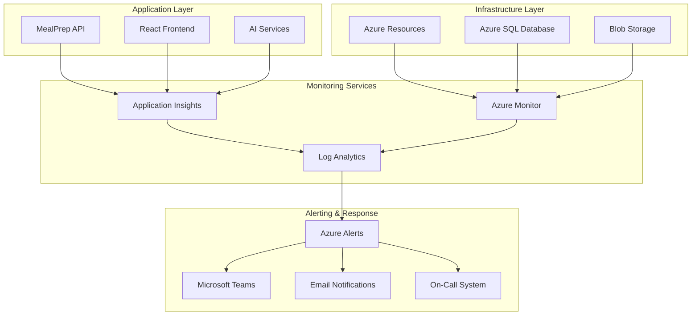

# Operations Monitoring Runbook

## Overview
Comprehensive operational monitoring procedures for the MealPrep AI-powered meal planning application, covering system health monitoring, alerting protocols, incident response procedures, and maintenance workflows.

## Monitoring Architecture

### Monitoring Stack Overview


### Key Metrics Dashboard
```yaml
Primary Metrics:
  Application Health:
    - API Response Time (p50, p95, p99)
    - Error Rate (4xx, 5xx responses)
    - Request Throughput (requests/minute)
    - AI Service Availability
    
  Infrastructure Health:
    - CPU Utilization
    - Memory Usage
    - Disk I/O
    - Network Latency
    
  Business Metrics:
    - Active Users
    - Recipe Generation Success Rate
    - AI Suggestion Quality Score
    - User Engagement Metrics
    
  Security Metrics:
    - Authentication Failures
    - Suspicious Login Attempts
    - Rate Limit Violations
    - Security Scan Results
```

---

## Monitoring Procedures

### Daily Health Checks

#### Morning System Status Review (9:00 AM)
```bash
#!/bin/bash
# scripts/monitoring/daily-health-check.sh

echo "?? MealPrep Daily Health Check - $(date)"
echo "============================================"

# Check Azure resource health
echo "?? Azure Resource Health:"
az resource health availability-status list \
  --resource-group "rg-mealprep-prod" \
  --query "[].{Name:name, Status:properties.availabilityState, Summary:properties.summary}" \
  --output table

# Check Container Apps status
echo -e "\n?? Container Apps Status:"
az containerapp list \
  --resource-group "rg-mealprep-prod" \
  --query "[].{Name:name, Status:properties.runningStatus, Replicas:properties.template.scale.minReplicas}" \
  --output table

# Check database performance
echo -e "\n?? Database Performance:"
az sql db show \
  --resource-group "rg-mealprep-prod" \
  --server "mealprep-prod-sql" \
  --name "mealprep-prod-db" \
  --query "{Status:status, ServiceTier:currentServiceObjectiveName, Storage:maxSizeBytes}" \
  --output table

# Check last 24h error summary
echo -e "\n??  Last 24h Error Summary:"
az monitor metrics list \
  --resource "/subscriptions/{subscription-id}/resourceGroups/rg-mealprep-prod/providers/Microsoft.App/containerApps/mealprep-prod-api" \
  --metric "Requests" \
  --interval PT1H \
  --start-time $(date -d '24 hours ago' --iso-8601) \
  --aggregation Count \
  --filter "ResponseCode ge 400" \
  --output table

echo -e "\n? Daily health check completed"
```

#### API Health Verification
```powershell
# scripts/monitoring/api-health-check.ps1
$baseUrl = "https://mealprep-prod-api.azurecontainerapps.io"
$healthEndpoints = @(
    "/health",
    "/health/ready", 
    "/health/live"
)

Write-Host "?? API Health Check - $(Get-Date)" -ForegroundColor Green
Write-Host "================================" -ForegroundColor Green

foreach ($endpoint in $healthEndpoints) {
    try {
        $response = Invoke-RestMethod -Uri "$baseUrl$endpoint" -Method Get -TimeoutSec 10
        $statusCode = $response.StatusCode
        Write-Host "? $endpoint - Status: OK" -ForegroundColor Green
    }
    catch {
        Write-Host "? $endpoint - Status: FAILED - $($_.Exception.Message)" -ForegroundColor Red
    }
}

# Check AI service integration
try {
    $aiResponse = Invoke-RestMethod -Uri "$baseUrl/api/ai/health" -Method Get -TimeoutSec 30
    Write-Host "? AI Service - Status: OK" -ForegroundColor Green
}
catch {
    Write-Host "? AI Service - Status: FAILED - $($_.Exception.Message)" -ForegroundColor Red
}

Write-Host "`n? API health check completed" -ForegroundColor Green
```

### Weekly Performance Review

#### Weekly Metrics Analysis
```sql
-- scripts/monitoring/weekly-performance-review.sql

-- Weekly performance summary
DECLARE @StartDate DATETIME = DATEADD(DAY, -7, GETDATE())
DECLARE @EndDate DATETIME = GETDATE()

SELECT 
    'Weekly Performance Summary' as Report,
    @StartDate as StartDate,
    @EndDate as EndDate

-- Recipe generation performance
SELECT 
    'Recipe Performance' as Metric,
    COUNT(*) as TotalRecipes,
    AVG(DATEDIFF(ms, CreatedAt, UpdatedAt)) as AvgProcessingTimeMs,
    COUNT(CASE WHEN IsAIGenerated = 1 THEN 1 END) as AIGeneratedCount,
    CAST(COUNT(CASE WHEN IsAIGenerated = 1 THEN 1 END) * 100.0 / COUNT(*) as DECIMAL(5,2)) as AIGeneratedPercentage
FROM Recipes 
WHERE CreatedAt BETWEEN @StartDate AND @EndDate

-- User engagement metrics
SELECT 
    'User Engagement' as Metric,
    COUNT(DISTINCT UserId) as ActiveUsers,
    COUNT(*) as TotalSessions,
    AVG(DATEDIFF(minute, CreatedAt, LastAccessedAt)) as AvgSessionDurationMinutes
FROM UserSessions 
WHERE CreatedAt BETWEEN @StartDate AND @EndDate

-- AI service performance
SELECT 
    'AI Service Performance' as Metric,
    COUNT(*) as TotalRequests,
    COUNT(CASE WHEN Status = 'Success' THEN 1 END) as SuccessfulRequests,
    CAST(COUNT(CASE WHEN Status = 'Success' THEN 1 END) * 100.0 / COUNT(*) as DECIMAL(5,2)) as SuccessRate,
    AVG(ResponseTimeMs) as AvgResponseTimeMs
FROM AISuggestionLogs 
WHERE CreatedAt BETWEEN @StartDate AND @EndDate

-- Error analysis
SELECT 
    'Error Analysis' as Metric,
    ErrorCode,
    COUNT(*) as ErrorCount,
    COUNT(DISTINCT UserId) as AffectedUsers
FROM ErrorLogs 
WHERE CreatedAt BETWEEN @StartDate AND @EndDate
GROUP BY ErrorCode
ORDER BY ErrorCount DESC
```

---

## Alert Management

### Critical Alerts (P0 - Immediate Response Required)

#### API Service Down
```yaml
Alert: API Service Unavailable
Trigger: API health check fails for 2 consecutive minutes
Impact: Complete service outage
Response Time: Immediate (< 5 minutes)

Runbook:
  1. Check Azure Container Apps status
  2. Verify database connectivity
  3. Check recent deployments
  4. Review application logs
  5. Escalate to on-call engineer if unresolved in 15 minutes
```

```bash
# scripts/monitoring/api-service-down-response.sh
#!/bin/bash

echo "?? CRITICAL ALERT: API Service Down Response"
echo "Timestamp: $(date)"
echo "=========================================="

# Step 1: Check Container Apps status
echo "1. Checking Container Apps status..."
az containerapp show \
  --name "mealprep-prod-api" \
  --resource-group "rg-mealprep-prod" \
  --query "{Name:name, Status:properties.runningStatus, Health:properties.health}"

# Step 2: Check recent logs for errors
echo -e "\n2. Checking recent application logs..."
az containerapp logs show \
  --name "mealprep-prod-api" \
  --resource-group "rg-mealprep-prod" \
  --tail 50 \
  --follow false

# Step 3: Verify database connectivity
echo -e "\n3. Checking database connectivity..."
az sql db show \
  --resource-group "rg-mealprep-prod" \
  --server "mealprep-prod-sql" \
  --name "mealprep-prod-db" \
  --query "{Status:status, State:state}"

# Step 4: Check for recent deployments
echo -e "\n4. Checking recent deployments..."
az containerapp revision list \
  --name "mealprep-prod-api" \
  --resource-group "rg-mealprep-prod" \
  --query "[0:3].{Name:name, CreatedTime:properties.createdTime, Active:properties.active}"

# Step 5: Restart if necessary
echo -e "\n5. Checking if restart is needed..."
read -p "Restart the API service? (y/N): " -n 1 -r
echo
if [[ $REPLY =~ ^[Yy]$ ]]; then
    echo "Restarting API service..."
    az containerapp revision restart \
      --name "mealprep-prod-api" \
      --resource-group "rg-mealprep-prod"
    echo "? Restart initiated"
fi
```

#### Database Performance Degradation
```yaml
Alert: Database DTU > 80% for 5 minutes
Trigger: Database CPU/DTU utilization exceeds 80% for 5 consecutive minutes
Impact: Slow API responses, potential timeouts
Response Time: < 10 minutes

Runbook:
  1. Check current database performance metrics
  2. Identify long-running queries
  3. Review recent query performance
  4. Check for blocking processes
  5. Consider temporary scaling if needed
```

```sql
-- scripts/monitoring/database-performance-response.sql

-- Check current database performance
SELECT 
    'Current Performance' as Check,
    GETDATE() as Timestamp,
    (SELECT COUNT(*) FROM sys.dm_exec_requests WHERE session_id > 50) as ActiveRequests,
    (SELECT COUNT(*) FROM sys.dm_exec_requests WHERE session_id > 50 AND wait_type IS NOT NULL) as BlockedRequests

-- Find top 10 resource-consuming queries
SELECT TOP 10
    'Resource Consuming Queries' as Check,
    qs.execution_count,
    qs.total_worker_time / 1000 as total_cpu_time_ms,
    qs.total_elapsed_time / 1000 as total_elapsed_time_ms,
    qs.total_logical_reads,
    SUBSTRING(qt.text, (qs.statement_start_offset/2)+1,
        ((CASE WHEN qs.statement_end_offset = -1 
            THEN LEN(CONVERT(NVARCHAR(MAX), qt.text)) * 2 
            ELSE qs.statement_end_offset END - qs.statement_start_offset)/2) + 1) as query_text
FROM sys.dm_exec_query_stats qs
CROSS APPLY sys.dm_exec_sql_text(qs.sql_handle) qt
ORDER BY qs.total_worker_time DESC

-- Check for blocking processes
SELECT 
    'Blocking Processes' as Check,
    r.session_id,
    r.blocking_session_id,
    r.wait_type,
    r.wait_time,
    r.cpu_time,
    s.program_name,
    s.login_name,
    t.text as sql_text
FROM sys.dm_exec_requests r
JOIN sys.dm_exec_sessions s ON r.session_id = s.session_id
CROSS APPLY sys.dm_exec_sql_text(r.sql_handle) t
WHERE r.blocking_session_id <> 0
ORDER BY r.wait_time DESC
```

### High Priority Alerts (P1 - Response within 30 minutes)

#### High Error Rate
```yaml
Alert: API Error Rate > 5%
Trigger: HTTP 5xx responses exceed 5% of total requests for 5 minutes
Impact: Degraded user experience
Response Time: < 30 minutes

Runbook:
  1. Analyze error patterns in Application Insights
  2. Check for recent code deployments
  3. Review error logs for common issues
  4. Monitor AI service health
  5. Consider rollback if errors persist
```

#### AI Service Degraded
```yaml
Alert: AI Service Response Time > 10 seconds
Trigger: Average AI service response time exceeds 10 seconds for 10 minutes
Impact: Slow meal suggestions, poor user experience
Response Time: < 30 minutes

Runbook:
  1. Check Azure OpenAI service status
  2. Review AI service quotas and limits
  3. Analyze prompt complexity and optimize if needed
  4. Enable fallback suggestion system
  5. Contact Azure support if service issue
```

### Medium Priority Alerts (P2 - Response within 2 hours)

#### High Memory Usage
```yaml
Alert: Container Memory Usage > 85%
Trigger: Container memory utilization exceeds 85% for 15 minutes
Impact: Potential performance degradation
Response Time: < 2 hours

Runbook:
  1. Check memory usage trends
  2. Analyze memory allocation patterns
  3. Look for memory leaks in application code
  4. Consider scaling up if needed
  5. Schedule memory optimization review
```

---

## Incident Response Procedures

### Incident Severity Classification

#### Severity 1 (Critical)
- **Definition**: Complete service outage or critical security incident
- **Examples**: API completely down, database unavailable, data breach
- **Response Time**: Immediate (< 5 minutes)
- **Escalation**: Immediate notification to on-call team and management

#### Severity 2 (High)
- **Definition**: Significant service degradation affecting multiple users
- **Examples**: High error rates, slow response times, AI service down
- **Response Time**: < 30 minutes
- **Escalation**: Notification to on-call team

#### Severity 3 (Medium)
- **Definition**: Service degradation affecting limited functionality
- **Examples**: Single feature not working, performance issues
- **Response Time**: < 2 hours
- **Escalation**: Standard support team notification

#### Severity 4 (Low)
- **Definition**: Minor issues with minimal user impact
- **Examples**: Cosmetic bugs, non-critical feature issues
- **Response Time**: Next business day
- **Escalation**: Bug tracking system

### Incident Response Workflow

#### Initial Response (0-15 minutes)
```bash
# scripts/monitoring/incident-response-initial.sh
#!/bin/bash

INCIDENT_ID=${1:-$(date +%Y%m%d-%H%M%S)}
SEVERITY=${2:-3}

echo "?? INCIDENT RESPONSE INITIATED"
echo "Incident ID: $INCIDENT_ID"
echo "Severity: $SEVERITY"
echo "Timestamp: $(date)"
echo "==============================="

# Create incident tracking file
cat > "/tmp/incident-$INCIDENT_ID.log" << EOF
Incident ID: $INCIDENT_ID
Severity: $SEVERITY
Start Time: $(date)
Status: INVESTIGATING
Assigned: $(whoami)

TIMELINE:
$(date) - Incident detected and response initiated

ACTIONS TAKEN:
EOF

# Initial system health check
echo "Performing initial system health check..."
./daily-health-check.sh >> "/tmp/incident-$INCIDENT_ID.log"

# Notify team based on severity
if [ "$SEVERITY" -le 2 ]; then
    echo "High severity incident - notifying on-call team"
    # Send alert to Teams/Slack
    curl -X POST "$TEAMS_WEBHOOK_URL" \
      -H "Content-Type: application/json" \
      -d "{\"text\":\"?? INCIDENT $INCIDENT_ID (Severity $SEVERITY) - Investigation started\"}"
fi

echo "? Initial response completed. Incident ID: $INCIDENT_ID"
```

#### Investigation Phase
```yaml
Investigation Checklist:
  System Health:
    - [ ] Check all service status dashboards
    - [ ] Review recent alerts and notifications
    - [ ] Verify database connectivity and performance
    - [ ] Check external service dependencies (Azure OpenAI, etc.)
    
  Recent Changes:
    - [ ] Review deployments in last 24 hours
    - [ ] Check configuration changes
    - [ ] Verify infrastructure modifications
    - [ ] Review security updates
    
  User Impact Assessment:
    - [ ] Determine affected user count
    - [ ] Identify impacted functionality
    - [ ] Assess business impact
    - [ ] Check user reports and feedback
    
  Data Collection:
    - [ ] Collect relevant logs and metrics
    - [ ] Screenshot error messages
    - [ ] Document reproduction steps
    - [ ] Gather performance data
```

#### Resolution and Communication
```bash
# scripts/monitoring/incident-resolution.sh
#!/bin/bash

INCIDENT_ID=$1
RESOLUTION_SUMMARY="$2"

if [ -z "$INCIDENT_ID" ] || [ -z "$RESOLUTION_SUMMARY" ]; then
    echo "Usage: $0 <incident-id> <resolution-summary>"
    exit 1
fi

echo "?? INCIDENT RESOLUTION"
echo "Incident ID: $INCIDENT_ID"
echo "Resolution: $RESOLUTION_SUMMARY"
echo "Timestamp: $(date)"
echo "========================"

# Update incident log
cat >> "/tmp/incident-$INCIDENT_ID.log" << EOF

RESOLUTION:
$(date) - Incident resolved: $RESOLUTION_SUMMARY
End Time: $(date)
Status: RESOLVED
Total Duration: $(( $(date +%s) - $(stat -c %Y "/tmp/incident-$INCIDENT_ID.log") )) seconds

EOF

# Notify team of resolution
curl -X POST "$TEAMS_WEBHOOK_URL" \
  -H "Content-Type: application/json" \
  -d "{\"text\":\"? INCIDENT $INCIDENT_ID RESOLVED: $RESOLUTION_SUMMARY\"}"

# Schedule post-incident review
echo "?? Scheduling post-incident review for $INCIDENT_ID"
echo "Incident log available at: /tmp/incident-$INCIDENT_ID.log"

echo "? Incident resolution completed"
```

---

## Performance Monitoring

### Key Performance Indicators (KPIs)

#### Application Performance KPIs
```yaml
Response Time Targets:
  API Endpoints:
    - GET requests: < 200ms (p95)
    - POST requests: < 500ms (p95)
    - AI suggestions: < 5 seconds (p95)
    
  Database Queries:
    - Simple queries: < 50ms (p95)
    - Complex queries: < 500ms (p95)
    - Reports: < 2 seconds (p95)
    
  Frontend Performance:
    - Page load time: < 2 seconds
    - Time to interactive: < 3 seconds
    - First contentful paint: < 1 second

Availability Targets:
  API Service: 99.9% uptime
  Database: 99.95% uptime
  AI Services: 99.5% uptime
  Frontend: 99.9% uptime
```

#### Business Performance KPIs
```yaml
User Experience Metrics:
  - User Session Duration: > 10 minutes average
  - Recipe Generation Success Rate: > 95%
  - AI Suggestion Satisfaction: > 4.0/5.0 rating
  - Feature Adoption Rate: Track monthly
  
Operational Metrics:
  - Mean Time to Recovery (MTTR): < 30 minutes
  - Mean Time Between Failures (MTBF): > 168 hours
  - Change Success Rate: > 95%
  - Deployment Frequency: Track weekly
```

### Performance Analysis Queries

#### Daily Performance Summary
```sql
-- scripts/monitoring/daily-performance-summary.sql

DECLARE @Date DATE = CAST(GETDATE() AS DATE)

-- API Performance Summary
SELECT 
    'API Performance' as Metric,
    COUNT(*) as TotalRequests,
    AVG(ResponseTimeMs) as AvgResponseTime,
    PERCENTILE_CONT(0.95) WITHIN GROUP (ORDER BY ResponseTimeMs) as P95ResponseTime,
    COUNT(CASE WHEN StatusCode >= 400 THEN 1 END) as ErrorCount,
    CAST(COUNT(CASE WHEN StatusCode >= 400 THEN 1 END) * 100.0 / COUNT(*) as DECIMAL(5,2)) as ErrorRate
FROM ApiRequestLogs 
WHERE CAST(Timestamp AS DATE) = @Date

-- AI Service Performance
SELECT 
    'AI Service Performance' as Metric,
    COUNT(*) as TotalRequests,
    AVG(ProcessingTimeMs) as AvgProcessingTime,
    COUNT(CASE WHEN Status = 'Success' THEN 1 END) as SuccessfulRequests,
    CAST(COUNT(CASE WHEN Status = 'Success' THEN 1 END) * 100.0 / COUNT(*) as DECIMAL(5,2)) as SuccessRate
FROM AISuggestionLogs 
WHERE CAST(CreatedAt AS DATE) = @Date

-- User Activity Summary
SELECT 
    'User Activity' as Metric,
    COUNT(DISTINCT UserId) as ActiveUsers,
    COUNT(*) as TotalSessions,
    AVG(DATEDIFF(minute, SessionStart, SessionEnd)) as AvgSessionDurationMinutes
FROM UserSessions 
WHERE CAST(SessionStart AS DATE) = @Date
```

---

## Maintenance Procedures

### Regular Maintenance Tasks

#### Daily Maintenance (Automated)
```bash
#!/bin/bash
# scripts/monitoring/daily-maintenance.sh

echo "?? Daily Maintenance - $(date)"
echo "============================="

# Clear old log files (keep 30 days)
echo "Cleaning old log files..."
find /var/log/mealprep -name "*.log" -mtime +30 -delete
echo "? Log cleanup completed"

# Database maintenance
echo "Running database maintenance..."
sqlcmd -S "mealprep-prod-sql.database.windows.net" -d "mealprep-prod-db" -Q "
    -- Update statistics for key tables
    UPDATE STATISTICS Recipes;
    UPDATE STATISTICS Users;
    UPDATE STATISTICS AISuggestionLogs;
    
    -- Clear old session data (keep 90 days)
    DELETE FROM UserSessions WHERE CreatedAt < DATEADD(DAY, -90, GETDATE());
    
    -- Archive old audit logs (keep 1 year)
    INSERT INTO AuditLogsArchive 
    SELECT * FROM AuditLogs WHERE CreatedAt < DATEADD(YEAR, -1, GETDATE());
    DELETE FROM AuditLogs WHERE CreatedAt < DATEADD(YEAR, -1, GETDATE());
"
echo "? Database maintenance completed"

# Check disk space
echo "Checking disk space..."
df -h | grep -E "(Filesystem|/dev/)" | awk '{ 
    if (NR==1) print $0; 
    else if ($5+0 > 80) print $0 " ?? HIGH USAGE"
    else print $0 " ? OK"
}'

echo "? Daily maintenance completed"
```

#### Weekly Maintenance
```bash
#!/bin/bash
# scripts/monitoring/weekly-maintenance.sh

echo "?? Weekly Maintenance - $(date)"
echo "=============================="

# Analyze database performance
echo "Analyzing database performance..."
sqlcmd -S "mealprep-prod-sql.database.windows.net" -d "mealprep-prod-db" -Q "
    -- Find unused indexes
    SELECT 
        i.name as IndexName,
        t.name as TableName,
        i.type_desc,
        us.user_seeks,
        us.user_scans,
        us.user_lookups,
        us.user_updates
    FROM sys.indexes i
    LEFT JOIN sys.dm_db_index_usage_stats us ON i.object_id = us.object_id AND i.index_id = us.index_id
    JOIN sys.tables t ON i.object_id = t.object_id
    WHERE us.user_seeks + us.user_scans + us.user_lookups = 0
        AND i.index_id > 0
        AND i.is_primary_key = 0
        AND i.is_unique_constraint = 0;
        
    -- Check index fragmentation
    SELECT 
        DB_NAME() as DatabaseName,
        OBJECT_NAME(ips.object_id) as TableName,
        i.name as IndexName,
        ips.avg_fragmentation_in_percent,
        ips.page_count
    FROM sys.dm_db_index_physical_stats(DB_ID(), NULL, NULL, NULL, 'LIMITED') ips
    JOIN sys.indexes i ON ips.object_id = i.object_id AND ips.index_id = i.index_id
    WHERE ips.avg_fragmentation_in_percent > 30 AND ips.page_count > 1000
    ORDER BY ips.avg_fragmentation_in_percent DESC;
"

# Review application insights data
echo "Generating weekly performance report..."
az monitor app-insights query \
    --app "mealprep-prod-insights" \
    --analytics-query "
        requests
        | where timestamp > ago(7d)
        | summarize 
            RequestCount = count(),
            AvgDuration = avg(duration),
            P95Duration = percentile(duration, 95),
            ErrorRate = countif(success == false) * 100.0 / count()
        by bin(timestamp, 1d)
        | order by timestamp desc
    " \
    --output table

echo "? Weekly maintenance completed"
```

#### Monthly Maintenance
```yaml
Monthly Tasks:
  Security Review:
    - [ ] Review access logs for anomalies
    - [ ] Update security certificates if needed
    - [ ] Audit user permissions and roles
    - [ ] Review API key usage and rotation
    
  Performance Review:
    - [ ] Analyze monthly performance trends
    - [ ] Review capacity planning metrics
    - [ ] Optimize database queries if needed
    - [ ] Update monitoring thresholds
    
  Cost Optimization:
    - [ ] Review Azure resource utilization
    - [ ] Analyze cost trends and optimization opportunities
    - [ ] Review reserved instance usage
    - [ ] Optimize storage tiers
    
  Documentation Updates:
    - [ ] Update runbooks based on incidents
    - [ ] Review and update monitoring procedures
    - [ ] Update team contact information
    - [ ] Validate disaster recovery procedures
```

---

## Emergency Procedures

### Service Recovery Procedures

#### Complete Service Restoration
```bash
#!/bin/bash
# scripts/monitoring/emergency-restore.sh

echo "?? EMERGENCY SERVICE RESTORATION"
echo "Timestamp: $(date)"
echo "==============================="

# Step 1: Stop all services
echo "1. Stopping all services..."
az containerapp revision deactivate \
    --name "mealprep-prod-api" \
    --resource-group "rg-mealprep-prod" \
    --revision latest

# Step 2: Restore from last known good backup
echo "2. Restoring database from backup..."
read -p "Enter backup restore point (YYYY-MM-DDTHH:MM:SS): " RESTORE_POINT

az sql db restore \
    --dest-name "mealprep-prod-db-restored" \
    --dest-server "mealprep-prod-sql" \
    --name "mealprep-prod-db" \
    --resource-group "rg-mealprep-prod" \
    --time "$RESTORE_POINT"

# Step 3: Update connection strings
echo "3. Updating connection strings..."
az keyvault secret set \
    --vault-name "mealprep-prod-kv" \
    --name "sql-connection-string-backup" \
    --value "$(az keyvault secret show --vault-name "mealprep-prod-kv" --name "sql-connection-string" --query value -o tsv)"

# Step 4: Deploy last known good version
echo "4. Deploying last known good version..."
az containerapp update \
    --name "mealprep-prod-api" \
    --resource-group "rg-mealprep-prod" \
    --image "mealprep.azurecr.io/mealprep-api:last-known-good"

# Step 5: Verify service health
echo "5. Verifying service health..."
sleep 60  # Wait for startup
./api-health-check.ps1

echo "? Emergency restoration completed"
```

#### Data Recovery Procedures
```sql
-- scripts/monitoring/data-recovery.sql

-- Create backup of current state before recovery
CREATE TABLE RecoveryBackup_$(date +%Y%m%d_%H%M%S) AS
SELECT * FROM [TargetTable] WHERE [CriteriaColumns];

-- Data recovery strategies
-- Strategy 1: Point-in-time recovery from transaction log
RESTORE DATABASE [mealprep-prod-db] 
FROM DISK = 'backup_path'
WITH REPLACE, STOPAT = '2024-01-15 14:30:00';

-- Strategy 2: Selective data recovery from backup
INSERT INTO [TargetTable]
SELECT * FROM [BackupTable] 
WHERE [RecoveryConditions]
    AND NOT EXISTS (
        SELECT 1 FROM [TargetTable] t 
        WHERE t.[PrimaryKey] = [BackupTable].[PrimaryKey]
    );

-- Strategy 3: Rollback specific transactions
-- (Use with caution - requires transaction log analysis)
-- Identify problematic transactions first
```

This comprehensive monitoring runbook provides structured procedures for maintaining the health, performance, and reliability of the MealPrep application across all operational scenarios.

---

*Last Updated: December 2024*  
*Monitoring runbook continuously updated based on operational experience and incident learnings*