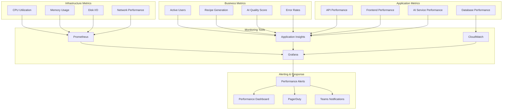

# Performance Monitoring Guide

## Overview
Comprehensive performance monitoring strategy for the MealPrep AI-powered meal planning application, covering metrics collection, analysis, alerting, and optimization workflows across all system components.

## Performance Monitoring Architecture

### Monitoring Stack Overview


### Key Performance Indicators (KPIs)
```yaml
Application Performance KPIs:
  Response Time:
    - API Response Time (p50, p95, p99)
    - Page Load Time (First Contentful Paint)
    - Time to Interactive (TTI)
    - AI Suggestion Generation Time
    
  Throughput:
    - Requests per second (RPS)
    - Concurrent users
    - Recipe generations per hour
    - AI suggestions per minute
    
  Availability:
    - Service uptime percentage
    - Error rate (4xx, 5xx responses)
    - Service dependency availability
    - Database connection success rate
    
  Resource Utilization:
    - CPU utilization
    - Memory consumption
    - Disk I/O operations
    - Network bandwidth usage
    
Business Performance KPIs:
  User Experience:
    - User session duration
    - Recipe search success rate
    - AI suggestion acceptance rate
    - Feature adoption metrics
    
  System Efficiency:
    - Cost per user
    - Infrastructure efficiency ratio
    - AI service cost optimization
    - Database query optimization
```

---

## Application Performance Monitoring

### API Performance Monitoring

#### Response Time Tracking
```csharp
// Middleware for response time tracking
public class PerformanceTrackingMiddleware
{
    private readonly RequestDelegate _next;
    private readonly IMetricsLogger _metricsLogger;
    private readonly ILogger<PerformanceTrackingMiddleware> _logger;

    public async Task InvokeAsync(HttpContext context)
    {
        var stopwatch = Stopwatch.StartNew();
        var startTime = DateTimeOffset.UtcNow;

        try
        {
            await _next(context);
        }
        finally
        {
            stopwatch.Stop();
            
            var responseTime = stopwatch.ElapsedMilliseconds;
            var endpoint = GetNormalizedEndpoint(context.Request.Path);
            var method = context.Request.Method;
            var statusCode = context.Response.StatusCode;
            var userId = context.User?.FindFirst("userId")?.Value;

            // Log performance metrics
            _metricsLogger.LogPerformanceMetric(new PerformanceMetric
            {
                Endpoint = endpoint,
                Method = method,
                ResponseTimeMs = responseTime,
                StatusCode = statusCode,
                UserId = userId,
                Timestamp = startTime,
                RequestSize = context.Request.ContentLength ?? 0,
                ResponseSize = context.Response.ContentLength ?? 0
            });

            // Set response headers for client-side monitoring
            context.Response.Headers.Add("X-Response-Time", $"{responseTime}ms");
            context.Response.Headers.Add("X-Server-Timing", $"total;dur={responseTime}");

            // Alert on slow responses
            if (responseTime > GetSlowResponseThreshold(endpoint))
            {
                _logger.LogWarning("Slow response detected: {Endpoint} took {ResponseTime}ms", 
                    endpoint, responseTime);
            }
        }
    }

    private int GetSlowResponseThreshold(string endpoint)
    {
        return endpoint switch
        {
            "/api/ai/suggestions" => 5000,  // AI endpoints can be slower
            "/api/recipes/search" => 1000,  // Search should be fast
            "/api/auth/login" => 2000,      // Auth can take some time
            _ => 500                        // Default threshold
        };
    }
}
```

#### Custom Performance Counters
```csharp
public class PerformanceCounters
{
    private readonly IMetricsRoot _metrics;

    public PerformanceCounters(IMetricsRoot metrics)
    {
        _metrics = metrics;
    }

    // API Performance Counters
    public void RecordApiResponseTime(string endpoint, string method, long responseTimeMs)
    {
        _metrics.Measure.Timer.Time(
            MetricNames.ApiResponseTime,
            responseTimeMs,
            new MetricTags("endpoint", endpoint, "method", method)
        );
    }

    public void IncrementApiRequestCount(string endpoint, string method, int statusCode)
    {
        _metrics.Measure.Counter.Increment(
            MetricNames.ApiRequestCount,
            new MetricTags("endpoint", endpoint, "method", method, "status", statusCode.ToString())
        );
    }

    // AI Service Performance Counters
    public void RecordAiSuggestionTime(string model, long processingTimeMs, bool success)
    {
        _metrics.Measure.Timer.Time(
            MetricNames.AiSuggestionTime,
            processingTimeMs,
            new MetricTags("model", model, "success", success.ToString())
        );
    }

    public void RecordAiQualityScore(double qualityScore, string suggestionType)
    {
        _metrics.Measure.Gauge.SetValue(
            MetricNames.AiQualityScore,
            qualityScore,
            new MetricTags("type", suggestionType)
        );
    }

    // Database Performance Counters
    public void RecordDatabaseQueryTime(string operation, string table, long queryTimeMs)
    {
        _metrics.Measure.Timer.Time(
            MetricNames.DatabaseQueryTime,
            queryTimeMs,
            new MetricTags("operation", operation, "table", table)
        );
    }

    // Business Metrics
    public void IncrementActiveUsers(string userTier)
    {
        _metrics.Measure.Counter.Increment(
            MetricNames.ActiveUsers,
            new MetricTags("tier", userTier)
        );
    }

    public void RecordRecipeGenerationSuccess(bool success, string source)
    {
        _metrics.Measure.Counter.Increment(
            MetricNames.RecipeGeneration,
            new MetricTags("success", success.ToString(), "source", source)
        );
    }
}

public static class MetricNames
{
    public const string ApiResponseTime = "api.response_time";
    public const string ApiRequestCount = "api.request_count";
    public const string AiSuggestionTime = "ai.suggestion_time";
    public const string AiQualityScore = "ai.quality_score";
    public const string DatabaseQueryTime = "db.query_time";
    public const string ActiveUsers = "users.active";
    public const string RecipeGeneration = "recipes.generation";
}
```

### Frontend Performance Monitoring

#### Real User Monitoring (RUM)
```typescript
// Frontend performance monitoring
export class PerformanceMonitor {
    private performanceObserver: PerformanceObserver;
    private metricsCollector: MetricsCollector;

    constructor() {
        this.metricsCollector = new MetricsCollector();
        this.initializePerformanceMonitoring();
    }

    private initializePerformanceMonitoring(): void {
        // Core Web Vitals monitoring
        this.monitorCoreWebVitals();
        
        // API call performance
        this.monitorApiCalls();
        
        // User interaction performance
        this.monitorUserInteractions();
        
        // Resource loading performance
        this.monitorResourceLoading();
    }

    private monitorCoreWebVitals(): void {
        // First Contentful Paint (FCP)
        new PerformanceObserver((entryList) => {
            for (const entry of entryList.getEntries()) {
                if (entry.name === 'first-contentful-paint') {
                    this.metricsCollector.recordMetric('fcp', entry.startTime, {
                        page: window.location.pathname,
                        userAgent: navigator.userAgent
                    });
                }
            }
        }).observe({ entryTypes: ['paint'] });

        // Largest Contentful Paint (LCP)
        new PerformanceObserver((entryList) => {
            const entries = entryList.getEntries();
            const lastEntry = entries[entries.length - 1];
            
            this.metricsCollector.recordMetric('lcp', lastEntry.startTime, {
                page: window.location.pathname,
                element: lastEntry.element?.tagName || 'unknown'
            });
        }).observe({ entryTypes: ['largest-contentful-paint'] });

        // Cumulative Layout Shift (CLS)
        let clsValue = 0;
        new PerformanceObserver((entryList) => {
            for (const entry of entryList.getEntries()) {
                if (!entry.hadRecentInput) {
                    clsValue += entry.value;
                }
            }
            
            this.metricsCollector.recordMetric('cls', clsValue, {
                page: window.location.pathname
            });
        }).observe({ entryTypes: ['layout-shift'] });

        // First Input Delay (FID)
        new PerformanceObserver((entryList) => {
            for (const entry of entryList.getEntries()) {
                this.metricsCollector.recordMetric('fid', entry.processingStart - entry.startTime, {
                    page: window.location.pathname,
                    inputType: entry.name
                });
            }
        }).observe({ entryTypes: ['first-input'] });
    }

    private monitorApiCalls(): void {
        // Intercept fetch calls
        const originalFetch = window.fetch;
        window.fetch = async (...args) => {
            const startTime = performance.now();
            const url = args[0] instanceof Request ? args[0].url : args[0];
            
            try {
                const response = await originalFetch(...args);
                const endTime = performance.now();
                const duration = endTime - startTime;

                this.metricsCollector.recordMetric('api.response_time', duration, {
                    url: this.normalizeUrl(url),
                    method: args[1]?.method || 'GET',
                    status: response.status,
                    success: response.ok
                });

                return response;
            } catch (error) {
                const endTime = performance.now();
                const duration = endTime - startTime;

                this.metricsCollector.recordMetric('api.response_time', duration, {
                    url: this.normalizeUrl(url),
                    method: args[1]?.method || 'GET',
                    status: 0,
                    success: false,
                    error: error.message
                });

                throw error;
            }
        };
    }

    private monitorUserInteractions(): void {
        // Click performance
        document.addEventListener('click', (event) => {
            const startTime = performance.now();
            
            // Track time to next paint after click
            requestAnimationFrame(() => {
                const endTime = performance.now();
                const duration = endTime - startTime;

                this.metricsCollector.recordMetric('interaction.click_response', duration, {
                    element: event.target?.tagName || 'unknown',
                    page: window.location.pathname
                });
            });
        });

        // Form submission performance
        document.addEventListener('submit', (event) => {
            const form = event.target as HTMLFormElement;
            const startTime = performance.now();

            form.addEventListener('load', () => {
                const endTime = performance.now();
                const duration = endTime - startTime;

                this.metricsCollector.recordMetric('interaction.form_submit', duration, {
                    formId: form.id || 'unknown',
                    page: window.location.pathname
                });
            }, { once: true });
        });
    }

    private normalizeUrl(url: string): string {
        try {
            const urlObj = new URL(url);
            // Remove query parameters and replace IDs with placeholders
            return urlObj.pathname.replace(/\/\d+/g, '/:id');
        } catch {
            return url;
        }
    }
}

// Metrics collector for batching and sending to backend
export class MetricsCollector {
    private metrics: PerformanceMetric[] = [];
    private batchSize = 50;
    private flushInterval = 30000; // 30 seconds

    constructor() {
        setInterval(() => this.flush(), this.flushInterval);
        
        // Flush on page unload
        window.addEventListener('beforeunload', () => this.flush());
    }

    recordMetric(name: string, value: number, tags: Record<string, any> = {}): void {
        this.metrics.push({
            name,
            value,
            tags,
            timestamp: Date.now(),
            sessionId: this.getSessionId(),
            userId: this.getUserId()
        });

        if (this.metrics.length >= this.batchSize) {
            this.flush();
        }
    }

    private async flush(): Promise<void> {
        if (this.metrics.length === 0) return;

        const metricsToSend = [...this.metrics];
        this.metrics = [];

        try {
            await fetch('/api/metrics/client', {
                method: 'POST',
                headers: {
                    'Content-Type': 'application/json'
                },
                body: JSON.stringify({ metrics: metricsToSend })
            });
        } catch (error) {
            console.error('Failed to send performance metrics:', error);
            // Add metrics back to queue for retry
            this.metrics.unshift(...metricsToSend);
        }
    }

    private getSessionId(): string {
        return sessionStorage.getItem('sessionId') || 'unknown';
    }

    private getUserId(): string {
        return localStorage.getItem('userId') || 'anonymous';
    }
}

interface PerformanceMetric {
    name: string;
    value: number;
    tags: Record<string, any>;
    timestamp: number;
    sessionId: string;
    userId: string;
}
```

---

## Infrastructure Performance Monitoring

### System Resource Monitoring

#### CPU and Memory Monitoring
```yaml
# Prometheus configuration for system monitoring
global:
  scrape_interval: 15s
  evaluation_interval: 15s

rule_files:
  - "mealprep_rules.yml"

scrape_configs:
  - job_name: 'mealprep-api'
    static_configs:
      - targets: ['localhost:5000']
    metrics_path: '/metrics'
    scrape_interval: 10s

  - job_name: 'node-exporter'
    static_configs:
      - targets: ['localhost:9100']

  - job_name: 'postgres-exporter'
    static_configs:
      - targets: ['localhost:9187']

alerting:
  alertmanagers:
    - static_configs:
        - targets:
          - localhost:9093
```

#### Performance Rules Configuration
```yaml
# mealprep_rules.yml
groups:
  - name: mealprep_performance
    rules:
      # API Performance Rules
      - alert: HighAPIResponseTime
        expr: histogram_quantile(0.95, http_request_duration_seconds_bucket{job="mealprep-api"}) > 2
        for: 5m
        labels:
          severity: warning
          service: api
        annotations:
          summary: "High API response time detected"
          description: "95th percentile response time is {{ $value }}s for {{ $labels.endpoint }}"

      - alert: HighErrorRate
        expr: rate(http_requests_total{job="mealprep-api",code=~"5.."}[5m]) / rate(http_requests_total{job="mealprep-api"}[5m]) > 0.05
        for: 2m
        labels:
          severity: critical
          service: api
        annotations:
          summary: "High error rate detected"
          description: "Error rate is {{ $value | humanizePercentage }} for the last 5 minutes"

      # System Resource Rules
      - alert: HighCPUUsage
        expr: 100 - (avg by(instance) (irate(node_cpu_seconds_total{mode="idle"}[5m])) * 100) > 80
        for: 5m
        labels:
          severity: warning
          service: system
        annotations:
          summary: "High CPU usage detected"
          description: "CPU usage is {{ $value }}% on {{ $labels.instance }}"

      - alert: HighMemoryUsage
        expr: (1 - (node_memory_MemAvailable_bytes / node_memory_MemTotal_bytes)) * 100 > 85
        for: 5m
        labels:
          severity: warning
          service: system
        annotations:
          summary: "High memory usage detected"
          description: "Memory usage is {{ $value }}% on {{ $labels.instance }}"

      # Database Performance Rules
      - alert: DatabaseSlowQueries
        expr: pg_stat_activity_max_tx_duration{datname="mealprep"} > 300
        for: 2m
        labels:
          severity: warning
          service: database
        annotations:
          summary: "Slow database queries detected"
          description: "Long running query detected: {{ $value }}s in database {{ $labels.datname }}"

      - alert: DatabaseHighConnections
        expr: pg_stat_activity_count{datname="mealprep"} / pg_settings_max_connections * 100 > 80
        for: 5m
        labels:
          severity: warning
          service: database
        annotations:
          summary: "High database connection usage"
          description: "Database connection usage is {{ $value }}% for {{ $labels.datname }}"

      # AI Service Performance Rules
      - alert: AIServiceSlowResponse
        expr: histogram_quantile(0.95, ai_suggestion_duration_seconds_bucket) > 10
        for: 5m
        labels:
          severity: warning
          service: ai
        annotations:
          summary: "AI service slow response time"
          description: "AI suggestion generation is taking {{ $value }}s (95th percentile)"

      - alert: AIServiceLowQuality
        expr: avg(ai_suggestion_quality_score) < 0.7
        for: 10m
        labels:
          severity: warning
          service: ai
        annotations:
          summary: "AI service quality degradation"
          description: "Average AI suggestion quality score is {{ $value }}"
```

### Database Performance Monitoring

#### PostgreSQL Performance Queries
```sql
-- Database performance monitoring queries

-- 1. Slow Query Analysis
CREATE OR REPLACE VIEW slow_queries AS
SELECT 
    query,
    calls,
    total_time,
    mean_time,
    rows,
    100.0 * shared_blks_hit / nullif(shared_blks_hit + shared_blks_read, 0) AS hit_percent
FROM pg_stat_statements 
WHERE mean_time > 100  -- Queries taking more than 100ms on average
ORDER BY mean_time DESC
LIMIT 20;

-- 2. Index Usage Analysis
CREATE OR REPLACE VIEW index_usage AS
SELECT 
    schemaname,
    tablename,
    indexname,
    idx_tup_read,
    idx_tup_fetch,
    idx_scan,
    CASE 
        WHEN idx_scan = 0 THEN 'Never Used'
        WHEN idx_scan < 10 THEN 'Rarely Used'
        ELSE 'Frequently Used'
    END as usage_status
FROM pg_stat_user_indexes
ORDER BY idx_scan DESC;

-- 3. Table Size and Growth Analysis
CREATE OR REPLACE VIEW table_sizes AS
SELECT 
    schemaname,
    tablename,
    pg_size_pretty(pg_total_relation_size(schemaname||'.'||tablename)) as size,
    pg_total_relation_size(schemaname||'.'||tablename) as size_bytes,
    n_tup_ins as inserts,
    n_tup_upd as updates,
    n_tup_del as deletes,
    n_live_tup as live_rows,
    n_dead_tup as dead_rows
FROM pg_stat_user_tables
ORDER BY pg_total_relation_size(schemaname||'.'||tablename) DESC;

-- 4. Connection and Lock Monitoring
CREATE OR REPLACE VIEW connection_activity AS
SELECT 
    datname,
    usename,
    client_addr,
    state,
    query_start,
    now() - query_start as query_duration,
    waiting,
    LEFT(query, 100) as query_preview
FROM pg_stat_activity 
WHERE state != 'idle'
ORDER BY query_start ASC;

-- 5. Database Cache Hit Ratio
CREATE OR REPLACE VIEW cache_hit_ratio AS
SELECT 
    'Database' as cache_type,
    sum(heap_blks_read) as disk_reads,
    sum(heap_blks_hit) as cache_hits,
    round(
        sum(heap_blks_hit) * 100.0 / 
        NULLIF(sum(heap_blks_hit) + sum(heap_blks_read), 0), 
        2
    ) as hit_ratio_percent
FROM pg_statio_user_tables
UNION ALL
SELECT 
    'Indexes' as cache_type,
    sum(idx_blks_read) as disk_reads,
    sum(idx_blks_hit) as cache_hits,
    round(
        sum(idx_blks_hit) * 100.0 / 
        NULLIF(sum(idx_blks_hit) + sum(idx_blks_read), 0), 
        2
    ) as hit_ratio_percent
FROM pg_statio_user_indexes;
```

#### Database Performance Optimization Script
```bash
#!/bin/bash
# scripts/monitoring/database-performance-check.sh

DATABASE_NAME="mealprep"
OUTPUT_FILE="/tmp/db-performance-$(date +%Y%m%d-%H%M%S).txt"

echo "?? Database Performance Analysis - $(date)" > $OUTPUT_FILE
echo "=============================================" >> $OUTPUT_FILE

# 1. Check slow queries
echo -e "\n?? Slow Queries Analysis:" >> $OUTPUT_FILE
psql -d $DATABASE_NAME -c "SELECT * FROM slow_queries;" >> $OUTPUT_FILE

# 2. Check index usage
echo -e "\n?? Index Usage Analysis:" >> $OUTPUT_FILE
psql -d $DATABASE_NAME -c "SELECT * FROM index_usage WHERE usage_status = 'Never Used';" >> $OUTPUT_FILE

# 3. Check table sizes
echo -e "\n?? Table Sizes:" >> $OUTPUT_FILE
psql -d $DATABASE_NAME -c "SELECT * FROM table_sizes LIMIT 10;" >> $OUTPUT_FILE

# 4. Check cache hit ratio
echo -e "\n?? Cache Hit Ratios:" >> $OUTPUT_FILE
psql -d $DATABASE_NAME -c "SELECT * FROM cache_hit_ratio;" >> $OUTPUT_FILE

# 5. Check current connections
echo -e "\n?? Active Connections:" >> $OUTPUT_FILE
psql -d $DATABASE_NAME -c "SELECT COUNT(*) as active_connections FROM pg_stat_activity WHERE state != 'idle';" >> $OUTPUT_FILE

# 6. Check database size
echo -e "\n?? Database Size:" >> $OUTPUT_FILE
psql -d $DATABASE_NAME -c "SELECT pg_size_pretty(pg_database_size('$DATABASE_NAME')) as database_size;" >> $OUTPUT_FILE

# Alert thresholds
SLOW_QUERY_COUNT=$(psql -d $DATABASE_NAME -t -c "SELECT COUNT(*) FROM slow_queries;")
UNUSED_INDEX_COUNT=$(psql -d $DATABASE_NAME -t -c "SELECT COUNT(*) FROM index_usage WHERE usage_status = 'Never Used';")
CACHE_HIT_RATIO=$(psql -d $DATABASE_NAME -t -c "SELECT hit_ratio_percent FROM cache_hit_ratio WHERE cache_type = 'Database';")

echo -e "\n??  Performance Alerts:" >> $OUTPUT_FILE

if [ "$SLOW_QUERY_COUNT" -gt 5 ]; then
    echo "- High number of slow queries detected: $SLOW_QUERY_COUNT" >> $OUTPUT_FILE
fi

if [ "$UNUSED_INDEX_COUNT" -gt 3 ]; then
    echo "- Multiple unused indexes detected: $UNUSED_INDEX_COUNT" >> $OUTPUT_FILE
fi

if (( $(echo "$CACHE_HIT_RATIO < 95" | bc -l) )); then
    echo "- Low cache hit ratio: $CACHE_HIT_RATIO%" >> $OUTPUT_FILE
fi

echo "? Performance analysis completed. Report saved to: $OUTPUT_FILE"
cat $OUTPUT_FILE
```

---

## Performance Dashboards

### Grafana Dashboard Configuration
```json
{
  "dashboard": {
    "id": null,
    "title": "MealPrep Performance Dashboard",
    "tags": ["mealprep", "performance"],
    "timezone": "utc",
    "panels": [
      {
        "id": 1,
        "title": "API Response Times",
        "type": "graph",
        "targets": [
          {
            "expr": "histogram_quantile(0.50, http_request_duration_seconds_bucket{job=\"mealprep-api\"})",
            "legendFormat": "50th percentile"
          },
          {
            "expr": "histogram_quantile(0.95, http_request_duration_seconds_bucket{job=\"mealprep-api\"})",
            "legendFormat": "95th percentile"
          },
          {
            "expr": "histogram_quantile(0.99, http_request_duration_seconds_bucket{job=\"mealprep-api\"})",
            "legendFormat": "99th percentile"
          }
        ],
        "yAxes": [
          {
            "label": "Response Time (seconds)",
            "min": 0
          }
        ],
        "alert": {
          "conditions": [
            {
              "evaluator": {
                "params": [2],
                "type": "gt"
              },
              "operator": {
                "type": "and"
              },
              "query": {
                "params": ["A", "5m", "now"]
              },
              "reducer": {
                "params": [],
                "type": "avg"
              },
              "type": "query"
            }
          ],
          "executionErrorState": "alerting",
          "for": "5m",
          "frequency": "10s",
          "handler": 1,
          "name": "High API Response Time",
          "noDataState": "no_data",
          "notifications": []
        }
      },
      {
        "id": 2,
        "title": "Request Rate",
        "type": "graph",
        "targets": [
          {
            "expr": "rate(http_requests_total{job=\"mealprep-api\"}[5m])",
            "legendFormat": "{{endpoint}} - {{method}}"
          }
        ],
        "yAxes": [
          {
            "label": "Requests per second",
            "min": 0
          }
        ]
      },
      {
        "id": 3,
        "title": "Error Rate",
        "type": "graph",
        "targets": [
          {
            "expr": "rate(http_requests_total{job=\"mealprep-api\",code=~\"4..\"}[5m])",
            "legendFormat": "4xx errors"
          },
          {
            "expr": "rate(http_requests_total{job=\"mealprep-api\",code=~\"5..\"}[5m])",
            "legendFormat": "5xx errors"
          }
        ],
        "yAxes": [
          {
            "label": "Errors per second",
            "min": 0
          }
        ]
      },
      {
        "id": 4,
        "title": "System Resources",
        "type": "graph",
        "targets": [
          {
            "expr": "100 - (avg by(instance) (irate(node_cpu_seconds_total{mode=\"idle\"}[5m])) * 100)",
            "legendFormat": "CPU Usage %"
          },
          {
            "expr": "(1 - (node_memory_MemAvailable_bytes / node_memory_MemTotal_bytes)) * 100",
            "legendFormat": "Memory Usage %"
          }
        ],
        "yAxes": [
          {
            "label": "Percentage",
            "min": 0,
            "max": 100
          }
        ]
      },
      {
        "id": 5,
        "title": "Database Performance",
        "type": "graph",
        "targets": [
          {
            "expr": "pg_stat_activity_count{datname=\"mealprep\"}",
            "legendFormat": "Active Connections"
          },
          {
            "expr": "rate(pg_stat_database_tup_fetched{datname=\"mealprep\"}[5m])",
            "legendFormat": "Tuples Fetched/sec"
          }
        ]
      },
      {
        "id": 6,
        "title": "AI Service Performance",
        "type": "graph",
        "targets": [
          {
            "expr": "histogram_quantile(0.95, ai_suggestion_duration_seconds_bucket)",
            "legendFormat": "AI Response Time (95th percentile)"
          },
          {
            "expr": "avg(ai_suggestion_quality_score)",
            "legendFormat": "AI Quality Score"
          }
        ]
      }
    ],
    "time": {
      "from": "now-1h",
      "to": "now"
    },
    "refresh": "30s"
  }
}
```

### Custom Performance Dashboard
```typescript
// Custom dashboard component for real-time performance monitoring
export class PerformanceDashboard extends React.Component {
    private metricsService: MetricsService;
    private updateInterval: NodeJS.Timeout;

    constructor(props: any) {
        super(props);
        this.metricsService = new MetricsService();
        this.state = {
            apiMetrics: [],
            systemMetrics: {},
            alerts: []
        };
    }

    componentDidMount() {
        this.loadInitialData();
        this.updateInterval = setInterval(() => {
            this.refreshMetrics();
        }, 30000); // Update every 30 seconds
    }

    componentWillUnmount() {
        if (this.updateInterval) {
            clearInterval(this.updateInterval);
        }
    }

    private async loadInitialData() {
        try {
            const [apiMetrics, systemMetrics, alerts] = await Promise.all([
                this.metricsService.getApiMetrics('1h'),
                this.metricsService.getSystemMetrics('1h'),
                this.metricsService.getActiveAlerts()
            ]);

            this.setState({ apiMetrics, systemMetrics, alerts });
        } catch (error) {
            console.error('Failed to load dashboard data:', error);
        }
    }

    private async refreshMetrics() {
        try {
            const latestMetrics = await this.metricsService.getLatestMetrics();
            this.setState(prevState => ({
                ...prevState,
                ...latestMetrics
            }));
        } catch (error) {
            console.error('Failed to refresh metrics:', error);
        }
    }

    render() {
        const { apiMetrics, systemMetrics, alerts } = this.state;

        return (
            <div className="performance-dashboard">
                <div className="dashboard-header">
                    <h1>MealPrep Performance Dashboard</h1>
                    <div className="last-updated">
                        Last updated: {new Date().toLocaleTimeString()}
                    </div>
                </div>

                {alerts.length > 0 && (
                    <div className="alerts-section">
                        <h2>Active Alerts</h2>
                        {alerts.map(alert => (
                            <div key={alert.id} className={`alert alert-${alert.severity}`}>
                                <strong>{alert.title}</strong>: {alert.description}
                            </div>
                        ))}
                    </div>
                )}

                <div className="metrics-grid">
                    <div className="metric-card">
                        <h3>API Performance</h3>
                        <div className="metric-value">
                            {apiMetrics.averageResponseTime}ms
                        </div>
                        <div className="metric-label">Average Response Time</div>
                    </div>

                    <div className="metric-card">
                        <h3>Request Rate</h3>
                        <div className="metric-value">
                            {apiMetrics.requestsPerSecond}
                        </div>
                        <div className="metric-label">Requests/sec</div>
                    </div>

                    <div className="metric-card">
                        <h3>Error Rate</h3>
                        <div className="metric-value">
                            {apiMetrics.errorRate}%
                        </div>
                        <div className="metric-label">5xx Errors</div>
                    </div>

                    <div className="metric-card">
                        <h3>CPU Usage</h3>
                        <div className="metric-value">
                            {systemMetrics.cpuUsage}%
                        </div>
                        <div className="metric-label">System CPU</div>
                    </div>

                    <div className="metric-card">
                        <h3>Memory Usage</h3>
                        <div className="metric-value">
                            {systemMetrics.memoryUsage}%
                        </div>
                        <div className="metric-label">System Memory</div>
                    </div>

                    <div className="metric-card">
                        <h3>Active Users</h3>
                        <div className="metric-value">
                            {systemMetrics.activeUsers}
                        </div>
                        <div className="metric-label">Current Users</div>
                    </div>
                </div>

                <div className="charts-section">
                    <ResponseTimeChart data={apiMetrics.responseTimeHistory} />
                    <ThroughputChart data={apiMetrics.throughputHistory} />
                    <ErrorRateChart data={apiMetrics.errorHistory} />
                </div>
            </div>
        );
    }
}
```

---

## Performance Optimization Workflows

### Automated Performance Testing
```bash
#!/bin/bash
# scripts/monitoring/performance-test.sh

ENVIRONMENT=${1:-dev}
BASE_URL=${2:-"https://api.mealprep.com"}
DURATION=${3:-300}  # 5 minutes

echo "?? Starting performance test for $ENVIRONMENT environment"
echo "Target URL: $BASE_URL"
echo "Duration: $DURATION seconds"
echo "==============================="

# Create test results directory
TEST_DIR="/tmp/perf-test-$(date +%Y%m%d-%H%M%S)"
mkdir -p $TEST_DIR

# 1. Load Test with Artillery
cat > $TEST_DIR/artillery-config.yml << EOF
config:
  target: $BASE_URL
  phases:
    - duration: 60
      arrivalRate: 10
    - duration: 120
      arrivalRate: 50
    - duration: 120
      arrivalRate: 100
  defaults:
    headers:
      Authorization: 'Bearer {{token}}'

scenarios:
  - name: "Recipe Management Flow"
    weight: 40
    flow:
      - post:
          url: "/auth/login"
          json:
            email: "test@example.com"
            password: "TestPassword123!"
          capture:
            - json: "$.accessToken"
              as: "token"
      - get:
          url: "/api/recipes"
      - post:
          url: "/api/recipes"
          json:
            name: "Test Recipe {{$randomString()}}"
            description: "Performance test recipe"
            ingredients: [{"name": "Test Ingredient", "quantity": 1, "unit": "cup"}]

  - name: "AI Suggestions Flow"
    weight: 30
    flow:
      - post:
          url: "/auth/login"
          json:
            email: "test@example.com"
            password: "TestPassword123!"
          capture:
            - json: "$.accessToken"
              as: "token"
      - post:
          url: "/api/ai/suggestions"
          json:
            familyId: 1
            mealType: "dinner"
            preferences: ["quick", "healthy"]

  - name: "Search Flow"
    weight: 30
    flow:
      - get:
          url: "/api/recipes/search"
          qs:
            q: "chicken"
            limit: 20
EOF

# Run Artillery load test
echo "Running load test with Artillery..."
artillery run $TEST_DIR/artillery-config.yml --output $TEST_DIR/artillery-results.json

# Generate Artillery report
artillery report $TEST_DIR/artillery-results.json --output $TEST_DIR/artillery-report.html

# 2. Database Performance Test
echo "Running database performance test..."
psql -d mealprep -c "EXPLAIN ANALYZE SELECT * FROM recipes WHERE name ILIKE '%chicken%';" > $TEST_DIR/db-performance.txt

# 3. System Resource Monitoring during test
echo "Monitoring system resources..."
{
    echo "Timestamp,CPU%,Memory%,DiskIO,NetworkIn,NetworkOut"
    for i in {1..60}; do
        CPU=$(top -bn1 | grep "Cpu(s)" | awk '{print $2}' | cut -d'%' -f1)
        MEM=$(free | grep Mem | awk '{printf("%.2f", $3/$2 * 100.0)}')
        echo "$(date '+%Y-%m-%d %H:%M:%S'),$CPU,$MEM,0,0,0"
        sleep 5
    done
} > $TEST_DIR/system-resources.csv

# 4. Generate performance report
cat > $TEST_DIR/performance-report.md << EOF
# Performance Test Report

**Test Date**: $(date)
**Environment**: $ENVIRONMENT
**Target URL**: $BASE_URL
**Duration**: $DURATION seconds

## Test Results Summary

### Load Test Results
- View detailed results: [Artillery Report](artillery-report.html)
- Raw data: [Artillery Results](artillery-results.json)

### Database Performance
- Query analysis: [Database Performance](db-performance.txt)

### System Resources
- Resource monitoring: [System Resources](system-resources.csv)

## Recommendations

$(if [ -f $TEST_DIR/artillery-results.json ]; then
    MEAN_RESPONSE=$(jq '.aggregate.latency.mean' $TEST_DIR/artillery-results.json)
    P95_RESPONSE=$(jq '.aggregate.latency.p95' $TEST_DIR/artillery-results.json)
    ERROR_RATE=$(jq '.aggregate.counters["http.codes.200"] / .aggregate.counters["http.requests"] * 100' $TEST_DIR/artillery-results.json)
    
    echo "- Mean response time: ${MEAN_RESPONSE}ms"
    echo "- 95th percentile response time: ${P95_RESPONSE}ms"
    echo "- Success rate: ${ERROR_RATE}%"
    
    if (( $(echo "$MEAN_RESPONSE > 1000" | bc -l) )); then
        echo "- ?? High mean response time detected"
    fi
    
    if (( $(echo "$P95_RESPONSE > 2000" | bc -l) )); then
        echo "- ?? High 95th percentile response time detected"
    fi
    
    if (( $(echo "$ERROR_RATE < 99" | bc -l) )); then
        echo "- ?? Low success rate detected"
    fi
fi)

EOF

echo "? Performance test completed"
echo "?? Results available in: $TEST_DIR"
echo "?? Performance report: $TEST_DIR/performance-report.md"
```

This comprehensive performance monitoring guide provides real-time monitoring, alerting, and optimization workflows for the MealPrep application across all system components.

---

*Last Updated: December 2024*  
*Performance monitoring guide continuously updated with new metrics and optimization strategies*