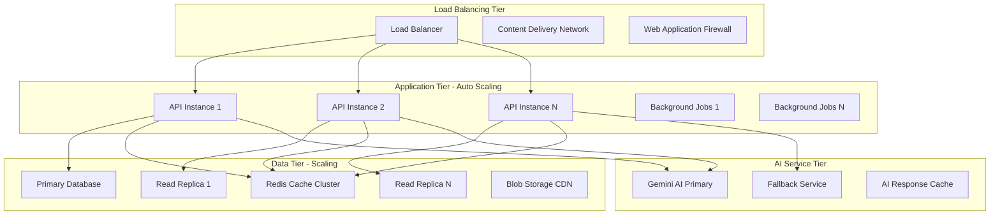

# Application Scaling Procedures

## Overview
Comprehensive guide for scaling the MealPrep AI-powered meal planning application, covering horizontal and vertical scaling strategies, auto-scaling configurations, load balancing, performance optimization, and capacity planning across all environments and cloud providers.

## Scaling Architecture Overview

### Multi-Tier Scaling Strategy


### Scaling Principles and Metrics
```yaml
Scaling Principles:
  Horizontal Scaling (Scale Out):
    - Add more application instances
    - Distribute load across multiple containers
    - Stateless application design
    - Load balancer health checks
    
  Vertical Scaling (Scale Up):
    - Increase CPU and memory resources
    - Optimize for single-instance performance
    - Database connection pool sizing
    - Memory cache optimization
    
  Auto Scaling Triggers:
    - CPU utilization > 70% for 5 minutes
    - Memory utilization > 80% for 3 minutes
    - Request queue depth > 100 requests
    - Response time > 2 seconds for 2 minutes
    - Error rate > 5% for 1 minute

Key Performance Indicators:
  Application Metrics:
    - Requests per second (RPS)
    - Average response time
    - 95th percentile response time
    - Error rate percentage
    - Active user sessions
    
  Infrastructure Metrics:
    - CPU utilization percentage
    - Memory utilization percentage
    - Network throughput
    - Disk I/O operations
    - Container health status
    
  Business Metrics:
    - Active users per hour
    - AI suggestions per minute
    - Recipe searches per second
    - Family registrations per day
    - Peak concurrent users
```

---

## Azure Container Apps Scaling

### Auto Scaling Configuration
```bash
#!/bin/bash
# scripts/scaling/azure-auto-scaling.sh

ENVIRONMENT=${1:-production}
MIN_REPLICAS=${2:-2}
MAX_REPLICAS=${3:-20}
TARGET_CPU=${4:-70}
TARGET_MEMORY=${5:-80}

echo "?? Configuring Azure Container Apps Auto Scaling"
echo "Environment: $ENVIRONMENT"
echo "Min replicas: $MIN_REPLICAS"
echo "Max replicas: $MAX_REPLICAS"
echo "Target CPU: $TARGET_CPU%"
echo "Target Memory: $TARGET_MEMORY%"
echo "================================================"

RESOURCE_GROUP="rg-mealprep-$ENVIRONMENT"
API_APP_NAME="mealprep-$ENVIRONMENT-api"
JOBS_APP_NAME="mealprep-$ENVIRONMENT-jobs"

# 1. Configure API scaling rules
echo "1. Configuring API application scaling..."

# CPU-based scaling rule
az containerapp update \
    --name $API_APP_NAME \
    --resource-group $RESOURCE_GROUP \
    --min-replicas $MIN_REPLICAS \
    --max-replicas $MAX_REPLICAS \
    --scale-rule-name "cpu-scaling" \
    --scale-rule-type "cpu" \
    --scale-rule-metadata "targetCPUUtilization=$TARGET_CPU" \
    --scale-rule-auth "type=None"

# Memory-based scaling rule
az containerapp update \
    --name $API_APP_NAME \
    --resource-group $RESOURCE_GROUP \
    --scale-rule-name "memory-scaling" \
    --scale-rule-type "memory" \
    --scale-rule-metadata "targetMemoryUtilization=$TARGET_MEMORY" \
    --scale-rule-auth "type=None"

# HTTP request-based scaling rule
az containerapp update \
    --name $API_APP_NAME \
    --resource-group $RESOURCE_GROUP \
    --scale-rule-name "http-scaling" \
    --scale-rule-type "http" \
    --scale-rule-metadata "targetConcurrentRequests=50" \
    --scale-rule-auth "type=None"

# Custom metric scaling (Application Insights)
az containerapp update \
    --name $API_APP_NAME \
    --resource-group $RESOURCE_GROUP \
    --scale-rule-name "response-time-scaling" \
    --scale-rule-type "azure-monitor" \
    --scale-rule-metadata \
        resourceURI="/subscriptions/$(az account show --query id -o tsv)/resourceGroups/$RESOURCE_GROUP/providers/Microsoft.Insights/components/mealprep-$ENVIRONMENT-insights" \
        metricName="requests/duration" \
        timeGrain="PT1M" \
        statistic="Average" \
        timeWindow="PT5M" \
        threshold="2000" \
    --scale-rule-auth "type=workloadIdentity"

echo "? API scaling rules configured"

# 2. Configure background jobs scaling
echo "2. Configuring background jobs scaling..."

# Queue-based scaling for background jobs
az containerapp update \
    --name $JOBS_APP_NAME \
    --resource-group $RESOURCE_GROUP \
    --min-replicas 1 \
    --max-replicas 10 \
    --scale-rule-name "queue-scaling" \
    --scale-rule-type "azure-servicebus" \
    --scale-rule-metadata \
        connectionFromEnv="SERVICEBUS_CONNECTION_STRING" \
        queueName="meal-processing-queue" \
        messageCount="5" \
    --scale-rule-auth "type=connection"

# CPU-based scaling for compute-intensive jobs
az containerapp update \
    --name $JOBS_APP_NAME \
    --resource-group $RESOURCE_GROUP \
    --scale-rule-name "jobs-cpu-scaling" \
    --scale-rule-type "cpu" \
    --scale-rule-metadata "targetCPUUtilization=60" \
    --scale-rule-auth "type=None"

echo "? Background jobs scaling rules configured"

# 3. Configure advanced scaling policies
echo "3. Configuring advanced scaling policies..."

# Scale-down stabilization (prevent rapid scale-down)
SCALE_POLICY='{
    "scaleDownRules": {
        "stabilizationWindowSeconds": 300,
        "policies": [
            {
                "type": "Percent",
                "value": 50,
                "periodSeconds": 60
            },
            {
                "type": "Pods",
                "value": 2,
                "periodSeconds": 60
            }
        ]
    },
    "scaleUpRules": {
        "stabilizationWindowSeconds": 60,
        "policies": [
            {
                "type": "Percent",
                "value": 100,
                "periodSeconds": 30
            },
            {
                "type": "Pods",
                "value": 5,
                "periodSeconds": 30
            }
        ]
    }
}'

# Apply scaling policy via ARM template
cat > scaling-policy.json << EOF
{
    "\$schema": "https://schema.management.azure.com/schemas/2019-04-01/deploymentTemplate.json#",
    "contentVersion": "1.0.0.0",
    "parameters": {
        "containerAppName": {
            "type": "string",
            "defaultValue": "$API_APP_NAME"
        }
    },
    "resources": [
        {
            "type": "Microsoft.App/containerApps",
            "apiVersion": "2023-05-01",
            "name": "[parameters('containerAppName')]",
            "location": "[resourceGroup().location]",
            "properties": {
                "configuration": {
                    "scaling": $SCALE_POLICY
                }
            }
        }
    ]
}
EOF

az deployment group create \
    --resource-group $RESOURCE_GROUP \
    --template-file scaling-policy.json \
    --parameters containerAppName=$API_APP_NAME

echo "? Advanced scaling policies applied"

# 4. Create scaling alerts
echo "4. Setting up scaling alerts..."

# Alert when scaling to maximum replicas
az monitor metrics alert create \
    --name "ContainerApp-MaxReplicas-$ENVIRONMENT" \
    --resource-group $RESOURCE_GROUP \
    --scopes "/subscriptions/$(az account show --query id -o tsv)/resourceGroups/$RESOURCE_GROUP/providers/Microsoft.App/containerApps/$API_APP_NAME" \
    --condition "avg Replicas >= $MAX_REPLICAS" \
    --description "Container App has scaled to maximum replicas" \
    --evaluation-frequency PT1M \
    --window-size PT5M \
    --severity 2 \
    --action-group "/subscriptions/$(az account show --query id -o tsv)/resourceGroups/$RESOURCE_GROUP/providers/Microsoft.Insights/actionGroups/MealPrep-High-Alerts"

# Alert for rapid scaling events
az monitor metrics alert create \
    --name "ContainerApp-RapidScaling-$ENVIRONMENT" \
    --resource-group $RESOURCE_GROUP \
    --scopes "/subscriptions/$(az account show --query id -o tsv)/resourceGroups/$RESOURCE_GROUP/providers/Microsoft.App/containerApps/$API_APP_NAME" \
    --condition "avg Replicas > 2 * $MIN_REPLICAS" \
    --description "Container App is experiencing rapid scaling" \
    --evaluation-frequency PT1M \
    --window-size PT2M \
    --severity 3 \
    --action-group "/subscriptions/$(az account show --query id -o tsv)/resourceGroups/$RESOURCE_GROUP/providers/Microsoft.Insights/actionGroups/MealPrep-Warning-Alerts"

echo "? Scaling alerts configured"

# 5. Validate scaling configuration
echo "5. Validating scaling configuration..."

CURRENT_CONFIG=$(az containerapp show \
    --name $API_APP_NAME \
    --resource-group $RESOURCE_GROUP \
    --query 'properties.template.scale' -o json)

echo "Current scaling configuration:"
echo $CURRENT_CONFIG | jq .

# Create scaling summary report
cat > "scaling-config-$ENVIRONMENT.json" << EOF
{
    "timestamp": "$(date -u +%Y-%m-%dT%H:%M:%SZ)",
    "environment": "$ENVIRONMENT",
    "configuration": {
        "apiApp": {
            "name": "$API_APP_NAME",
            "minReplicas": $MIN_REPLICAS,
            "maxReplicas": $MAX_REPLICAS,
            "targetCPU": "$TARGET_CPU%",
            "targetMemory": "$TARGET_MEMORY%"
        },
        "jobsApp": {
            "name": "$JOBS_APP_NAME",
            "minReplicas": 1,
            "maxReplicas": 10,
            "scalingTrigger": "queue-based"
        }
    },
    "scalingRules": [
        "cpu-scaling",
        "memory-scaling", 
        "http-scaling",
        "response-time-scaling",
        "queue-scaling"
    ],
    "alerts": [
        "ContainerApp-MaxReplicas-$ENVIRONMENT",
        "ContainerApp-RapidScaling-$ENVIRONMENT"
    ]
}
EOF

echo "? Azure Container Apps scaling configuration completed"
echo "?? Configuration summary saved to: scaling-config-$ENVIRONMENT.json"

# Cleanup
rm -f scaling-policy.json
```

### Load Testing and Validation
```bash
#!/bin/bash
# scripts/scaling/load-testing.sh

ENVIRONMENT=${1:-staging}
TARGET_RPS=${2:-100}
TEST_DURATION=${3:-600}  # 10 minutes
RAMP_UP_TIME=${4:-60}    # 1 minute

echo "?? Load Testing for Scaling Validation"
echo "Environment: $ENVIRONMENT"
echo "Target RPS: $TARGET_RPS"
echo "Test duration: $TEST_DURATION seconds"
echo "Ramp-up time: $RAMP_UP_TIME seconds"
echo "======================================"

API_ENDPOINT="https://api-$ENVIRONMENT.mealprep.com"
TEST_RESULTS_DIR="load-test-results-$(date +%Y%m%d-%H%M%S)"
mkdir -p $TEST_RESULTS_DIR

# 1. Pre-test baseline measurements
echo "1. Capturing baseline metrics..."
BASELINE_REPLICAS=$(az containerapp show \
    --name "mealprep-$ENVIRONMENT-api" \
    --resource-group "rg-mealprep-$ENVIRONMENT" \
    --query 'properties.template.scale.minReplicas' -o tsv)

echo "Baseline replicas: $BASELINE_REPLICAS"

# 2. Configure load testing tool (K6)
cat > load-test-script.js << 'EOF'
import http from 'k6/http';
import { check, sleep } from 'k6';
import { Rate, Trend } from 'k6/metrics';

// Custom metrics
let errorRate = new Rate('errors');
let responseTimeP95 = new Trend('response_time_p95');

export let options = {
    stages: [
        { duration: __ENV.RAMP_UP_TIME + 's', target: __ENV.TARGET_RPS },
        { duration: __ENV.TEST_DURATION + 's', target: __ENV.TARGET_RPS },
        { duration: '60s', target: 0 },
    ],
    thresholds: {
        http_req_duration: ['p(95)<2000'], // 95% of requests under 2s
        http_req_failed: ['rate<0.05'],    // Error rate under 5%
        errors: ['rate<0.05'],
    },
};

const API_ENDPOINT = __ENV.API_ENDPOINT;

export default function() {
    // Test different endpoints to simulate real traffic
    let responses = [];
    
    // Health check
    responses.push(http.get(`${API_ENDPOINT}/health`));
    
    // Recipe search (most common operation)
    if (Math.random() < 0.4) {
        responses.push(http.get(`${API_ENDPOINT}/api/recipes/search?q=chicken`));
    }
    
    // AI suggestions (CPU intensive)
    if (Math.random() < 0.2) {
        responses.push(http.post(`${API_ENDPOINT}/api/ai/suggestions`, 
            JSON.stringify({
                familyId: 'test-family-1',
                mealType: 'dinner',
                numberOfSuggestions: 5
            }),
            { headers: { 'Content-Type': 'application/json' } }
        ));
    }
    
    // User authentication
    if (Math.random() < 0.1) {
        responses.push(http.post(`${API_ENDPOINT}/api/auth/login`,
            JSON.stringify({
                email: 'test@example.com',
                password: 'TestPassword123!'
            }),
            { headers: { 'Content-Type': 'application/json' } }
        ));
    }
    
    // Check responses
    responses.forEach(response => {
        let success = check(response, {
            'status is 200-299': (r) => r.status >= 200 && r.status < 300,
            'response time < 5000ms': (r) => r.timings.duration < 5000,
        });
        
        errorRate.add(!success);
        responseTimeP95.add(response.timings.duration);
    });
    
    sleep(1);
}

export function handleSummary(data) {
    return {
        'load-test-summary.json': JSON.stringify(data),
    };
}
EOF

# 3. Run load test with scaling monitoring
echo "2. Starting load test with monitoring..."

# Start monitoring script in background
./scripts/scaling/monitor-scaling.sh $ENVIRONMENT $TEST_DURATION &
MONITOR_PID=$!

# Run load test
k6 run \
    --env API_ENDPOINT=$API_ENDPOINT \
    --env TARGET_RPS=$TARGET_RPS \
    --env TEST_DURATION=$TEST_DURATION \
    --env RAMP_UP_TIME=$RAMP_UP_TIME \
    --out json=load-test-results.json \
    load-test-script.js

# Stop monitoring
kill $MONITOR_PID 2>/dev/null || true

# 4. Analyze results
echo "3. Analyzing load test results..."

# Extract key metrics from K6 results
METRICS=$(jq '.metrics' load-test-summary.json)
P95_RESPONSE_TIME=$(echo $METRICS | jq '.http_req_duration.p95')
ERROR_RATE=$(echo $METRICS | jq '.http_req_failed.rate')
TOTAL_REQUESTS=$(echo $METRICS | jq '.http_reqs.count')
AVG_RPS=$(echo $METRICS | jq '.http_reqs.rate')

echo "Load Test Results:"
echo "=================="
echo "Total Requests: $TOTAL_REQUESTS"
echo "Average RPS: $AVG_RPS"
echo "P95 Response Time: ${P95_RESPONSE_TIME}ms"
echo "Error Rate: $(echo "$ERROR_RATE * 100" | bc -l)%"

# Get final replica count
FINAL_REPLICAS=$(az containerapp show \
    --name "mealprep-$ENVIRONMENT-api" \
    --resource-group "rg-mealprep-$ENVIRONMENT" \
    --query 'properties.template.scale.maxReplicas' -o tsv)

echo "Scaling Results:"
echo "==============="
echo "Baseline Replicas: $BASELINE_REPLICAS"
echo "Peak Replicas: $FINAL_REPLICAS"
echo "Scaling Factor: $(echo "scale=2; $FINAL_REPLICAS / $BASELINE_REPLICAS" | bc -l)x"

# 5. Generate scaling efficiency report
cat > "$TEST_RESULTS_DIR/scaling-report.json" << EOF
{
    "testId": "$(uuidgen)",
    "timestamp": "$(date -u +%Y-%m-%dT%H:%M:%SZ)",
    "environment": "$ENVIRONMENT",
    "testConfiguration": {
        "targetRPS": $TARGET_RPS,
        "testDuration": $TEST_DURATION,
        "rampUpTime": $RAMP_UP_TIME
    },
    "results": {
        "performance": {
            "totalRequests": $TOTAL_REQUESTS,
            "averageRPS": $AVG_RPS,
            "p95ResponseTime": $P95_RESPONSE_TIME,
            "errorRate": $ERROR_RATE
        },
        "scaling": {
            "baselineReplicas": $BASELINE_REPLICAS,
            "peakReplicas": $FINAL_REPLICAS,
            "scalingFactor": $(echo "scale=2; $FINAL_REPLICAS / $BASELINE_REPLICAS" | bc -l),
            "scalingEfficiency": "$([ $(echo "$P95_RESPONSE_TIME < 2000" | bc -l) -eq 1 ] && echo "EXCELLENT" || echo "NEEDS_OPTIMIZATION")"
        },
        "thresholds": {
            "responseTimePassed": $([ $(echo "$P95_RESPONSE_TIME < 2000" | bc -l) -eq 1 ] && echo "true" || echo "false"),
            "errorRatePassed": $([ $(echo "$ERROR_RATE < 0.05" | bc -l) -eq 1 ] && echo "true" || echo "false")
        }
    },
    "recommendations": []
}
EOF

# Add recommendations based on results
if [ $(echo "$P95_RESPONSE_TIME > 2000" | bc -l) -eq 1 ]; then
    jq '.recommendations += ["Consider lowering CPU/memory thresholds for faster scaling"]' "$TEST_RESULTS_DIR/scaling-report.json" > tmp.json && mv tmp.json "$TEST_RESULTS_DIR/scaling-report.json"
fi

if [ $(echo "$ERROR_RATE > 0.05" | bc -l) -eq 1 ]; then
    jq '.recommendations += ["High error rate detected - investigate application bottlenecks"]' "$TEST_RESULTS_DIR/scaling-report.json" > tmp.json && mv tmp.json "$TEST_RESULTS_DIR/scaling-report.json"
fi

# Move results to results directory
mv load-test-* $TEST_RESULTS_DIR/

echo "? Load testing completed"
echo "?? Results saved to: $TEST_RESULTS_DIR/"
echo "?? Scaling report: $TEST_RESULTS_DIR/scaling-report.json"

# Cleanup
rm -f load-test-script.js
```

---

## Database Scaling Strategies

### Read Replica Configuration
```bash
#!/bin/bash
# scripts/scaling/database-scaling.sh

ENVIRONMENT=${1:-production}
REPLICA_COUNT=${2:-2}
REPLICA_REGIONS=${3:-"eastus,westus"}

echo "??? Database Scaling Configuration"
echo "Environment: $ENVIRONMENT"
echo "Replica count: $REPLICA_COUNT"
echo "Replica regions: $REPLICA_REGIONS"
echo "=================================="

RESOURCE_GROUP="rg-mealprep-$ENVIRONMENT"
SERVER_NAME="mealprep-$ENVIRONMENT-sql"
DATABASE_NAME="mealprep-$ENVIRONMENT-db"

# 1. Configure read replicas
echo "1. Configuring read replicas..."

IFS=',' read -ra REGIONS <<< "$REPLICA_REGIONS"
REPLICA_CONFIGS=()

for i in "${!REGIONS[@]}"; do
    REGION=${REGIONS[$i]}
    REPLICA_NAME="$SERVER_NAME-replica-$((i+1))"
    
    echo "Creating read replica $REPLICA_NAME in $REGION..."
    
    # Create read replica
    az sql db replica create \
        --name $DATABASE_NAME \
        --resource-group $RESOURCE_GROUP \
        --server $SERVER_NAME \
        --partner-server $REPLICA_NAME \
        --partner-resource-group $RESOURCE_GROUP \
        --partner-database $DATABASE_NAME \
        --service-objective S2 \
        --location $REGION
    
    # Get replica connection string
    REPLICA_CONNECTION=$(az sql db show-connection-string \
        --server $REPLICA_NAME \
        --name $DATABASE_NAME \
        --client ado.net \
        --auth-type SqlPassword)
    
    REPLICA_CONFIGS+=("{\"name\":\"$REPLICA_NAME\",\"region\":\"$REGION\",\"connection\":\"$REPLICA_CONNECTION\"}")
done

echo "? Read replicas configured"

# 2. Configure connection string routing
echo "2. Configuring connection string routing..."

# Create routing configuration for application
cat > "database-routing-$ENVIRONMENT.json" << EOF
{
    "databaseRouting": {
        "primary": {
            "server": "$SERVER_NAME",
            "database": "$DATABASE_NAME",
            "purpose": "read-write"
        },
        "replicas": [
$(IFS=','; echo "${REPLICA_CONFIGS[*]}")
        ],
        "routingRules": {
            "readOperations": {
                "strategy": "round-robin",
                "fallbackToPrimary": true,
                "healthCheckInterval": 30
            },
            "writeOperations": {
                "strategy": "primary-only"
            },
            "reportingQueries": {
                "strategy": "replica-preferred",
                "allowStaleData": true,
                "maxStalenessSeconds": 60
            }
        }
    }
}
EOF

# Update application configuration
az containerapp update \
    --name "mealprep-$ENVIRONMENT-api" \
    --resource-group $RESOURCE_GROUP \
    --set-env-vars DATABASE_ROUTING_CONFIG="$(cat database-routing-$ENVIRONMENT.json | jq -c .)"

echo "? Connection routing configured"

# 3. Configure auto-scaling for database DTU/vCore
echo "3. Configuring database auto-scaling..."

# Create auto-scaling rule for database
az monitor autoscale create \
    --resource-group $RESOURCE_GROUP \
    --resource "/subscriptions/$(az account show --query id -o tsv)/resourceGroups/$RESOURCE_GROUP/providers/Microsoft.Sql/servers/$SERVER_NAME/databases/$DATABASE_NAME" \
    --name "database-autoscale-$ENVIRONMENT" \
    --min-count 2 \
    --max-count 10 \
    --count 2

# DTU-based scaling rule
az monitor autoscale rule create \
    --resource-group $RESOURCE_GROUP \
    --autoscale-name "database-autoscale-$ENVIRONMENT" \
    --condition "Percentage CPU > 75 avg 5m" \
    --scale out 2

az monitor autoscale rule create \
    --resource-group $RESOURCE_GROUP \
    --autoscale-name "database-autoscale-$ENVIRONMENT" \
    --condition "Percentage CPU < 30 avg 10m" \
    --scale in 1

echo "? Database auto-scaling configured"

# 4. Set up database monitoring and alerts
echo "4. Setting up database monitoring..."

# High DTU utilization alert
az monitor metrics alert create \
    --name "Database-HighDTU-$ENVIRONMENT" \
    --resource-group $RESOURCE_GROUP \
    --scopes "/subscriptions/$(az account show --query id -o tsv)/resourceGroups/$RESOURCE_GROUP/providers/Microsoft.Sql/servers/$SERVER_NAME/databases/$DATABASE_NAME" \
    --condition "avg dtu_consumption_percent >= 85" \
    --description "Database DTU utilization is high" \
    --evaluation-frequency PT1M \
    --window-size PT5M \
    --severity 2

# Connection count alert
az monitor metrics alert create \
    --name "Database-HighConnections-$ENVIRONMENT" \
    --resource-group $RESOURCE_GROUP \
    --scopes "/subscriptions/$(az account show --query id -o tsv)/resourceGroups/$RESOURCE_GROUP/providers/Microsoft.Sql/servers/$SERVER_NAME/databases/$DATABASE_NAME" \
    --condition "avg connection_successful >= 80" \
    --description "Database connection count is high" \
    --evaluation-frequency PT1M \
    --window-size PT5M \
    --severity 3

echo "? Database monitoring configured"
```

### Application-Level Database Scaling
```csharp
// Services/DatabaseRoutingService.cs
public class DatabaseRoutingService : IDatabaseRoutingService
{
    private readonly IConfiguration _configuration;
    private readonly ILogger<DatabaseRoutingService> _logger;
    private readonly List<DatabaseConnection> _readReplicas;
    private readonly DatabaseConnection _primaryConnection;
    private int _currentReplicaIndex = 0;

    public DatabaseRoutingService(IConfiguration configuration, ILogger<DatabaseRoutingService> logger)
    {
        _configuration = configuration;
        _logger = logger;
        
        var routingConfig = _configuration.GetSection("DatabaseRouting");
        _primaryConnection = routingConfig.GetSection("Primary").Get<DatabaseConnection>();
        _readReplicas = routingConfig.GetSection("Replicas").Get<List<DatabaseConnection>>();
    }

    public async Task<IDbConnection> GetConnectionAsync(DatabaseOperationType operationType)
    {
        return operationType switch
        {
            DatabaseOperationType.Read => await GetReadConnectionAsync(),
            DatabaseOperationType.Write => await GetWriteConnectionAsync(),
            DatabaseOperationType.Reporting => await GetReportingConnectionAsync(),
            _ => await GetWriteConnectionAsync()
        };
    }

    private async Task<IDbConnection> GetReadConnectionAsync()
    {
        // Round-robin strategy for read operations
        if (_readReplicas?.Any() == true)
        {
            var maxAttempts = _readReplicas.Count;
            
            for (int attempt = 0; attempt < maxAttempts; attempt++)
            {
                var replica = GetNextReplica();
                
                if (await IsConnectionHealthyAsync(replica))
                {
                    _logger.LogDebug("Using read replica: {ReplicaName}", replica.Name);
                    return CreateConnection(replica.ConnectionString);
                }
                
                _logger.LogWarning("Read replica {ReplicaName} is unhealthy, trying next", replica.Name);
            }
            
            _logger.LogWarning("All read replicas are unhealthy, falling back to primary");
        }
        
        // Fallback to primary
        return await GetWriteConnectionAsync();
    }

    private async Task<IDbConnection> GetWriteConnectionAsync()
    {
        if (!await IsConnectionHealthyAsync(_primaryConnection))
        {
            _logger.LogError("Primary database connection is unhealthy");
            throw new DatabaseConnectionException("Primary database is unavailable");
        }

        _logger.LogDebug("Using primary database for write operation");
        return CreateConnection(_primaryConnection.ConnectionString);
    }

    private async Task<IDbConnection> GetReportingConnectionAsync()
    {
        // Prefer replicas for reporting queries to reduce load on primary
        if (_readReplicas?.Any() == true)
        {
            var healthyReplicas = new List<DatabaseConnection>();
            
            foreach (var replica in _readReplicas)
            {
                if (await IsConnectionHealthyAsync(replica))
                {
                    healthyReplicas.Add(replica);
                }
            }
            
            if (healthyReplicas.Any())
            {
                var selectedReplica = healthyReplicas[Random.Shared.Next(healthyReplicas.Count)];
                _logger.LogDebug("Using replica {ReplicaName} for reporting query", selectedReplica.Name);
                return CreateConnection(selectedReplica.ConnectionString);
            }
        }
        
        _logger.LogInformation("No healthy replicas available, using primary for reporting query");
        return await GetWriteConnectionAsync();
    }

    private DatabaseConnection GetNextReplica()
    {
        var replica = _readReplicas[_currentReplicaIndex];
        _currentReplicaIndex = (_currentReplicaIndex + 1) % _readReplicas.Count;
        return replica;
    }

    private async Task<bool> IsConnectionHealthyAsync(DatabaseConnection connection)
    {
        try
        {
            using var testConnection = CreateConnection(connection.ConnectionString);
            await testConnection.OpenAsync();
            
            using var command = testConnection.CreateCommand();
            command.CommandText = "SELECT 1";
            command.CommandTimeout = 5; // Quick health check
            
            var result = await command.ExecuteScalarAsync();
            return result?.ToString() == "1";
        }
        catch (Exception ex)
        {
            _logger.LogWarning(ex, "Health check failed for database connection: {ConnectionName}", connection.Name);
            return false;
        }
    }

    private IDbConnection CreateConnection(string connectionString)
    {
        return new SqlConnection(connectionString);
    }
}

// Models/DatabaseConnection.cs
public class DatabaseConnection
{
    public string Name { get; set; }
    public string Region { get; set; }
    public string ConnectionString { get; set; }
    public DatabaseRole Role { get; set; }
    public DateTime LastHealthCheck { get; set; }
    public bool IsHealthy { get; set; }
}

public enum DatabaseOperationType
{
    Read,
    Write,
    Reporting
}

public enum DatabaseRole
{
    Primary,
    ReadReplica,
    Reporting
}

// Repository pattern with scaling support
public class ScalableRecipeRepository : IRecipeRepository
{
    private readonly IDatabaseRoutingService _databaseRouting;
    private readonly ILogger<ScalableRecipeRepository> _logger;
    private readonly IMemoryCache _cache;

    public ScalableRecipeRepository(
        IDatabaseRoutingService databaseRouting,
        ILogger<ScalableRecipeRepository> logger,
        IMemoryCache cache)
    {
        _databaseRouting = databaseRouting;
        _logger = logger;
        _cache = cache;
    }

    public async Task<Recipe> GetByIdAsync(int id)
    {
        // Check cache first
        var cacheKey = $"recipe:{id}";
        if (_cache.TryGetValue(cacheKey, out Recipe cachedRecipe))
        {
            _logger.LogDebug("Recipe {RecipeId} served from cache", id);
            return cachedRecipe;
        }

        // Use read connection for read operations
        using var connection = await _databaseRouting.GetConnectionAsync(DatabaseOperationType.Read);
        
        var recipe = await connection.QuerySingleOrDefaultAsync<Recipe>(
            "SELECT * FROM Recipes WHERE Id = @Id",
            new { Id = id });

        if (recipe != null)
        {
            // Cache for 5 minutes
            _cache.Set(cacheKey, recipe, TimeSpan.FromMinutes(5));
        }

        return recipe;
    }

    public async Task<Recipe> CreateAsync(Recipe recipe)
    {
        // Use write connection for write operations
        using var connection = await _databaseRouting.GetConnectionAsync(DatabaseOperationType.Write);
        
        var sql = @"
            INSERT INTO Recipes (Name, Description, UserId, CreatedAt, UpdatedAt)
            VALUES (@Name, @Description, @UserId, @CreatedAt, @UpdatedAt);
            SELECT CAST(SCOPE_IDENTITY() as int);";

        var id = await connection.QuerySingleAsync<int>(sql, recipe);
        recipe.Id = id;

        // Invalidate related cache entries
        _cache.Remove($"recipe:{id}");
        _cache.Remove($"user_recipes:{recipe.UserId}");

        _logger.LogInformation("Recipe {RecipeId} created for user {UserId}", id, recipe.UserId);
        return recipe;
    }

    public async Task<IEnumerable<Recipe>> SearchAsync(string query, int page = 1, int pageSize = 20)
    {
        // Use reporting connection for complex search queries
        using var connection = await _databaseRouting.GetConnectionAsync(DatabaseOperationType.Reporting);
        
        var offset = (page - 1) * pageSize;
        
        var sql = @"
            SELECT r.*, u.FirstName + ' ' + u.LastName as AuthorName
            FROM Recipes r
            INNER JOIN Users u ON r.UserId = u.Id
            WHERE r.Name LIKE @Query 
               OR r.Description LIKE @Query
               OR EXISTS (
                   SELECT 1 FROM RecipeIngredients ri
                   INNER JOIN Ingredients i ON ri.IngredientId = i.Id
                   WHERE ri.RecipeId = r.Id AND i.Name LIKE @Query
               )
            ORDER BY r.CreatedAt DESC
            OFFSET @Offset ROWS
            FETCH NEXT @PageSize ROWS ONLY";

        var recipes = await connection.QueryAsync<Recipe>(sql, new 
        { 
            Query = $"%{query}%",
            Offset = offset,
            PageSize = pageSize
        });

        _logger.LogInformation("Recipe search for '{Query}' returned {Count} results", query, recipes.Count());
        return recipes;
    }
}
```

---

## Caching and Performance Optimization

### Redis Cluster Scaling
```bash
#!/bin/bash
# scripts/scaling/redis-scaling.sh

ENVIRONMENT=${1:-production}
CACHE_SIZE=${2:-"6GB"}
REPLICA_COUNT=${3:-2}

echo "?? Redis Cache Scaling Configuration"
echo "Environment: $ENVIRONMENT"
echo "Cache size: $CACHE_SIZE"
echo "Replica count: $REPLICA_COUNT"
echo "===================================="

RESOURCE_GROUP="rg-mealprep-$ENVIRONMENT"
REDIS_NAME="mealprep-$ENVIRONMENT-redis"

# 1. Scale Redis cache instance
echo "1. Scaling Redis cache instance..."

# Determine SKU based on cache size
case $CACHE_SIZE in
    "1GB")
        SKU="Standard"
        SKU_FAMILY="C"
        SKU_CAPACITY=1
        ;;
    "2.5GB")
        SKU="Standard"
        SKU_FAMILY="C"
        SKU_CAPACITY=2
        ;;
    "6GB")
        SKU="Standard"
        SKU_FAMILY="C"
        SKU_CAPACITY=3
        ;;
    "13GB")
        SKU="Standard"
        SKU_FAMILY="C"
        SKU_CAPACITY=4
        ;;
    "26GB")
        SKU="Standard"
        SKU_FAMILY="C"
        SKU_CAPACITY=5
        ;;
    "53GB")
        SKU="Standard"
        SKU_FAMILY="C"
        SKU_CAPACITY=6
        ;;
    *)
        SKU="Premium"
        SKU_FAMILY="P"
        SKU_CAPACITY=1
        ;;
esac

# Scale the Redis instance
az redis update \
    --name $REDIS_NAME \
    --resource-group $RESOURCE_GROUP \
    --sku $SKU \
    --sku-family $SKU_FAMILY \
    --sku-capacity $SKU_CAPACITY \
    --replica-count $REPLICA_COUNT

echo "? Redis cache scaled to $CACHE_SIZE with $REPLICA_COUNT replicas"

# 2. Configure Redis clustering for high availability
if [ "$SKU" = "Premium" ]; then
    echo "2. Configuring Redis clustering..."
    
    az redis patch-schedule create \
        --name $REDIS_NAME \
        --resource-group $RESOURCE_GROUP \
        --schedule-entries '[{"day": "Sunday", "startHour": 2}]'
    
    # Enable clustering for Premium tier
    az redis update \
        --name $REDIS_NAME \
        --resource-group $RESOURCE_GROUP \
        --enable-non-ssl-port false \
        --redis-configuration '{"maxmemory-policy": "allkeys-lru", "notify-keyspace-events": "Ex"}'
    
    echo "? Redis clustering configured"
fi

# 3. Set up Redis monitoring
echo "3. Setting up Redis monitoring..."

# Memory usage alert
az monitor metrics alert create \
    --name "Redis-HighMemory-$ENVIRONMENT" \
    --resource-group $RESOURCE_GROUP \
    --scopes "/subscriptions/$(az account show --query id -o tsv)/resourceGroups/$RESOURCE_GROUP/providers/Microsoft.Cache/Redis/$REDIS_NAME" \
    --condition "avg usedmemorypercentage >= 85" \
    --description "Redis memory usage is high" \
    --evaluation-frequency PT1M \
    --window-size PT5M \
    --severity 2

# CPU usage alert
az monitor metrics alert create \
    --name "Redis-HighCPU-$ENVIRONMENT" \
    --resource-group $RESOURCE_GROUP \
    --scopes "/subscriptions/$(az account show --query id -o tsv)/resourceGroups/$RESOURCE_GROUP/providers/Microsoft.Cache/Redis/$REDIS_NAME" \
    --condition "avg percentProcessorTime >= 80" \
    --description "Redis CPU usage is high" \
    --evaluation-frequency PT1M \
    --window-size PT5M \
    --severity 2

# Connection count alert
az monitor metrics alert create \
    --name "Redis-HighConnections-$ENVIRONMENT" \
    --resource-group $RESOURCE_GROUP \
    --scopes "/subscriptions/$(az account show --query id -o tsv)/resourceGroups/$RESOURCE_GROUP/providers/Microsoft.Cache/Redis/$REDIS_NAME" \
    --condition "avg connectedclients >= 900" \
    --description "Redis connection count is high" \
    --evaluation-frequency PT1M \
    --window-size PT5M \
    --severity 3

echo "? Redis monitoring configured"

# 4. Update application cache configuration
echo "4. Updating application cache configuration..."

# Get Redis connection string
REDIS_CONNECTION=$(az redis list-keys \
    --name $REDIS_NAME \
    --resource-group $RESOURCE_GROUP \
    --query 'primaryKey' -o tsv)

REDIS_HOST=$(az redis show \
    --name $REDIS_NAME \
    --resource-group $RESOURCE_GROUP \
    --query 'hostName' -o tsv)

# Update container app with new cache configuration
az containerapp update \
    --name "mealprep-$ENVIRONMENT-api" \
    --resource-group $RESOURCE_GROUP \
    --set-env-vars \
        REDIS_CONNECTION_STRING="$REDIS_HOST:6380,password=$REDIS_CONNECTION,ssl=True,abortConnect=False" \
        REDIS_CLUSTER_SIZE="$SKU_CAPACITY" \
        REDIS_MAX_CONNECTIONS="1000"

echo "? Application cache configuration updated"
```

### Application-Level Caching Strategy
```csharp
// Services/CacheService.cs
public class DistributedCacheService : ICacheService
{
    private readonly IDistributedCache _distributedCache;
    private readonly IMemoryCache _memoryCache;
    private readonly ILogger<DistributedCacheService> _logger;
    private readonly IConfiguration _configuration;

    public DistributedCacheService(
        IDistributedCache distributedCache,
        IMemoryCache memoryCache,
        ILogger<DistributedCacheService> logger,
        IConfiguration configuration)
    {
        _distributedCache = distributedCache;
        _memoryCache = memoryCache;
        _logger = logger;
        _configuration = configuration;
    }

    public async Task<T> GetAsync<T>(string key, CacheLevel level = CacheLevel.Distributed)
    {
        try
        {
            // Try memory cache first for fastest access
            if (level == CacheLevel.Memory || level == CacheLevel.Both)
            {
                if (_memoryCache.TryGetValue(key, out T memoryValue))
                {
                    _logger.LogDebug("Cache hit (memory): {Key}", key);
                    return memoryValue;
                }
            }

            // Try distributed cache
            if (level == CacheLevel.Distributed || level == CacheLevel.Both)
            {
                var distributedValue = await _distributedCache.GetStringAsync(key);
                if (!string.IsNullOrEmpty(distributedValue))
                {
                    var deserializedValue = JsonSerializer.Deserialize<T>(distributedValue);
                    
                    // Also store in memory cache for next time
                    if (level == CacheLevel.Both)
                    {
                        _memoryCache.Set(key, deserializedValue, TimeSpan.FromMinutes(5));
                    }
                    
                    _logger.LogDebug("Cache hit (distributed): {Key}", key);
                    return deserializedValue;
                }
            }

            _logger.LogDebug("Cache miss: {Key}", key);
            return default(T);
        }
        catch (Exception ex)
        {
            _logger.LogError(ex, "Cache get operation failed for key: {Key}", key);
            return default(T);
        }
    }

    public async Task SetAsync<T>(string key, T value, TimeSpan? expiry = null, CacheLevel level = CacheLevel.Distributed)
    {
        try
        {
            var defaultExpiry = TimeSpan.FromMinutes(_configuration.GetValue<int>("Cache:DefaultExpiryMinutes", 30));
            var cacheExpiry = expiry ?? defaultExpiry;

            // Store in memory cache
            if (level == CacheLevel.Memory || level == CacheLevel.Both)
            {
                var memoryExpiry = cacheExpiry > TimeSpan.FromMinutes(10) 
                    ? TimeSpan.FromMinutes(10) 
                    : cacheExpiry;
                
                _memoryCache.Set(key, value, memoryExpiry);
            }

            // Store in distributed cache
            if (level == CacheLevel.Distributed || level == CacheLevel.Both)
            {
                var serializedValue = JsonSerializer.Serialize(value);
                var options = new DistributedCacheEntryOptions
                {
                    AbsoluteExpirationRelativeToNow = cacheExpiry
                };
                
                await _distributedCache.SetStringAsync(key, serializedValue, options);
            }

            _logger.LogDebug("Cache set: {Key} (expiry: {Expiry})", key, cacheExpiry);
        }
        catch (Exception ex)
        {
            _logger.LogError(ex, "Cache set operation failed for key: {Key}", key);
        }
    }

    public async Task RemoveAsync(string key, CacheLevel level = CacheLevel.Both)
    {
        try
        {
            if (level == CacheLevel.Memory || level == CacheLevel.Both)
            {
                _memoryCache.Remove(key);
            }

            if (level == CacheLevel.Distributed || level == CacheLevel.Both)
            {
                await _distributedCache.RemoveAsync(key);
            }

            _logger.LogDebug("Cache remove: {Key}", key);
        }
        catch (Exception ex)
        {
            _logger.LogError(ex, "Cache remove operation failed for key: {Key}", key);
        }
    }

    public async Task<T> GetOrSetAsync<T>(string key, Func<Task<T>> getItem, TimeSpan? expiry = null, CacheLevel level = CacheLevel.Distributed)
    {
        var cachedValue = await GetAsync<T>(key, level);
        if (cachedValue != null)
        {
            return cachedValue;
        }

        var value = await getItem();
        if (value != null)
        {
            await SetAsync(key, value, expiry, level);
        }

        return value;
    }
}

public enum CacheLevel
{
    Memory,
    Distributed,
    Both
}

// Caching decorators for repositories
public class CachedRecipeRepository : IRecipeRepository
{
    private readonly IRecipeRepository _repository;
    private readonly ICacheService _cache;
    private readonly ILogger<CachedRecipeRepository> _logger;

    public CachedRecipeRepository(
        IRecipeRepository repository,
        ICacheService cache,
        ILogger<CachedRecipeRepository> logger)
    {
        _repository = repository;
        _cache = cache;
        _logger = logger;
    }

    public async Task<Recipe> GetByIdAsync(int id)
    {
        return await _cache.GetOrSetAsync(
            $"recipe:{id}",
            () => _repository.GetByIdAsync(id),
            TimeSpan.FromMinutes(15),
            CacheLevel.Both);
    }

    public async Task<IEnumerable<Recipe>> GetByUserIdAsync(int userId)
    {
        return await _cache.GetOrSetAsync(
            $"user_recipes:{userId}",
            () => _repository.GetByUserIdAsync(userId),
            TimeSpan.FromMinutes(10),
            CacheLevel.Distributed);
    }

    public async Task<Recipe> CreateAsync(Recipe recipe)
    {
        var createdRecipe = await _repository.CreateAsync(recipe);
        
        // Invalidate related caches
        await _cache.RemoveAsync($"user_recipes:{recipe.UserId}");
        await _cache.RemoveAsync("popular_recipes");
        
        return createdRecipe;
    }

    public async Task<Recipe> UpdateAsync(Recipe recipe)
    {
        var updatedRecipe = await _repository.UpdateAsync(recipe);
        
        // Invalidate caches
        await _cache.RemoveAsync($"recipe:{recipe.Id}");
        await _cache.RemoveAsync($"user_recipes:{recipe.UserId}");
        
        return updatedRecipe;
    }

    public async Task DeleteAsync(int id)
    {
        var recipe = await GetByIdAsync(id);
        await _repository.DeleteAsync(id);
        
        // Invalidate caches
        await _cache.RemoveAsync($"recipe:{id}");
        if (recipe != null)
        {
            await _cache.RemoveAsync($"user_recipes:{recipe.UserId}");
        }
    }
}
```

This comprehensive scaling procedures guide provides production-ready strategies for scaling the MealPrep application across all tiers - application, database, and caching - with automated testing and monitoring capabilities.

---

*Last Updated: December 2024*  
*Application scaling procedures continuously updated with new optimization techniques and best practices*